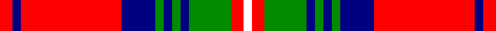

In pattern [RBRBGBGBGRW](/stripes/rbrbgbgbgrw/).

This was sourced from register-of-tartans.  It is a [11 stripe tartan](/stripes/stripes11/).

Original link https://www.tartanregister.gov.uk/tartanDetails.aspx?ref=10428

## Register references

External register numbers recorded for this tartan.

- Scottish Register of Tartans: [10428](https://www.tartanregister.gov.uk/tartanDetails.aspx?ref=10428)

## Thread count
R/6 DB4 R48 DB16 G4 DB4 G4 DB4 G20 R6 W/4

## Palette
Each colour and its ΔE from the base-6 reference it is a variant of.

| Colour | Shade | Base | ΔE (OKLab) |
|---|---|---|---|
| DB | <code style="background-color:#000080;">#000080</code> `#000080` | B <code style="background-color:#2A418A;">#2A418A</code> | 0.14 |
| G | <code style="background-color:#008B00;">#008B00</code> `#008B00` | G <code style="background-color:#006100;">#006100</code> | 0.13 |
| R | <code style="background-color:#FF0000;">#FF0000</code> `#FF0000` | R <code style="background-color:#CC0000;">#CC0000</code> | 0.11 |
| W | <code style="background-color:#FFFFFF;">#FFFFFF</code> `#FFFFFF` | W <code style="background-color:#F7F7F7;">#F7F7F7</code> | 0.02 |

## Nearest tartans

The nearest existing variants by ΔTartan distance.

1. [Normandy (Fashion)](/setts/s12/w8k9ly9r21ly6k6w4k6ly6r49k22w4/) — ΔT 0.93
1. [Hannay Dress (Dance)](/setts/s10/k9lr4k2lr4k2lr29k9lr4lg14ly2~x2/) — ΔT 1.03
1. [Hepburn (Clan)](/setts/s12/r21db4k5ly2k2ly2k2r7g4r2db3ly2~x4/) — ΔT 1.10
1. [Grant (Official)](/setts/s15/r8db2r2db2r32lt2r2db8r2g2r2g27r2db2r2~x2/) — ΔT 1.18
1. [MacFie Dress](/setts/s9/w1r12g2r2w16r2g2r12lo1~x4/) — ΔT 1.19
1. [Hearts Football Club (Corporate)](/setts/s9/db3w12k11r4w2r2w2r24ly3~x2/) — ΔT 1.19
1. [Winthrop University](/setts/s15/r2w2db6r2db2r2db1r20ly1r2ly2r2ly6w2ly2~x2/) — ΔT 1.20
1. [Loch Creran](/setts/s11/r5g9ly2g9r5b9r28g3lt2r4b2~x2/) — ΔT 1.22
1. [Fraser Gathering, Red (1997)](/setts/s9/r2db12r2g11r4db5g2r24w2~x2/) — ΔT 1.26
1. [Robbie (Stirling) (Personal)](/setts/s13/w1ly2r15db2r2db15r2g15r2db2r15ly2w1~x2/) — ΔT 1.27

## Neighbour map

Every grey dot is one of 14299 variants placed by the first two principal components of the ΔTartan feature space (44% of its variance). Red is this tartan; blue dots are its nearest — click one to open its page.

<svg viewBox="0 0 640 380" role="img" style="max-width:100%;height:auto;border:1px solid #e0e0e0;border-radius:4px;display:block" xmlns="http://www.w3.org/2000/svg"><image href="/nn/cloud.v1.png" width="640" height="380"/><a href="/setts/s12/w8k9ly9r21ly6k6w4k6ly6r49k22w4/"><circle cx="221.9" cy="127.3" r="4" fill="#3465a4"><title>Normandy (Fashion)</title></circle></a><a href="/setts/s10/k9lr4k2lr4k2lr29k9lr4lg14ly2~x2/"><circle cx="268.0" cy="139.0" r="4" fill="#3465a4"><title>Hannay Dress (Dance)</title></circle></a><a href="/setts/s12/r21db4k5ly2k2ly2k2r7g4r2db3ly2~x4/"><circle cx="245.0" cy="115.9" r="4" fill="#3465a4"><title>Hepburn (Clan)</title></circle></a><a href="/setts/s15/r8db2r2db2r32lt2r2db8r2g2r2g27r2db2r2~x2/"><circle cx="308.7" cy="90.2" r="4" fill="#3465a4"><title>Grant (Official)</title></circle></a><a href="/setts/s9/w1r12g2r2w16r2g2r12lo1~x4/"><circle cx="309.4" cy="134.0" r="4" fill="#3465a4"><title>MacFie Dress</title></circle></a><a href="/setts/s9/db3w12k11r4w2r2w2r24ly3~x2/"><circle cx="212.2" cy="125.3" r="4" fill="#3465a4"><title>Hearts Football Club (Corporate)</title></circle></a><a href="/setts/s15/r2w2db6r2db2r2db1r20ly1r2ly2r2ly6w2ly2~x2/"><circle cx="304.1" cy="88.7" r="4" fill="#3465a4"><title>Winthrop University</title></circle></a><a href="/setts/s11/r5g9ly2g9r5b9r28g3lt2r4b2~x2/"><circle cx="269.2" cy="122.5" r="4" fill="#3465a4"><title>Loch Creran</title></circle></a><a href="/setts/s9/r2db12r2g11r4db5g2r24w2~x2/"><circle cx="278.1" cy="162.4" r="4" fill="#3465a4"><title>Fraser Gathering, Red (1997)</title></circle></a><a href="/setts/s13/w1ly2r15db2r2db15r2g15r2db2r15ly2w1~x2/"><circle cx="215.2" cy="104.0" r="4" fill="#3465a4"><title>Robbie (Stirling) (Personal)</title></circle></a><circle cx="257.6" cy="123.9" r="5" fill="#c00000"/></svg>

ID: /setts/s11/r3db2r24db8g2db2g2db2g10r3w2~x2/
