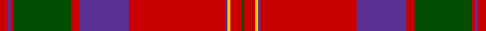

This page is one **sett** — a single exact thread-count. It belongs to the [tartan](/tartans/r3dp1r1dg21r3dp18r35dp1ly1r4dg1/)
(the same proportion at any scale), whose colour order is pattern [GRYBRBRGRBR](/stripes/grybrbrgrbr/).

Sourced from weddslist.  It is a [11 stripe tartan](/stripes/stripes11/).

Original link http://www.weddslist.com/cgi-bin/tartans/pg.pl?source=rb

## Thread count
R/3 P1 R1 G21 R3 P18 R35 P1 Y1 R4 G/1

## Palette

Palette: <strong>Tartan Register</strong> <small style="color:#888">(2 of 4 colours)</small>
<table><thead><tr><th>Colour</th><th>Threads</th><th>Shade</th><th>Base</th><th>OKLCh</th></tr></thead><tbody><tr><td>R/</td><td style="text-align:right;font-variant-numeric:tabular-nums">3</td><td><code style="background-color:#C80000;">#C80000</code> <small style="color:#888">#C80000</small></td><td>R <code style="background-color:#CC0000;">#CC0000</code></td><td><small style="color:#888">oklch(52.3% 0.215 29.2)</small></td></tr><tr><td>P</td><td style="text-align:right;font-variant-numeric:tabular-nums">1</td><td><code style="background-color:#5A3094;">#5A3094</code> <small style="color:#888">#5A3094</small></td><td>B <code style="background-color:#2A418A;">#2A418A</code></td><td><small style="color:#888">oklch(41.8% 0.156 298.7)</small></td></tr><tr><td>R</td><td style="text-align:right;font-variant-numeric:tabular-nums">1</td><td><code style="background-color:#C80000;">#C80000</code> <small style="color:#888">#C80000</small></td><td>R <code style="background-color:#CC0000;">#CC0000</code></td><td><small style="color:#888">oklch(52.3% 0.215 29.2)</small></td></tr><tr><td>G</td><td style="text-align:right;font-variant-numeric:tabular-nums">21</td><td><code style="background-color:#004C00;">#004C00</code> <small style="color:#888">#004C00</small></td><td>G <code style="background-color:#006100;">#006100</code></td><td><small style="color:#888">oklch(36.1% 0.123 142.5)</small></td></tr><tr><td>R</td><td style="text-align:right;font-variant-numeric:tabular-nums">3</td><td><code style="background-color:#C80000;">#C80000</code> <small style="color:#888">#C80000</small></td><td>R <code style="background-color:#CC0000;">#CC0000</code></td><td><small style="color:#888">oklch(52.3% 0.215 29.2)</small></td></tr><tr><td>P</td><td style="text-align:right;font-variant-numeric:tabular-nums">18</td><td><code style="background-color:#5A3094;">#5A3094</code> <small style="color:#888">#5A3094</small></td><td>B <code style="background-color:#2A418A;">#2A418A</code></td><td><small style="color:#888">oklch(41.8% 0.156 298.7)</small></td></tr><tr><td>R</td><td style="text-align:right;font-variant-numeric:tabular-nums">35</td><td><code style="background-color:#C80000;">#C80000</code> <small style="color:#888">#C80000</small></td><td>R <code style="background-color:#CC0000;">#CC0000</code></td><td><small style="color:#888">oklch(52.3% 0.215 29.2)</small></td></tr><tr><td>P</td><td style="text-align:right;font-variant-numeric:tabular-nums">1</td><td><code style="background-color:#5A3094;">#5A3094</code> <small style="color:#888">#5A3094</small></td><td>B <code style="background-color:#2A418A;">#2A418A</code></td><td><small style="color:#888">oklch(41.8% 0.156 298.7)</small></td></tr><tr><td>Y</td><td style="text-align:right;font-variant-numeric:tabular-nums">1</td><td><code style="background-color:#FFC800;">#FFC800</code> <small style="color:#888">#FFC800</small></td><td>Y <code style="background-color:#F2BF00;">#F2BF00</code></td><td><small style="color:#888">oklch(85.7% 0.175 88.5)</small></td></tr><tr><td>R</td><td style="text-align:right;font-variant-numeric:tabular-nums">4</td><td><code style="background-color:#C80000;">#C80000</code> <small style="color:#888">#C80000</small></td><td>R <code style="background-color:#CC0000;">#CC0000</code></td><td><small style="color:#888">oklch(52.3% 0.215 29.2)</small></td></tr><tr><td>G/</td><td style="text-align:right;font-variant-numeric:tabular-nums">1</td><td><code style="background-color:#004C00;">#004C00</code> <small style="color:#888">#004C00</small></td><td>G <code style="background-color:#006100;">#006100</code></td><td><small style="color:#888">oklch(36.1% 0.123 142.5)</small></td></tr></tbody></table>

## Nearest tartans

The nearest existing variants by ΔTartan distance, with this tartan at the top so the swatches line up against it.

ΔTartan

Tartan

Sett

—

<a href="/ttd/edit/#slug=r3dp1r1dg21r3dp18r35dp1ly1r4dg1">MacPherson Of Cluny</a> <a class="nn-out" href="/setts/s11/r3dp1r1dg21r3dp18r35dp1ly1r4dg1/" title="open its dictionary page">↗</a>

0.43

<a href="/ttd/edit/#slug=r5p2r2g42r5p36r70p2ly2r7g2~x2">MacPherson of Cluny</a> <a class="nn-out" href="/setts/s11/r5p2r2g42r5p36r70p2ly2r7g2~x2/" title="open its dictionary page">↗</a>

0.80

<a href="/ttd/edit/#slug=r6db1r1dg28r4db8w1r32dg1r4dg2~x2">MacDonell of Keppoch (artefact)</a> <a class="nn-out" href="/setts/s11/r6db1r1dg28r4db8w1r32dg1r4dg2~x2/" title="open its dictionary page">↗</a>

0.82

<a href="/ttd/edit/#slug=r4t1db1r32t2r2db12r2g16r4t1r4db2~x2">MacGillivray</a> <a class="nn-out" href="/setts/s13/r4t1db1r32t2r2db12r2g16r4t1r4db2~x2/" title="open its dictionary page">↗</a>

0.83

<a href="/ttd/edit/#slug=r6lb1r24dp6dg2dp1dg2dp1dg12r1">Chisholm D</a> <a class="nn-out" href="/setts/s10/r6lb1r24dp6dg2dp1dg2dp1dg12r1/" title="open its dictionary page">↗</a>

0.89

<a href="/ttd/edit/#slug=r5k2r2g42r5k36r70k2ly2r7g2">MacPherson of Cluny</a> <a class="nn-out" href="/setts/s11/r5k2r2g42r5k36r70k2ly2r7g2/" title="open its dictionary page">↗</a>

0.93

<a href="/ttd/edit/#slug=r4b1db1r32b2r2db12r2dg16r4b1r4db2~x2">MacGillivray</a> <a class="nn-out" href="/setts/s13/r4b1db1r32b2r2db12r2dg16r4b1r4db2~x2/" title="open its dictionary page">↗</a>

0.93

<a href="/ttd/edit/#slug=r4b1db1r32b2r2db12r2dg16r4b1r4db2">MacGillivray</a> <a class="nn-out" href="/setts/s13/r4b1db1r32b2r2db12r2dg16r4b1r4db2/" title="open its dictionary page">↗</a>

0.97

<a href="/ttd/edit/#slug=r6w1r24db6g2db1g2db1g12r1~x2">Chisholm</a> <a class="nn-out" href="/setts/s10/r6w1r24db6g2db1g2db1g12r1~x2/" title="open its dictionary page">↗</a>

0.98

<a href="/ttd/edit/#slug=r6db2r2g24r2g2r2db8r2t2r32db2r2db1r6~x2">Grant or Drummond Clan Tartan Tartan Number: 1384. Earliest known date: 1831 The usual design is sometimes called Drummond. It is recorded by Logan (1831), Smibert (1850), and Smith (1850). McIan's drawing of the Grant tartan is too roughly done to make out the pattern details. A certain difficulty arises in establishing a single Grant tartan to represent the clan, illustrated by the existance of ten Grant portraits at Cullen House in which each brother is wearing a different tartan, and where a coat or plaid is worn, these also differ. The chief of the Grants is Lord Strathspey. See products available Copyright © Blair Urquhart, Comrie, 2015</a> <a class="nn-out" href="/setts/s15/r6db2r2g24r2g2r2db8r2t2r32db2r2db1r6~x2/" title="open its dictionary page">↗</a>

1.02

<a href="/setts/s12/r60db2g24r8db2t3db2/">Unidentified Cant #12</a>

## Neighbour map

Every grey dot is one of 14299 variants placed by the first two principal components of the ΔTartan feature space (44% of its variance). Red is this tartan; blue dots are its nearest — click one to open its page.

<svg viewBox="0 0 640 380" role="img" style="max-width:100%;height:auto;border:1px solid #e0e0e0;border-radius:4px;display:block" xmlns="http://www.w3.org/2000/svg"><image href="/nn/cloud.v1.png" width="640" height="380"/><a href="/setts/s11/r5p2r2g42r5p36r70p2ly2r7g2~x2/"><circle cx="368.3" cy="100.3" r="4" fill="#3465a4"><title>MacPherson of Cluny</title></circle></a><a href="/setts/s11/r6db1r1dg28r4db8w1r32dg1r4dg2~x2/"><circle cx="374.9" cy="104.2" r="4" fill="#3465a4"><title>MacDonell of Keppoch (artefact)</title></circle></a><a href="/setts/s13/r4t1db1r32t2r2db12r2g16r4t1r4db2~x2/"><circle cx="395.5" cy="103.0" r="4" fill="#3465a4"><title>MacGillivray</title></circle></a><a href="/setts/s10/r6lb1r24dp6dg2dp1dg2dp1dg12r1/"><circle cx="373.1" cy="125.5" r="4" fill="#3465a4"><title>Chisholm D</title></circle></a><a href="/setts/s11/r5k2r2g42r5k36r70k2ly2r7g2/"><circle cx="345.6" cy="94.0" r="4" fill="#3465a4"><title>MacPherson of Cluny</title></circle></a><a href="/setts/s13/r4b1db1r32b2r2db12r2dg16r4b1r4db2~x2/"><circle cx="390.9" cy="105.8" r="4" fill="#3465a4"><title>MacGillivray</title></circle></a><a href="/setts/s13/r4b1db1r32b2r2db12r2dg16r4b1r4db2/"><circle cx="390.9" cy="105.8" r="4" fill="#3465a4"><title>MacGillivray</title></circle></a><a href="/setts/s10/r6w1r24db6g2db1g2db1g12r1~x2/"><circle cx="364.7" cy="123.0" r="4" fill="#3465a4"><title>Chisholm</title></circle></a><a href="/setts/s15/r6db2r2g24r2g2r2db8r2t2r32db2r2db1r6~x2/"><circle cx="391.0" cy="92.9" r="4" fill="#3465a4"><title>Grant or Drummond Clan Tartan Tartan Number: 1384. Earliest known date: 1831 The usual design is sometimes called Drummond. It is recorded by Logan (1831), Smibert (1850), and Smith (1850). McIan's drawing of the Grant tartan is too roughly done to make out the pattern details. A certain difficulty arises in establishing a single Grant tartan to represent the clan, illustrated by the existance of ten Grant portraits at Cullen House in which each brother is wearing a different tartan, and where a coat or plaid is worn, these also differ. The chief of the Grants is Lord Strathspey. See products available Copyright © Blair Urquhart, Comrie, 2015</title></circle></a><a href="/setts/s12/r60db2g24r8db2t3db2/"><circle cx="386.5" cy="105.3" r="4" fill="#3465a4"><title>Unidentified Cant #12</title></circle></a><circle cx="368.7" cy="103.5" r="5" fill="#c00000"/></svg>

ID: /setts/s11/r3dp1r1dg21r3dp18r35dp1ly1r4dg1/
