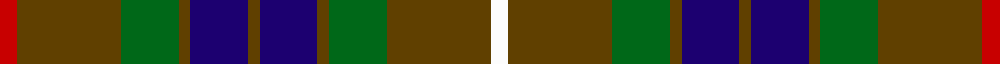

**Bands:** [RGGGBGBGGGW](/stripes/rgggbgbgggw/) · **Stripes:** [R DY G DY DB DY DB DY G DY W](/stripes/stripes11/) R DY G DY DB DY DB DY G DY W

This was sourced from register-of-tartans.  It is a [11 band tartan](/bands/bands11/).

Original link https://www.tartanregister.gov.uk/tartanDetails.aspx?ref=1258

## Also known as

This cloth is also recorded under:

- Fraser Hunting

## Attestations

This cloth appears in 2 source records; the oldest owns this page.

- 01/01/1842 — Fraser Hunting (register-of-tartans, [record](https://www.tartanregister.gov.uk/tartanDetails.aspx?ref=1258))
- undated — Fraser Hunting Clan Tartan Tartan Number: 1659. Earliest known date: 1906 (1855) In the Hunting Fraser, brown replaces the red of the Clan sett. The late Charles Ian Fraser of Reeling said, in his publication, "Clan Fraser", that this sett was designed by the Sobieski Stuart brothers at the request of Lord Lovat for use by the Inverness and Nairn militia. A letter to Lord Lovat from the War Office, c.1855, authorised the use of the Fraser tartan for the corps. The tartan is worn by the Boghall & Bathgate pipe bands. (Strathallan 1994) See products available Copyright © Blair Urquhart, Comrie, 2015 (house-of-tartan, [record](http://www.house-of-tartan.scotland.net/house/TartanViewjs.asp?colr=Def&tnam=1659))

## Register references

External register numbers recorded for this tartan.

- Scottish Register of Tartans: [1258](https://www.tartanregister.gov.uk/tartanDetails.aspx?ref=1258)
- Scottish Tartans Authority (ITI): 1659
- Scottish Tartans World Register: 1659

## Thread count
R/6 T36 G20 T4 DB20 T4 DB20 T4 G20 T36 W/6

## Palette
Each colour and its ΔE from the base-6 reference it is a variant of.

| Colour | Shade | Base | ΔE (OKLab) |
|---|---|---|---|
| DB | <code style="background-color:#1C0070;">#1C0070</code> `#1C0070` | B <code style="background-color:#2A418A;">#2A418A</code> | 0.14 |
| G | <code style="background-color:#006818;">#006818</code> `#006818` | G <code style="background-color:#006100;">#006100</code> | 0.02 |
| R | <code style="background-color:#C80000;">#C80000</code> `#C80000` | R <code style="background-color:#CC0000;">#CC0000</code> | 0.01 |
| T | <code style="background-color:#604000;">#604000</code> `#604000` | G <code style="background-color:#006100;">#006100</code> | 0.14 |
| W | <code style="background-color:#FCFCFC;">#FCFCFC</code> `#FCFCFC` | W <code style="background-color:#F7F7F7;">#F7F7F7</code> | 0.01 |

## Nearest tartans

The nearest existing variants by ΔTartan distance.

1. [Fraser Htg (Clan)](/setts/s11/r3dy18dg10dy2db10dy2db10dy2dg10dy18w3~x2/) — ΔT 0.53
1. [Royal College of Physicians Corporate Tartan Tartan Number: 2350. Earliest known date: September 1996 Full name is Royal College of Physicians, Edinburgh. Designed for the Royal College of Physicians (founded in 1681 for post graduate students), by Donald Fraser Weavers as a corporate tartan. Woven by Lochcarron, May 1997. Silk sample in STA Johnston Collection. See products available Copyright © Blair Urquhart, Comrie, 2015](/setts/s10/g23r3k9r3db18r3k9r3g23ly3~x2/) — ΔT 0.89
1. [Cochrane (1974)](/setts/s13/dg22r4dg2r2dg2r4dg12k12r2db10r4db4ly3~x2/) — ΔT 0.96
1. [Wilson's No.183](/setts/s10/r1g6dp6t1k2t1dp6g6r1g1~x4/) — ΔT 0.97
1. [Reid Family Tartan Tartan Number: 2066. Earliest known date: 1991 Designed for Mr. William Reid, President of DELCO Scottish games. See products available Copyright © Blair Urquhart, Comrie, 2015](/setts/s13/w1r2g10r2g2k8g2db8g2r2g10r2w1~x2/) — ΔT 1.05
1. [Maple Leaf Canadian District Tartan Tartan Number: 2034. Earliest known date: 1964 In creating the Maple Leaf Tartan fabric, David Weiser captured the natural phenomena of these leaves turning from summer into autumn. (The Office of the High Commissioner for Canada.) The sett is now regarded as a National tartan. See products available Copyright © Blair Urquhart, Comrie, 2015](/setts/s12/dg6m1dg1m4g4m4dg1m1dg6dy2g2ly2~x8/) — ΔT 1.09
1. [Maple Leaf MINI Canadian District Tartan Tartan Number: 20355. Earliest known date: 1964 Generated for Dupion Silk List for display purpose. See products available Copyright © Blair Urquhart, Comrie, 2015](/setts/s12/dg6m1dg1m4g4m4dg1m1dg6dy2g2ly2~x4/) — ΔT 1.09
1. [Dama Resort](/setts/s11/p3k2n6k2n2k18y13lb2y2k6p2~x2/) — ΔT 1.13
1. [Wilson's No.124](/setts/s8/g14dp11y3k5y3dp11g14ly2~x2/) — ΔT 1.16
1. [Art Pewter Silver](/setts/s8/db12k4y12ly1y12k4db8r3~x2/) — ΔT 1.16

## Neighbour map

Every grey dot is one of 14299 variants placed by the first two principal components of the ΔTartan feature space (44% of its variance). Red is this tartan; blue dots are its nearest — click one to open its page.

<svg viewBox="0 0 640 380" role="img" style="max-width:100%;height:auto;border:1px solid #e0e0e0;border-radius:4px;display:block" xmlns="http://www.w3.org/2000/svg"><image href="/nn/cloud.v1.png" width="640" height="380"/><a href="/setts/s11/r3dy18dg10dy2db10dy2db10dy2dg10dy18w3~x2/"><circle cx="231.5" cy="203.2" r="4" fill="#3465a4"><title>Fraser Htg (Clan)</title></circle></a><a href="/setts/s10/g23r3k9r3db18r3k9r3g23ly3~x2/"><circle cx="201.2" cy="191.0" r="4" fill="#3465a4"><title>Royal College of Physicians Corporate Tartan Tartan Number: 2350. Earliest known date: September 1996 Full name is Royal College of Physicians, Edinburgh. Designed for the Royal College of Physicians (founded in 1681 for post graduate students), by Donald Fraser Weavers as a corporate tartan. Woven by Lochcarron, May 1997. Silk sample in STA Johnston Collection. See products available Copyright © Blair Urquhart, Comrie, 2015</title></circle></a><a href="/setts/s13/dg22r4dg2r2dg2r4dg12k12r2db10r4db4ly3~x2/"><circle cx="209.1" cy="158.7" r="4" fill="#3465a4"><title>Cochrane (1974)</title></circle></a><a href="/setts/s10/r1g6dp6t1k2t1dp6g6r1g1~x4/"><circle cx="191.7" cy="208.0" r="4" fill="#3465a4"><title>Wilson's No.183</title></circle></a><a href="/setts/s13/w1r2g10r2g2k8g2db8g2r2g10r2w1~x2/"><circle cx="214.4" cy="165.1" r="4" fill="#3465a4"><title>Reid Family Tartan Tartan Number: 2066. Earliest known date: 1991 Designed for Mr. William Reid, President of DELCO Scottish games. See products available Copyright © Blair Urquhart, Comrie, 2015</title></circle></a><a href="/setts/s12/dg6m1dg1m4g4m4dg1m1dg6dy2g2ly2~x8/"><circle cx="163.8" cy="211.6" r="4" fill="#3465a4"><title>Maple Leaf Canadian District Tartan Tartan Number: 2034. Earliest known date: 1964 In creating the Maple Leaf Tartan fabric, David Weiser captured the natural phenomena of these leaves turning from summer into autumn. (The Office of the High Commissioner for Canada.) The sett is now regarded as a National tartan. See products available Copyright © Blair Urquhart, Comrie, 2015</title></circle></a><a href="/setts/s12/dg6m1dg1m4g4m4dg1m1dg6dy2g2ly2~x4/"><circle cx="163.8" cy="211.6" r="4" fill="#3465a4"><title>Maple Leaf MINI Canadian District Tartan Tartan Number: 20355. Earliest known date: 1964 Generated for Dupion Silk List for display purpose. See products available Copyright © Blair Urquhart, Comrie, 2015</title></circle></a><a href="/setts/s11/p3k2n6k2n2k18y13lb2y2k6p2~x2/"><circle cx="230.2" cy="171.5" r="4" fill="#3465a4"><title>Dama Resort</title></circle></a><a href="/setts/s8/g14dp11y3k5y3dp11g14ly2~x2/"><circle cx="184.9" cy="220.5" r="4" fill="#3465a4"><title>Wilson's No.124</title></circle></a><a href="/setts/s8/db12k4y12ly1y12k4db8r3~x2/"><circle cx="219.6" cy="215.9" r="4" fill="#3465a4"><title>Art Pewter Silver</title></circle></a><circle cx="220.7" cy="195.7" r="5" fill="#c00000"/></svg>

ID: /setts/s11/r3dy18g10dy2db10dy2db10dy2g10dy18w3~x2/
