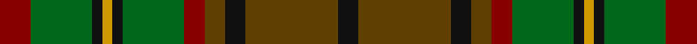

This page is one **sett** — a single exact thread-count. It belongs to the [tartan](/tartans/dr3g6k1dy1k1g6dr2t2k2t9k2/)
(the same proportion at any scale), whose colour order is pattern [KGKGRGKYKGR](/stripes/kgkgrgkykgr/).

Sourced from tartans-authority.  It is a [11 stripe tartan](/stripes/stripes11/).

Original link http://www.tartansauthority.com/tartan-ferret/display/1477/

## Thread count
DR/12 G24 K4 DY4 K4 G24 DR8 T8 K8 T36 K/8

## Palette
Each colour and the base-6 reference it is a variant of.

| Colour | Shade | Base |
|---|---|---|
| DR | <code style="background-color:#880000;">#880000</code> `oklch(39.4% 0.162 29.2)` <small>#880000</small> | R <code style="background-color:#CC0000;">#CC0000</code> |
| DY | <code style="background-color:#D09800;">#D09800</code> `oklch(71.4% 0.147 82.1)` <small>#D09800</small> | Y <code style="background-color:#F2BF00;">#F2BF00</code> |
| G | <code style="background-color:#006818;">#006818</code> `oklch(45.0% 0.142 145.0)` <small>#006818</small> | G <code style="background-color:#006100;">#006100</code> |
| K | <code style="background-color:#101010;">#101010</code> `oklch(17.3% 0.000 89.9)` <small>#101010</small> | K <code style="background-color:#000000;">#000000</code> |
| T | <code style="background-color:#604000;">#604000</code> `oklch(39.8% 0.083 76.8)` <small>#604000</small> | G <code style="background-color:#006100;">#006100</code> |

## Nearest tartans

The nearest existing variants by ΔTartan distance, with this tartan at the top so the swatches line up against it.

ΔTartan

Tartan

Sett

—

<a href="/ttd/edit/#slug=r3g6k1lo1k1g6r2dy2k2dy9k2~x4">MacAart (Personal)</a> <a class="nn-out" href="/setts/s11/r3g6k1lo1k1g6r2dy2k2dy9k2~x4/" title="open its dictionary page">↗</a>

0.45

<a href="/ttd/edit/#slug=dy9k2dy2r2g6k1lo1k1g6r3~x4">MacAart (Personal)</a> <a class="nn-out" href="/setts/s10/dy9k2dy2r2g6k1lo1k1g6r3~x4/" title="open its dictionary page">↗</a>

0.83

<a href="/ttd/edit/#slug=dy9k2dy2r2g6k1ly1k1g6r3~x2">MacAart Family Tartan Tartan Number: 1477. Earliest known date: pre 2003 Restricted See products available Copyright © Blair Urquhart, Comrie, 2015</a> <a class="nn-out" href="/setts/s10/dy9k2dy2r2g6k1ly1k1g6r3~x2/" title="open its dictionary page">↗</a>

0.90

<a href="/ttd/edit/#slug=k3r7k4dy7r3dy7k4dg3k3dg19k2dg2k2r3~x2">Anderson (Coulson Bonner #1)</a> <a class="nn-out" href="/setts/s14/k3r7k4dy7r3dy7k4dg3k3dg19k2dg2k2r3~x2/" title="open its dictionary page">↗</a>

0.97

<a href="/ttd/edit/#slug=k3r9k4dy9y3dy9k4g26k2y3~x2">Cavan, County</a> <a class="nn-out" href="/setts/s10/k3r9k4dy9y3dy9k4g26k2y3~x2/" title="open its dictionary page">↗</a>

1.08

<a href="/ttd/edit/#slug=dg10dp2dg3r4dg13k13r2g13r4g3r2g10~x2">MacDonald of Denovan Htg (Clan)</a> <a class="nn-out" href="/setts/s12/dg10dp2dg3r4dg13k13r2g13r4g3r2g10~x2/" title="open its dictionary page">↗</a>

1.18

<a href="/ttd/edit/#slug=do10r4do4r4do20k20r3g20r4g4lo4~x2">Cameron of Erracht (WCWM)</a> <a class="nn-out" href="/setts/s11/do10r4do4r4do20k20r3g20r4g4lo4~x2/" title="open its dictionary page">↗</a>

1.24

<a href="/ttd/edit/#slug=dt12dy2ly2dy2dt2dy10g10dy3g12dy10dt11r2ly2~x2">MacVicker (Name)</a> <a class="nn-out" href="/setts/s13/dt12dy2ly2dy2dt2dy10g10dy3g12dy10dt11r2ly2~x2/" title="open its dictionary page">↗</a>

1.27

<a href="/ttd/edit/#slug=dy16r16lr3dg16o2r1o2dy6r2~x4">Henry, W. A.</a> <a class="nn-out" href="/setts/s9/dy16r16lr3dg16o2r1o2dy6r2~x4/" title="open its dictionary page">↗</a>

1.29

<a href="/ttd/edit/#slug=r2dy1dg9y1dy2y6g2y1~x4">Tomass</a> <a class="nn-out" href="/setts/s8/r2dy1dg9y1dy2y6g2y1~x4/" title="open its dictionary page">↗</a>

1.29

<a href="/ttd/edit/#slug=dg6r1dg1r4g4r4dg1r1dg6o2g2y4~x8">Maple Leaf</a> <a class="nn-out" href="/setts/s12/dg6r1dg1r4g4r4dg1r1dg6o2g2y4~x8/" title="open its dictionary page">↗</a>

## Neighbour map

Every grey dot is one of 14299 variants placed by the first two principal components of the ΔTartan feature space (44% of its variance). Red is this tartan; blue dots are its nearest — click one to open its page.

<svg viewBox="0 0 640 380" role="img" style="max-width:100%;height:auto;border:1px solid #e0e0e0;border-radius:4px;display:block" xmlns="http://www.w3.org/2000/svg"><image href="/nn/cloud.v1.png" width="640" height="380"/><a href="/setts/s10/dy9k2dy2r2g6k1lo1k1g6r3~x4/"><circle cx="217.3" cy="216.0" r="4" fill="#3465a4"><title>MacAart (Personal)</title></circle></a><a href="/setts/s10/dy9k2dy2r2g6k1ly1k1g6r3~x2/"><circle cx="190.5" cy="198.7" r="4" fill="#3465a4"><title>MacAart Family Tartan Tartan Number: 1477. Earliest known date: pre 2003 Restricted See products available Copyright © Blair Urquhart, Comrie, 2015</title></circle></a><a href="/setts/s14/k3r7k4dy7r3dy7k4dg3k3dg19k2dg2k2r3~x2/"><circle cx="190.1" cy="186.6" r="4" fill="#3465a4"><title>Anderson (Coulson Bonner #1)</title></circle></a><a href="/setts/s10/k3r9k4dy9y3dy9k4g26k2y3~x2/"><circle cx="206.6" cy="176.5" r="4" fill="#3465a4"><title>Cavan, County</title></circle></a><a href="/setts/s12/dg10dp2dg3r4dg13k13r2g13r4g3r2g10~x2/"><circle cx="149.0" cy="217.0" r="4" fill="#3465a4"><title>MacDonald of Denovan Htg (Clan)</title></circle></a><a href="/setts/s11/do10r4do4r4do20k20r3g20r4g4lo4~x2/"><circle cx="167.7" cy="205.6" r="4" fill="#3465a4"><title>Cameron of Erracht (WCWM)</title></circle></a><a href="/setts/s13/dt12dy2ly2dy2dt2dy10g10dy3g12dy10dt11r2ly2~x2/"><circle cx="164.8" cy="218.2" r="4" fill="#3465a4"><title>MacVicker (Name)</title></circle></a><a href="/setts/s9/dy16r16lr3dg16o2r1o2dy6r2~x4/"><circle cx="238.0" cy="182.9" r="4" fill="#3465a4"><title>Henry, W. A.</title></circle></a><a href="/setts/s8/r2dy1dg9y1dy2y6g2y1~x4/"><circle cx="234.2" cy="220.5" r="4" fill="#3465a4"><title>Tomass</title></circle></a><a href="/setts/s12/dg6r1dg1r4g4r4dg1r1dg6o2g2y4~x8/"><circle cx="158.8" cy="224.8" r="4" fill="#3465a4"><title>Maple Leaf</title></circle></a><circle cx="195.0" cy="207.6" r="5" fill="#c00000"/></svg>

ID: /setts/s11/r3g6k1lo1k1g6r2dy2k2dy9k2~x4/
