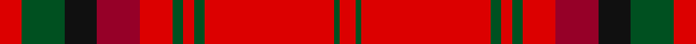

In pattern [RGKRRGRGRGR](/stripes/rgkrrgrgrgr/).

This was sourced from register-of-tartans.  It is a [11 stripe tartan](/stripes/stripes11/).

Original link https://www.tartanregister.gov.uk/tartanDetails.aspx?ref=2401

## Also known as

This cloth is also recorded under:

- MacDougall #8

## Register references

External register numbers recorded for this tartan.

- Scottish Register of Tartans: [2401](https://www.tartanregister.gov.uk/tartanDetails.aspx?ref=2401)
- Scottish Tartans World Register: 1471

## Thread count
R/8 G16 K12 DR16 R12 G4 R4 G4 R48 G2 R/6

## Palette
Each colour and the base-6 reference it is a variant of.

| Colour | Shade | Base |
|---|---|---|
| DR | <code style="background-color:#960028;">#960028</code> `oklch(42.7% 0.171 18.3)` <small>#960028</small> | R <code style="background-color:#CC0000;">#CC0000</code> |
| G | <code style="background-color:#005020;">#005020</code> `oklch(37.7% 0.105 149.6)` <small>#005020</small> | G <code style="background-color:#006100;">#006100</code> |
| K | <code style="background-color:#101010;">#101010</code> `oklch(17.3% 0.000 89.9)` <small>#101010</small> | K <code style="background-color:#000000;">#000000</code> |
| R | <code style="background-color:#DC0000;">#DC0000</code> `oklch(56.2% 0.230 29.2)` <small>#DC0000</small> | R <code style="background-color:#CC0000;">#CC0000</code> |

## Nearest tartans

The nearest existing variants by ΔTartan distance.

1. [MacDougal 3](/setts/s11/r4g8k6r8r6g2r2g2r24g1r3~x2/) — ΔT 0.72
1. [Virginia Tech (Corporate)](/setts/s10/r6lo2r36lo18r2lo4r2lo6w3db4~x2/) — ΔT 0.95
1. [Virginia Tech](/setts/s10/r6lo2r32lo15r2lo3r2lo6w3db4~x2/) — ΔT 0.97
1. [MacDonell of Keppoch](/setts/s10/dg2r2db1r24t1db6r3dg12r4db1~x2/) — ΔT 1.02
1. [Chisholm D](/setts/s10/r6lb1r24dp6dg2dp1dg2dp1dg12r1/) — ΔT 1.12
1. [Buccleuch](/setts/s7/r107k9r5dp41r5g51r14/) — ΔT 1.12
1. [MacDougal 4](/setts/s11/p4g8db6p8r6g2r2g2r24g1r3~x2/) — ΔT 1.16
1. [Griffiths (Welsh Name)](/setts/s11/lo4r37db17r4db8r6do2r5db2r3lo4/) — ΔT 1.19
1. [Cameron of Locheil](/setts/s13/db4r1db1r18db10r1dg1r6dg10r6w1r4db1~x2/) — ΔT 1.21
1. [Morgan (Welsh Name)](/setts/s11/r4r34do20r4do8r6ly2r5do2r3r4/) — ΔT 1.22

## Neighbour map

Every grey dot is one of 14299 variants placed by the first two principal components of the ΔTartan feature space (44% of its variance). Red is this tartan; blue dots are its nearest — click one to open its page.

<svg viewBox="0 0 640 380" role="img" style="max-width:100%;height:auto;border:1px solid #e0e0e0;border-radius:4px;display:block" xmlns="http://www.w3.org/2000/svg"><image href="/nn/cloud.v1.png" width="640" height="380"/><a href="/setts/s11/r4g8k6r8r6g2r2g2r24g1r3~x2/"><circle cx="359.6" cy="127.4" r="4" fill="#3465a4"><title>MacDougal 3</title></circle></a><a href="/setts/s10/r6lo2r36lo18r2lo4r2lo6w3db4~x2/"><circle cx="377.4" cy="132.1" r="4" fill="#3465a4"><title>Virginia Tech (Corporate)</title></circle></a><a href="/setts/s10/r6lo2r32lo15r2lo3r2lo6w3db4~x2/"><circle cx="369.8" cy="138.0" r="4" fill="#3465a4"><title>Virginia Tech</title></circle></a><a href="/setts/s10/dg2r2db1r24t1db6r3dg12r4db1~x2/"><circle cx="400.5" cy="130.5" r="4" fill="#3465a4"><title>MacDonell of Keppoch</title></circle></a><a href="/setts/s10/r6lb1r24dp6dg2dp1dg2dp1dg12r1/"><circle cx="373.1" cy="125.5" r="4" fill="#3465a4"><title>Chisholm D</title></circle></a><a href="/setts/s7/r107k9r5dp41r5g51r14/"><circle cx="363.9" cy="153.0" r="4" fill="#3465a4"><title>Buccleuch</title></circle></a><a href="/setts/s11/p4g8db6p8r6g2r2g2r24g1r3~x2/"><circle cx="342.9" cy="137.3" r="4" fill="#3465a4"><title>MacDougal 4</title></circle></a><a href="/setts/s11/lo4r37db17r4db8r6do2r5db2r3lo4/"><circle cx="389.8" cy="132.2" r="4" fill="#3465a4"><title>Griffiths (Welsh Name)</title></circle></a><a href="/setts/s13/db4r1db1r18db10r1dg1r6dg10r6w1r4db1~x2/"><circle cx="337.4" cy="133.8" r="4" fill="#3465a4"><title>Cameron of Locheil</title></circle></a><a href="/setts/s11/r4r34do20r4do8r6ly2r5do2r3r4/"><circle cx="401.3" cy="152.1" r="4" fill="#3465a4"><title>Morgan (Welsh Name)</title></circle></a><circle cx="376.7" cy="131.1" r="5" fill="#c00000"/></svg>

ID: /setts/s11/r4dg8k6r8r6dg2r2dg2r24dg1r3~x2/
