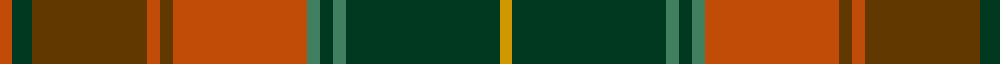

In pattern [RGGRGRGGGGY](/patterns/rggrgrggggy/).

This was sourced from tartans-authority.  It is a [11 stripes tartan](/stripes/stripes11/).

Original link http://www.tartansauthority.com/tartan-ferret/display/11092/

## Thread count
DO/4 DG6 T36 DO4 T4 DO42 G4 DG4 G4 DG48 DY/4

## Palette
Each colour and its ΔE from the base-6 reference it is a variant of.

| Colour | Shade | Base | ΔE (OKLab) |
|---|---|---|---|
| DG | <code style="background-color:#003820;">#003820</code> `#003820` | G <code style="background-color:#006100;">#006100</code> | 0.15 |
| DO | <code style="background-color:#C04C08;">#C04C08</code> `#C04C08` | R <code style="background-color:#CC0000;">#CC0000</code> | 0.08 |
| DY | <code style="background-color:#D09800;">#D09800</code> `#D09800` | Y <code style="background-color:#F2BF00;">#F2BF00</code> | 0.12 |
| G | <code style="background-color:#408060;">#408060</code> `#408060` | G <code style="background-color:#006100;">#006100</code> | 0.14 |
| T | <code style="background-color:#603800;">#603800</code> `#603800` | G <code style="background-color:#006100;">#006100</code> | 0.16 |

## Nearest tartans

The nearest existing variants by ΔTartan distance.

1. [Prince Edward Island District Tartan Tartan Number: 918. Earliest known date: 1964 The warmth and glow of the fertile soil, The green field and tree, The yellow and the brown of Autumn, The white of surf or a summer snow, Rust, green, yellow and white, Yes! That's our Island Tartan. See products available Copyright © Blair Urquhart, Comrie, 2015](/setts/s15/g32ga2g4ga2g4ga24r24ga2y4ga2r24ga24g24ga2w4-g006818-ga604000-ra00048-we0e0e0-ye8c000/) — ΔT 1.03
1. [Cavan, County](/setts/s10/g6k4ga52k8gb18g6gb18k8r18k6-g8c7038-ga006818-gb604000-k101010-rc80000/) — ΔT 1.06
1. [Methven](/setts/s11/r4g6ga36r4ga4r42gb12g4gb4g48y4-g003820-ga503c14-gb5c6428-rb03000-yc88c00/) — ΔT 1.08
1. [Harmony 5](/setts/s12/g18r6g8ga6g6ga8g6b22ra60r6ra8g6-b840068-g005020-ga503c14-rc82828-rabe7832/) — ΔT 1.09
1. [Henry, W. A.](/setts/s9/g64r64y12ga64ra8r4ra8g24r8-g484800-ga004c00-r9c0030-ra9c8000-yb0b0b0/) — ΔT 1.12
1. [McCall (Name)](/setts/s15/r16k10r16g54r16w4r6g6r6w4r16ra54r16ra6r6-g408060-k101010-r880000-ra906000-we0e0e0/) — ΔT 1.16
1. [Dorcas](/setts/s12/g8y4g4y6g40k12b8k4b4k4b32r6-b4c3428-g8c7038-k101010-re86000-yb8b8b8/) — ΔT 1.19
1. [Brousseau (Personal)](/setts/s9/y50r4w4b4w4r26g56b4r6-b141e46-g703200-ra52b05-we0e0e0-y96963c/) — ΔT 1.22
1. [Glen Nevis #2 (Personal)](/setts/s12/g56y4g4y4g8k12g12k12b12ba4b36y4-b4c3428-ba441800-g8c7038-k101010-ydc943c/) — ΔT 1.22
1. [Prince Edward Island](/setts/s15/g32r2g4r2g4r24ra24r2y4r2ra24r24g24r2w4-g008000-r806050-ra900030-we0e0e0-yf0c000/) — ΔT 1.26

## Neighbour map

Every grey dot is one of 15726 variants placed by the first two principal components of the ΔTartan feature space (44% of its variance). Red is this tartan; blue dots are its nearest — click one to open its page.

<svg viewBox="0 0 640 380" role="img" style="max-width:100%;height:auto;border:1px solid #e0e0e0;border-radius:4px;display:block" xmlns="http://www.w3.org/2000/svg"><image href="/nn/cloud.v1.png" width="640" height="380"/><a href="/setts/s15/g32ga2g4ga2g4ga24r24ga2y4ga2r24ga24g24ga2w4-g006818-ga604000-ra00048-we0e0e0-ye8c000/"><circle cx="229.1" cy="145.4" r="4" fill="#3465a4"><title>Prince Edward Island District Tartan Tartan Number: 918. Earliest known date: 1964 The warmth and glow of the fertile soil, The green field and tree, The yellow and the brown of Autumn, The white of surf or a summer snow, Rust, green, yellow and white, Yes! That's our Island Tartan. See products available Copyright © Blair Urquhart, Comrie, 2015</title></circle></a><a href="/setts/s10/g6k4ga52k8gb18g6gb18k8r18k6-g8c7038-ga006818-gb604000-k101010-rc80000/"><circle cx="202.3" cy="170.9" r="4" fill="#3465a4"><title>Cavan, County</title></circle></a><a href="/setts/s11/r4g6ga36r4ga4r42gb12g4gb4g48y4-g003820-ga503c14-gb5c6428-rb03000-yc88c00/"><circle cx="247.1" cy="171.9" r="4" fill="#3465a4"><title>Methven</title></circle></a><a href="/setts/s12/g18r6g8ga6g6ga8g6b22ra60r6ra8g6-b840068-g005020-ga503c14-rc82828-rabe7832/"><circle cx="231.4" cy="146.8" r="4" fill="#3465a4"><title>Harmony 5</title></circle></a><a href="/setts/s9/g64r64y12ga64ra8r4ra8g24r8-g484800-ga004c00-r9c0030-ra9c8000-yb0b0b0/"><circle cx="234.3" cy="176.5" r="4" fill="#3465a4"><title>Henry, W. A.</title></circle></a><a href="/setts/s15/r16k10r16g54r16w4r6g6r6w4r16ra54r16ra6r6-g408060-k101010-r880000-ra906000-we0e0e0/"><circle cx="244.3" cy="140.7" r="4" fill="#3465a4"><title>McCall (Name)</title></circle></a><a href="/setts/s12/g8y4g4y6g40k12b8k4b4k4b32r6-b4c3428-g8c7038-k101010-re86000-yb8b8b8/"><circle cx="205.0" cy="151.0" r="4" fill="#3465a4"><title>Dorcas</title></circle></a><a href="/setts/s9/y50r4w4b4w4r26g56b4r6-b141e46-g703200-ra52b05-we0e0e0-y96963c/"><circle cx="222.4" cy="141.8" r="4" fill="#3465a4"><title>Brousseau (Personal)</title></circle></a><a href="/setts/s12/g56y4g4y4g8k12g12k12b12ba4b36y4-b4c3428-ba441800-g8c7038-k101010-ydc943c/"><circle cx="272.0" cy="142.8" r="4" fill="#3465a4"><title>Glen Nevis #2 (Personal)</title></circle></a><a href="/setts/s15/g32r2g4r2g4r24ra24r2y4r2ra24r24g24r2w4-g008000-r806050-ra900030-we0e0e0-yf0c000/"><circle cx="221.4" cy="141.0" r="4" fill="#3465a4"><title>Prince Edward Island</title></circle></a><circle cx="238.4" cy="153.9" r="5" fill="#c00000"/></svg>

ID: /setts/s11/r4g6ga36r4ga4r42gb4g4gb4g48y4-g003820-ga603800-gb408060-rc04c08-yd09800/
