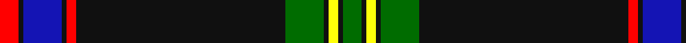

This page is one **sett** — a single exact thread-count. It belongs to the [tartan](/tartans/r4k1b8k1r2k44g8k1y2k1g4/)
(the same proportion at any scale), whose colour order is pattern [GKYKGKRKBKR](/stripes/gkykgkrkbkr/).

Sourced from register-of-tartans.  It is a [11 stripe tartan](/stripes/stripes11/).

Original link https://www.tartanregister.gov.uk/tartanDetails.aspx?ref=10585

## Register references

External register numbers recorded for this tartan.

- Scottish Register of Tartans: [10585](https://www.tartanregister.gov.uk/tartanDetails.aspx?ref=10585)

## Thread count
R/8 K2 B16 K2 R4 K88 G16 K2 Y4 K2 G/8

## Palette
Each colour and the base-6 reference it is a variant of.

| Colour | Shade | Base |
|---|---|---|
| B | <code style="background-color:#1414B4;">#1414B4</code> `oklch(36.5% 0.229 267.2)` <small>#1414B4</small> | B <code style="background-color:#2A418A;">#2A418A</code> |
| G | <code style="background-color:#006C00;">#006C00</code> `oklch(46.0% 0.157 142.5)` <small>#006C00</small> | G <code style="background-color:#006100;">#006100</code> |
| K | <code style="background-color:#101010;">#101010</code> `oklch(17.3% 0.000 89.9)` <small>#101010</small> | K <code style="background-color:#000000;">#000000</code> |
| R | <code style="background-color:#FF0000;">#FF0000</code> `oklch(62.8% 0.258 29.2)` <small>#FF0000</small> | R <code style="background-color:#CC0000;">#CC0000</code> |
| Y | <code style="background-color:#FFFF0A;">#FFFF0A</code> `oklch(96.8% 0.210 109.8)` <small>#FFFF0A</small> | Y <code style="background-color:#F2BF00;">#F2BF00</code> |

## Nearest tartans

The nearest existing variants by ΔTartan distance, with this tartan at the top so the swatches line up against it.

ΔTartan

Tartan

Sett

—

<a href="/ttd/edit/#slug=r4k1db8k1r2k44g8k1ly2k1g4~x2">Marsa Scout Group</a> <a class="nn-out" href="/setts/s11/r4k1db8k1r2k44g8k1ly2k1g4~x2/" title="open its dictionary page">↗</a>

0.72

<a href="/ttd/edit/#slug=r4k1k1db8r2k44g8k1ly2k1g4~x2">Marsa Scout Group</a> <a class="nn-out" href="/setts/s11/r4k1k1db8r2k44g8k1ly2k1g4~x2/" title="open its dictionary page">↗</a>

0.84

<a href="/ttd/edit/#slug=k86n6k4lb3k3r3k3n22o14k3o6lb4">Langtree</a> <a class="nn-out" href="/setts/s12/k86n6k4lb3k3r3k3n22o14k3o6lb4/" title="open its dictionary page">↗</a>

0.90

<a href="/ttd/edit/#slug=k86o6k4w3k3r3k3o22lo14k3lo6w4">Langtree Trade Tartan Tartan Number: 1131. Earliest known date: pre 2003 A Stewart colour variation marketed by Selfridge's, London and apparently designed and woven by Pendleton Woolen Mills of Oregon. See products available Copyright © Blair Urquhart, Comrie, 2015</a> <a class="nn-out" href="/setts/s12/k86o6k4w3k3r3k3o22lo14k3lo6w4/" title="open its dictionary page">↗</a>

0.97

<a href="/ttd/edit/#slug=lb4n6k4r2r10k44n1k1lb2~x2">Calgary HOG (Corporate)</a> <a class="nn-out" href="/setts/s9/lb4n6k4r2r10k44n1k1lb2~x2/" title="open its dictionary page">↗</a>

1.05

<a href="/ttd/edit/#slug=k3lo3k3lo3k3lo3k3lo3k36w1k2dt9r2dt1~x2">Goldwire (2015)</a> <a class="nn-out" href="/setts/s14/k3lo3k3lo3k3lo3k3lo3k36w1k2dt9r2dt1~x2/" title="open its dictionary page">↗</a>

1.09

<a href="/ttd/edit/#slug=k53b3k2w1k2b3k5b32ly1r3~x2">Estonian National Tartan (District)</a> <a class="nn-out" href="/setts/s10/k53b3k2w1k2b3k5b32ly1r3~x2/" title="open its dictionary page">↗</a>

1.18

<a href="/ttd/edit/#slug=r5k1w3k6n5k2ly3k45n4k2ly3~x2">Williams Dress (Personal)</a> <a class="nn-out" href="/setts/s11/r5k1w3k6n5k2ly3k45n4k2ly3~x2/" title="open its dictionary page">↗</a>

1.21

<a href="/ttd/edit/#slug=r4k2w6k2db40k80dg10w6r3">Italian American</a> <a class="nn-out" href="/setts/s9/r4k2w6k2db40k80dg10w6r3/" title="open its dictionary page">↗</a>

1.23

<a href="/ttd/edit/#slug=k86y6k4w3k3r3k3y22o14k3o6w4">Langtree</a> <a class="nn-out" href="/setts/s12/k86y6k4w3k3r3k3y22o14k3o6w4/" title="open its dictionary page">↗</a>

1.26

<a href="/ttd/edit/#slug=lr2k1r5n3o12n4lr1k40b1~x2">Montgomerie, Colin</a> <a class="nn-out" href="/setts/s9/lr2k1r5n3o12n4lr1k40b1~x2/" title="open its dictionary page">↗</a>

## Neighbour map

Every grey dot is one of 14299 variants placed by the first two principal components of the ΔTartan feature space (44% of its variance). Red is this tartan; blue dots are its nearest — click one to open its page.

<svg viewBox="0 0 640 380" role="img" style="max-width:100%;height:auto;border:1px solid #e0e0e0;border-radius:4px;display:block" xmlns="http://www.w3.org/2000/svg"><image href="/nn/cloud.v1.png" width="640" height="380"/><a href="/setts/s11/r4k1k1db8r2k44g8k1ly2k1g4~x2/"><circle cx="421.0" cy="84.2" r="4" fill="#3465a4"><title>Marsa Scout Group</title></circle></a><a href="/setts/s12/k86n6k4lb3k3r3k3n22o14k3o6lb4/"><circle cx="396.7" cy="88.5" r="4" fill="#3465a4"><title>Langtree</title></circle></a><a href="/setts/s12/k86o6k4w3k3r3k3o22lo14k3lo6w4/"><circle cx="375.5" cy="76.5" r="4" fill="#3465a4"><title>Langtree Trade Tartan Tartan Number: 1131. Earliest known date: pre 2003 A Stewart colour variation marketed by Selfridge's, London and apparently designed and woven by Pendleton Woolen Mills of Oregon. See products available Copyright © Blair Urquhart, Comrie, 2015</title></circle></a><a href="/setts/s9/lb4n6k4r2r10k44n1k1lb2~x2/"><circle cx="430.8" cy="88.9" r="4" fill="#3465a4"><title>Calgary HOG (Corporate)</title></circle></a><a href="/setts/s14/k3lo3k3lo3k3lo3k3lo3k36w1k2dt9r2dt1~x2/"><circle cx="425.6" cy="78.1" r="4" fill="#3465a4"><title>Goldwire (2015)</title></circle></a><a href="/setts/s10/k53b3k2w1k2b3k5b32ly1r3~x2/"><circle cx="409.6" cy="86.1" r="4" fill="#3465a4"><title>Estonian National Tartan (District)</title></circle></a><a href="/setts/s11/r5k1w3k6n5k2ly3k45n4k2ly3~x2/"><circle cx="445.7" cy="69.0" r="4" fill="#3465a4"><title>Williams Dress (Personal)</title></circle></a><a href="/setts/s9/r4k2w6k2db40k80dg10w6r3/"><circle cx="341.6" cy="97.0" r="4" fill="#3465a4"><title>Italian American</title></circle></a><a href="/setts/s12/k86y6k4w3k3r3k3y22o14k3o6w4/"><circle cx="366.6" cy="77.0" r="4" fill="#3465a4"><title>Langtree</title></circle></a><a href="/setts/s9/lr2k1r5n3o12n4lr1k40b1~x2/"><circle cx="356.8" cy="74.9" r="4" fill="#3465a4"><title>Montgomerie, Colin</title></circle></a><circle cx="399.7" cy="73.6" r="5" fill="#c00000"/></svg>

ID: /setts/s11/r4k1db8k1r2k44g8k1ly2k1g4~x2/
