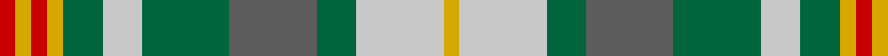

In pattern [RYRYGWGBGWY](/patterns/ryrygwgbgwy/).

This was sourced from register-of-tartans.  It is a [11 stripes tartan](/stripes/stripes11/).

Original link https://www.tartanregister.gov.uk/tartanDetails.aspx?ref=10808

## Thread count
R/4 Y4 R4 Y4 G10 Na10 G22 N22 G10 Na22 Y/4

## Palette
Each colour and its ΔE from the base-6 reference it is a variant of.

| Colour | Shade | Base | ΔE (OKLab) |
|---|---|---|---|
| G | <code style="background-color:#00643C;">#00643C</code> `#00643C` | G <code style="background-color:#006400;">#006400</code> | 0.06 |
| N | <code style="background-color:#5C5C5C;">#5C5C5C</code> `#5C5C5C` | B <code style="background-color:#2C4084;">#2C4084</code> | 0.14 |
| Na | <code style="background-color:#C8C8C8;">#C8C8C8</code> `#C8C8C8` | W <code style="background-color:#F4F4F0;">#F4F4F0</code> | 0.13 |
| R | <code style="background-color:#C80000;">#C80000</code> `#C80000` | R <code style="background-color:#C80000;">#C80000</code> | 0.00 |
| Y | <code style="background-color:#D4A800;">#D4A800</code> `#D4A800` | Y <code style="background-color:#E8C000;">#E8C000</code> | 0.07 |

## Nearest tartans

The nearest existing variants by ΔTartan distance.

1. [Fraser hunting, dress](/setts/s11/b8r48g34r6w36r6w36r6g34r48ra8-b304080-g008000-r806050-rac00000-we0e0e0/) — ΔT 0.97
1. [Toorak Chapler (Fashion)](/setts/s9/g18y6w6g6y6g18w18ya36r6-g604000-r880000-wc0c0c0-ya08858-yac4bc68/) — ΔT 1.05
1. [Vassseur Mignon ({Personal)](/setts/s11/r4y4r4y4g10ra10g22b22g10ra22y4-b5c5c5c-g006818-rc80000-ra888888-yfccc00/) — ΔT 1.11
1. [Equorian Olympic](/setts/s8/b2g1r1ga6w3r3r1g1-b2c4084-g808080-ga003c14-rbe7832-wf5dca0/) — ΔT 1.12
1. [Rotary Corporate Tartan Tartan Number: 2334. Earliest known date: 1996 March 1996. Check colours. Sample in STA Johnston Collection. Woven by Lochcarron of Scotland. STS entry says that it was launched at the Rotary World Convention, Glasgow, 1997 and indicates that it was designed by the Tartans Society (Keith Lumsden) for Rotary International. A counter claim suggests that Geoffrey (Tailor) was the designer. He's certainly the official supplier and can be contacted on 0131 557 0256 - 17.9.04 - "only polyviscose left and when that's finished, they won't be stocking any more." See products available Copyright © Blair Urquhart, Comrie, 2015](/setts/s12/b8y4g30r16ba30r6g30r6ba30r16g30y4-b202060-ba2888c4-g006818-rc80000-yd8b000/) — ΔT 1.20
1. [Muirhead (Clan)](/setts/s11/y6g28ga18b8ga16w4ga24r24ga4r10w4-b1c0070-g006818-ga408060-rc80000-we0e0e0-ye8c000/) — ΔT 1.24
1. [Wilson's No.179](/setts/s8/g24y4r4b8r8b8r4y4-b2888c4-g006818-rc80000-ye8c000/) — ΔT 1.26
1. [Toorak Chapler](/setts/s9/b18r6y6b6r18b18y18ya36ba6-b3d3134-ba72393f-ra58065-yafb8bb-yaf5d38b/) — ΔT 1.27
1. [Niagara Falls](/setts/s12/b44g8b8g34r34g34b8g8b44y16r16ra16-b304080-g008000-r806050-rac00000-yf0c000/) — ΔT 1.28
1. [Northern College](/setts/s10/g10b6ba6g10w8y3ba2y3b2r2-b304080-ba5480b0-g008000-rc00000-we0e0e0-yf0c000/) — ΔT 1.31

## Neighbour map

Every grey dot is one of 15726 variants placed by the first two principal components of the ΔTartan feature space (44% of its variance). Red is this tartan; blue dots are its nearest — click one to open its page.

<svg viewBox="0 0 640 380" role="img" style="max-width:100%;height:auto;border:1px solid #e0e0e0;border-radius:4px;display:block" xmlns="http://www.w3.org/2000/svg"><image href="/nn/cloud.v1.png" width="640" height="380"/><a href="/setts/s11/b8r48g34r6w36r6w36r6g34r48ra8-b304080-g008000-r806050-rac00000-we0e0e0/"><circle cx="159.6" cy="180.2" r="4" fill="#3465a4"><title>Fraser hunting, dress</title></circle></a><a href="/setts/s9/g18y6w6g6y6g18w18ya36r6-g604000-r880000-wc0c0c0-ya08858-yac4bc68/"><circle cx="125.1" cy="192.5" r="4" fill="#3465a4"><title>Toorak Chapler (Fashion)</title></circle></a><a href="/setts/s11/r4y4r4y4g10ra10g22b22g10ra22y4-b5c5c5c-g006818-rc80000-ra888888-yfccc00/"><circle cx="139.9" cy="209.4" r="4" fill="#3465a4"><title>Vassseur Mignon ({Personal)</title></circle></a><a href="/setts/s8/b2g1r1ga6w3r3r1g1-b2c4084-g808080-ga003c14-rbe7832-wf5dca0/"><circle cx="93.3" cy="194.5" r="4" fill="#3465a4"><title>Equorian Olympic</title></circle></a><a href="/setts/s12/b8y4g30r16ba30r6g30r6ba30r16g30y4-b202060-ba2888c4-g006818-rc80000-yd8b000/"><circle cx="167.6" cy="196.9" r="4" fill="#3465a4"><title>Rotary Corporate Tartan Tartan Number: 2334. Earliest known date: 1996 March 1996. Check colours. Sample in STA Johnston Collection. Woven by Lochcarron of Scotland. STS entry says that it was launched at the Rotary World Convention, Glasgow, 1997 and indicates that it was designed by the Tartans Society (Keith Lumsden) for Rotary International. A counter claim suggests that Geoffrey (Tailor) was the designer. He's certainly the official supplier and can be contacted on 0131 557 0256 - 17.9.04 - &quot;only polyviscose left and when that's finished, they won't be stocking any more.&quot; See products available Copyright © Blair Urquhart, Comrie, 2015</title></circle></a><a href="/setts/s11/y6g28ga18b8ga16w4ga24r24ga4r10w4-b1c0070-g006818-ga408060-rc80000-we0e0e0-ye8c000/"><circle cx="136.8" cy="180.9" r="4" fill="#3465a4"><title>Muirhead (Clan)</title></circle></a><a href="/setts/s8/g24y4r4b8r8b8r4y4-b2888c4-g006818-rc80000-ye8c000/"><circle cx="160.0" cy="211.9" r="4" fill="#3465a4"><title>Wilson's No.179</title></circle></a><a href="/setts/s9/b18r6y6b6r18b18y18ya36ba6-b3d3134-ba72393f-ra58065-yafb8bb-yaf5d38b/"><circle cx="77.5" cy="190.6" r="4" fill="#3465a4"><title>Toorak Chapler</title></circle></a><a href="/setts/s12/b44g8b8g34r34g34b8g8b44y16r16ra16-b304080-g008000-r806050-rac00000-yf0c000/"><circle cx="138.7" cy="215.7" r="4" fill="#3465a4"><title>Niagara Falls</title></circle></a><a href="/setts/s10/g10b6ba6g10w8y3ba2y3b2r2-b304080-ba5480b0-g008000-rc00000-we0e0e0-yf0c000/"><circle cx="61.5" cy="192.9" r="4" fill="#3465a4"><title>Northern College</title></circle></a><circle cx="112.1" cy="194.1" r="5" fill="#c00000"/></svg>

ID: /setts/s11/r4y4r4y4g10w10g22b22g10w22y4-b5c5c5c-g00643c-rc80000-wc8c8c8-yd4a800/
