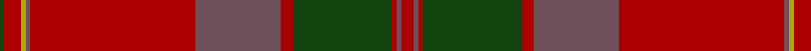

In pattern [GRYBRBRGRBR](/patterns/grybrbrgrbr/).

This was sourced from weddslist.  It is a [11 stripes tartan](/stripes/stripes11/).

Original link http://www.weddslist.com/cgi-bin/tartans/pg.pl?source=x

## Thread count
DG/2 DR7 LG2 N2 DR70 N36 DR5 DG42 DR2 N2 DR/5

## Palette
Each colour and its ΔE from the base-6 reference it is a variant of.

| Colour | Shade | Base | ΔE (OKLab) |
|---|---|---|---|
| DG | <code style="background-color:#11450D;">#11450D</code> `#11450D` | G <code style="background-color:#006400;">#006400</code> | 0.10 |
| DR | <code style="background-color:#AA0000;">#AA0000</code> `#AA0000` | R <code style="background-color:#C80000;">#C80000</code> | 0.06 |
| LG | <code style="background-color:#AAAA00;">#AAAA00</code> `#AAAA00` | Y <code style="background-color:#E8C000;">#E8C000</code> | 0.11 |
| N | <code style="background-color:#6E5058;">#6E5058</code> `#6E5058` | B <code style="background-color:#2C4084;">#2C4084</code> | 0.14 |

## Nearest tartans

The nearest existing variants by ΔTartan distance.

1. [MacPherson Of Cluny](/setts/s11/r10b4r4g84r10b72r140b4y4r14g4-b6e5058-g11450d-raa0000-yaaaa00/) — ΔT 0.00
1. [Chisholm D](/setts/s10/r12y2r48b12g4b2g4b2g24r2-b6e5058-g11450d-raa0000-yaaaaaa/) — ΔT 0.95
1. [Drummond of Megginch - 1997 Kilt](/setts/s15/r14b4r6g64r4g4r4b20r4w4r62b4r4b2r12-b282c39-g304f45-r983029-w98c8e8/) — ΔT 1.21
1. [Waverly, Check](/setts/s12/b88r10ra16r4ra4r4ra4r28rb18ra4rb8r4-b401000-r906030-ra703000-rb806050/) — ΔT 1.23
1. [MacDougall #5](/setts/s12/r14ra4b4r4g64r12b24r82g4r10ra4g10-b2c4084-g005020-r960028-rac82828/) — ΔT 1.30
1. [Laporte](/setts/s10/g16r12k8r128ra2k56r12g80r12k8-g5c6428-k101010-r880000-ra888888/) — ΔT 1.33
1. [Bell of Ardbel (Name)](/setts/s10/r14ra8r8ra50b2g64b8g4w4g10-b740074-g54603c-r6c2400-ra880000-wfcfcfc/) — ΔT 1.33
1. [Pride of Scotland, Silver (Fashion)](/setts/s12/b18r4b4ra4r36ra4b4b2b2b38ra66b4-b5c5c5c-r888888-rac80000/) — ΔT 1.42
1. [Bell of Ardbel (Personal)](/setts/s10/b14r8b8r50ba2g64ba8g4w4g10-b441800-ba780078-g5c6428-r901c38-wfcfcfc/) — ΔT 1.44
1. [Bell, John](/setts/s10/b14r8b8r50ba2g64ba8g4w4g10-b401000-ba800080-g505020-r802040-we0e0e0/) — ΔT 1.45

## Neighbour map

Every grey dot is one of 15726 variants placed by the first two principal components of the ΔTartan feature space (44% of its variance). Red is this tartan; blue dots are its nearest — click one to open its page.

<svg viewBox="0 0 640 380" role="img" style="max-width:100%;height:auto;border:1px solid #e0e0e0;border-radius:4px;display:block" xmlns="http://www.w3.org/2000/svg"><image href="/nn/cloud.v1.png" width="640" height="380"/><a href="/setts/s11/r10b4r4g84r10b72r140b4y4r14g4-b6e5058-g11450d-raa0000-yaaaa00/"><circle cx="418.5" cy="129.2" r="4" fill="#3465a4"><title>MacPherson Of Cluny</title></circle></a><a href="/setts/s10/r12y2r48b12g4b2g4b2g24r2-b6e5058-g11450d-raa0000-yaaaaaa/"><circle cx="417.3" cy="148.8" r="4" fill="#3465a4"><title>Chisholm D</title></circle></a><a href="/setts/s15/r14b4r6g64r4g4r4b20r4w4r62b4r4b2r12-b282c39-g304f45-r983029-w98c8e8/"><circle cx="429.9" cy="129.9" r="4" fill="#3465a4"><title>Drummond of Megginch - 1997 Kilt</title></circle></a><a href="/setts/s12/b88r10ra16r4ra4r4ra4r28rb18ra4rb8r4-b401000-r906030-ra703000-rb806050/"><circle cx="365.3" cy="144.6" r="4" fill="#3465a4"><title>Waverly, Check</title></circle></a><a href="/setts/s12/r14ra4b4r4g64r12b24r82g4r10ra4g10-b2c4084-g005020-r960028-rac82828/"><circle cx="383.2" cy="147.5" r="4" fill="#3465a4"><title>MacDougall #5</title></circle></a><a href="/setts/s10/g16r12k8r128ra2k56r12g80r12k8-g5c6428-k101010-r880000-ra888888/"><circle cx="391.7" cy="124.9" r="4" fill="#3465a4"><title>Laporte</title></circle></a><a href="/setts/s10/r14ra8r8ra50b2g64b8g4w4g10-b740074-g54603c-r6c2400-ra880000-wfcfcfc/"><circle cx="356.6" cy="135.0" r="4" fill="#3465a4"><title>Bell of Ardbel (Name)</title></circle></a><a href="/setts/s12/b18r4b4ra4r36ra4b4b2b2b38ra66b4-b5c5c5c-r888888-rac80000/"><circle cx="364.0" cy="132.6" r="4" fill="#3465a4"><title>Pride of Scotland, Silver (Fashion)</title></circle></a><a href="/setts/s10/b14r8b8r50ba2g64ba8g4w4g10-b441800-ba780078-g5c6428-r901c38-wfcfcfc/"><circle cx="335.2" cy="124.6" r="4" fill="#3465a4"><title>Bell of Ardbel (Personal)</title></circle></a><a href="/setts/s10/b14r8b8r50ba2g64ba8g4w4g10-b401000-ba800080-g505020-r802040-we0e0e0/"><circle cx="360.0" cy="138.3" r="4" fill="#3465a4"><title>Bell, John</title></circle></a><circle cx="418.5" cy="129.2" r="5" fill="#c00000"/></svg>

ID: /setts/s11/r5b2r2g42r5b36r70b2y2r7g2-b6e5058-g11450d-raa0000-yaaaa00/
