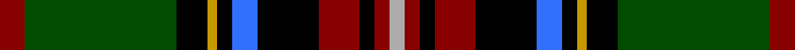

In pattern [RGKYKBKRKRY](/stripes/rgkykbkrkry/).

This was sourced from register-of-tartans.  It is a [11 stripe tartan](/stripes/stripes11/).

Original link https://www.tartanregister.gov.uk/tartanDetails.aspx?ref=1982

## Register references

External register numbers recorded for this tartan.

- Scottish Register of Tartans: [1982](https://www.tartanregister.gov.uk/tartanDetails.aspx?ref=1982)
- Scottish Tartans Authority (ITI): 5352

## Thread count
DR/10 G60 K12 DY4 K6 B10 K24 DR16 K6 DR6 N/6

## Palette
Each colour and the base-6 reference it is a variant of.

| Colour | Shade | Base |
|---|---|---|
| B | <code style="background-color:#3070FC;">#3070FC</code> `oklch(58.8% 0.219 262.9)` <small>#3070FC</small> | B <code style="background-color:#2A418A;">#2A418A</code> |
| DR | <code style="background-color:#880000;">#880000</code> `oklch(39.4% 0.162 29.2)` <small>#880000</small> | R <code style="background-color:#CC0000;">#CC0000</code> |
| DY | <code style="background-color:#C89800;">#C89800</code> `oklch(70.6% 0.144 85.9)` <small>#C89800</small> | Y <code style="background-color:#F2BF00;">#F2BF00</code> |
| G | <code style="background-color:#004C00;">#004C00</code> `oklch(36.1% 0.123 142.5)` <small>#004C00</small> | G <code style="background-color:#006100;">#006100</code> |
| K | <code style="background-color:#000000;">#000000</code> `oklch(0.0% 0.000 0.0)` <small>#000000</small> | K <code style="background-color:#000000;">#000000</code> |
| N | <code style="background-color:#ACACAC;">#ACACAC</code> `oklch(74.4% 0.000 89.9)` <small>#ACACAC</small> | Y <code style="background-color:#F2BF00;">#F2BF00</code> |

## Nearest tartans

The nearest existing variants by ΔTartan distance.

1. [Princess Diana](/setts/s12/k14r2k2r2k2g18r2g18lb1db12t1r8~x2/) — ΔT 1.01
1. [Kerby, from the Tennessee Cumberland Basin](/setts/s12/dp4w2dp10k10dg3k3dg3k2dg24ly2dg2r4~x2/) — ΔT 1.03
1. [Tilley, Sir Samuel Leonard](/setts/s13/r4dg20k16ly2k3lb3k2n18r6k2r4k1lb2~x4/) — ΔT 1.09
1. [Quebec, Plaid Du](/setts/s12/db25g5db2ly2k2r3g20r20db2w2k2r2~x2/) — ΔT 1.14
1. [Roderick Dhu](/setts/s9/b3k2r2k12g10ly1k1g2lb2~x4/) — ΔT 1.16
1. [Bird Family (Wales) (Personal)](/setts/s10/lo4k28lo2dp7w3k9g2w4g2k2~x2/) — ΔT 1.17
1. [Loch Awe](/setts/s9/ly3k2r3db20k24g20r3k2lb3~x2/) — ΔT 1.18
1. [Scottish Spirit](/setts/s12/n9m3n32n12k5n2k4n2k17p4k2lb2~x2/) — ΔT 1.18
1. [Esteba-Quer (Personal)](/setts/s14/g10r2g2r3g11lb2k10r2db12k1lo2r2lo2r2~x2/) — ΔT 1.19
1. [King George VI](/setts/s11/r3dg24k4ly2k3db2k6r4k2r3w2~x2/) — ΔT 1.19

## Neighbour map

Every grey dot is one of 14299 variants placed by the first two principal components of the ΔTartan feature space (44% of its variance). Red is this tartan; blue dots are its nearest — click one to open its page.

<svg viewBox="0 0 640 380" role="img" style="max-width:100%;height:auto;border:1px solid #e0e0e0;border-radius:4px;display:block" xmlns="http://www.w3.org/2000/svg"><image href="/nn/cloud.v1.png" width="640" height="380"/><a href="/setts/s12/k14r2k2r2k2g18r2g18lb1db12t1r8~x2/"><circle cx="176.2" cy="117.6" r="4" fill="#3465a4"><title>Princess Diana</title></circle></a><a href="/setts/s12/dp4w2dp10k10dg3k3dg3k2dg24ly2dg2r4~x2/"><circle cx="205.4" cy="135.5" r="4" fill="#3465a4"><title>Kerby, from the Tennessee Cumberland Basin</title></circle></a><a href="/setts/s13/r4dg20k16ly2k3lb3k2n18r6k2r4k1lb2~x4/"><circle cx="112.5" cy="101.3" r="4" fill="#3465a4"><title>Tilley, Sir Samuel Leonard</title></circle></a><a href="/setts/s12/db25g5db2ly2k2r3g20r20db2w2k2r2~x2/"><circle cx="138.8" cy="106.2" r="4" fill="#3465a4"><title>Quebec, Plaid Du</title></circle></a><a href="/setts/s9/b3k2r2k12g10ly1k1g2lb2~x4/"><circle cx="187.3" cy="145.8" r="4" fill="#3465a4"><title>Roderick Dhu</title></circle></a><a href="/setts/s10/lo4k28lo2dp7w3k9g2w4g2k2~x2/"><circle cx="190.2" cy="107.9" r="4" fill="#3465a4"><title>Bird Family (Wales) (Personal)</title></circle></a><a href="/setts/s9/ly3k2r3db20k24g20r3k2lb3~x2/"><circle cx="145.2" cy="144.4" r="4" fill="#3465a4"><title>Loch Awe</title></circle></a><a href="/setts/s12/n9m3n32n12k5n2k4n2k17p4k2lb2~x2/"><circle cx="204.2" cy="115.9" r="4" fill="#3465a4"><title>Scottish Spirit</title></circle></a><a href="/setts/s14/g10r2g2r3g11lb2k10r2db12k1lo2r2lo2r2~x2/"><circle cx="105.8" cy="124.4" r="4" fill="#3465a4"><title>Esteba-Quer (Personal)</title></circle></a><a href="/setts/s11/r3dg24k4ly2k3db2k6r4k2r3w2~x2/"><circle cx="198.9" cy="117.7" r="4" fill="#3465a4"><title>King George VI</title></circle></a><circle cx="160.2" cy="120.9" r="5" fill="#c00000"/></svg>

ID: /setts/s11/r5dg30k6ly2k3b5k12r8k3r3lr3~x2/
