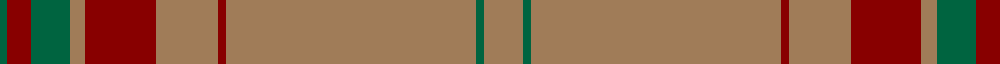

In pattern [GRGGRRRRRGR](/patterns/grggrrrrrgr/).

This was sourced from tartans-authority.  It is a [11 stripes tartan](/stripes/stripes11/).

Original link http://www.tartansauthority.com/tartan-ferret/display/10328/

## Thread count
Ga/2 DR6 G6 Ga4 LT4 DR18 LT16 DR2 LT64 Ga2 LT/10

## Palette
Each colour and its ΔE from the base-6 reference it is a variant of.

| Colour | Shade | Base | ΔE (OKLab) |
|---|---|---|---|
| DR | <code style="background-color:#880000;">#880000</code> `#880000` | R <code style="background-color:#CC0000;">#CC0000</code> | 0.15 |
| G | <code style="background-color:#006440;">#006440</code> `#006440` | G <code style="background-color:#006100;">#006100</code> | 0.06 |
| Ga | <code style="background-color:#006440;">#006440</code> `#006440` | G <code style="background-color:#006100;">#006100</code> | 0.06 |
| LT | <code style="background-color:#A07C58;">#A07C58</code> `#A07C58` | R <code style="background-color:#CC0000;">#CC0000</code> | 0.19 |

## Nearest tartans

The nearest existing variants by ΔTartan distance.

1. [Bartlett (Personal)](/setts/s13/r4y40b12ra2b12y30k2y4k2y4ra2y3k3x2~b5c5c5c-k101010-rc8002c-ra888888-ya08858/) — ΔT 1.51
1. [Spencer](/setts/s11/g40b3g8r2g2w2g10b6ba2b2w2x2~b3c5c70-ba441800-g846844-rc80000-wf8f8f8/) — ΔT 1.51
1. [Seton, hunting](/setts/s10/g6w1g12r4ra4r2ra4r32g1r2x2~g008000-r806050-rac00000-we0e0e0/) — ΔT 1.64
1. [Galway Irish County Tartan Tartan Number: 2254. Earliest known date: 1995 One of a series of Irish District tartans designed by Polly Wittering of the House of Edgar, with colours reminiscent of the Country with soft warm colours dominating. See products available Copyright © Blair Urquhart, Comrie, 2015](/setts/s10/r4g13r3b4r3b3r40b3r2y4x2~b141c50-g446844-rb84820-yc48800/) — ΔT 1.70
1. [Welsh, Stanly-Gpa (Personal)](/setts/s9/g2ga3g2ga45y3g4r2g2r2x2~g006818-ga604000-rc80000-yfccc00/) — ΔT 1.72
1. [Welsh Stanley–Gpa (Personal)](/setts/s9/g2ga3g2ga45y3g4r2g2r2x2~g386818-ga604000-rc80000-ye8c000/) — ΔT 1.74
1. [Yarrow](/setts/s11/g42b10ba2b2y2b2g10y6b2y3g2x2~b441800-ba5c8ca8-g604000-ya08858/) — ΔT 1.74
1. [Reid (1939)](/setts/s6/g40r8g4w2g4y5x2~g8c7038-rc80000-we0e0e0-ye8c000/) — ΔT 1.80
1. [Stuart of Bute St Colmac](/setts/s9/r16w8g1w2g1w1g8r34wa2x2~g565148-r8c8179-w88ace0-wafdfbf8/) — ΔT 1.81
1. [Montreal Granate](/setts/s9/y78r10r1g2r6y2r3y2r43x2~g006818-r901c38-ya08858/) — ΔT 1.88

## Neighbour map

Every grey dot is one of 15726 variants placed by the first two principal components of the ΔTartan feature space (44% of its variance). Red is this tartan; blue dots are its nearest — click one to open its page.

<svg viewBox="0 0 640 380" role="img" style="max-width:100%;height:auto;border:1px solid #e0e0e0;border-radius:4px;display:block" xmlns="http://www.w3.org/2000/svg"><image href="/nn/cloud.v1.png" width="640" height="380"/><a href="/setts/s13/r4y40b12ra2b12y30k2y4k2y4ra2y3k3x2~b5c5c5c-k101010-rc8002c-ra888888-ya08858/"><circle cx="454.1" cy="133.6" r="4" fill="#3465a4"><title>Bartlett (Personal)</title></circle></a><a href="/setts/s11/g40b3g8r2g2w2g10b6ba2b2w2x2~b3c5c70-ba441800-g846844-rc80000-wf8f8f8/"><circle cx="539.0" cy="136.8" r="4" fill="#3465a4"><title>Spencer</title></circle></a><a href="/setts/s10/g6w1g12r4ra4r2ra4r32g1r2x2~g008000-r806050-rac00000-we0e0e0/"><circle cx="464.2" cy="149.4" r="4" fill="#3465a4"><title>Seton, hunting</title></circle></a><a href="/setts/s10/r4g13r3b4r3b3r40b3r2y4x2~b141c50-g446844-rb84820-yc48800/"><circle cx="463.4" cy="141.4" r="4" fill="#3465a4"><title>Galway Irish County Tartan Tartan Number: 2254. Earliest known date: 1995 One of a series of Irish District tartans designed by Polly Wittering of the House of Edgar, with colours reminiscent of the Country with soft warm colours dominating. See products available Copyright © Blair Urquhart, Comrie, 2015</title></circle></a><a href="/setts/s9/g2ga3g2ga45y3g4r2g2r2x2~g006818-ga604000-rc80000-yfccc00/"><circle cx="568.0" cy="148.4" r="4" fill="#3465a4"><title>Welsh, Stanly-Gpa (Personal)</title></circle></a><a href="/setts/s9/g2ga3g2ga45y3g4r2g2r2x2~g386818-ga604000-rc80000-ye8c000/"><circle cx="586.9" cy="155.7" r="4" fill="#3465a4"><title>Welsh Stanley–Gpa (Personal)</title></circle></a><a href="/setts/s11/g42b10ba2b2y2b2g10y6b2y3g2x2~b441800-ba5c8ca8-g604000-ya08858/"><circle cx="506.1" cy="160.6" r="4" fill="#3465a4"><title>Yarrow</title></circle></a><a href="/setts/s6/g40r8g4w2g4y5x2~g8c7038-rc80000-we0e0e0-ye8c000/"><circle cx="567.0" cy="186.0" r="4" fill="#3465a4"><title>Reid (1939)</title></circle></a><a href="/setts/s9/r16w8g1w2g1w1g8r34wa2x2~g565148-r8c8179-w88ace0-wafdfbf8/"><circle cx="529.1" cy="157.5" r="4" fill="#3465a4"><title>Stuart of Bute St Colmac</title></circle></a><a href="/setts/s9/y78r10r1g2r6y2r3y2r43x2~g006818-r901c38-ya08858/"><circle cx="508.5" cy="127.9" r="4" fill="#3465a4"><title>Montreal Granate</title></circle></a><circle cx="539.8" cy="136.9" r="5" fill="#c00000"/></svg>

ID: /setts/s11/r5g1r32ra1r8ra9r2g2g3ra3g1x2~g006440-ra07c58-ra880000/
