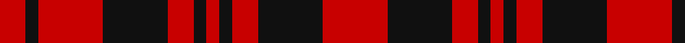

In pattern [RKRKRKRKRKR](/patterns/rkrkrkrkrkr/).

This was sourced from register-of-tartans.  It is a [11 stripes tartan](/stripes/stripes11/).

Original link https://www.tartanregister.gov.uk/tartanDetails.aspx?ref=312

## Attestations

This cloth appears in 2 source records; the oldest owns this page.

- 01/01/1998 — Border Reiver, The (register-of-tartans, [record](https://www.tartanregister.gov.uk/tartanDetails.aspx?ref=312))
- 1998 — Border Reiver, The (District) (tartans-authority, [record](http://www.tartansauthority.com/tartan-ferret/display/2471/))

## Thread count
R/8 K4 R20 K20 R8 K4 R4 K4 R8 K20 R/20

## Palette
Each colour and its ΔE from the base-6 reference it is a variant of.

| Colour | Shade | Base | ΔE (OKLab) |
|---|---|---|---|
| K | <code style="background-color:#101010;">#101010</code> `#101010` | K <code style="background-color:#000000;">#000000</code> | 0.17 |
| LG | <code style="background-color:#789484;">#789484</code> `#789484` | G <code style="background-color:#006100;">#006100</code> | 0.24 |
| LR | <code style="background-color:#EC34C4;">#EC34C4</code> `#EC34C4` | R <code style="background-color:#CC0000;">#CC0000</code> | 0.24 |
| R | <code style="background-color:#C80000;">#C80000</code> `#C80000` | R <code style="background-color:#CC0000;">#CC0000</code> | 0.01 |

## Nearest tartans

The nearest existing variants by ΔTartan distance.

1. [Border Reiver, The](/setts/s11/r5k5r2k1r1k1r2k5r5k1r2~k000000-rc00000~x4/) — ΔT 1.11
1. [MacLeod #2](/setts/s8/k12r3k2r16k8r12k2r3~k101010-rdc0000~x2/) — ΔT 1.12
1. [German National (US) (Fashion)](/setts/s12/r16k2r2k2r13k12r2k12r13k13r2y2~k101010-rc80000-ye8c000~x2/) — ΔT 1.27
1. [Haig & Haig Whisky](/setts/s8/r26k18r7k4y4k4r7k18~k101010-rc80000-ye8c000~x2/) — ΔT 1.48
1. [bodog.com Corporate Tartan Tartan Number: 6889. Earliest known date: 2006 Corporate brand name and colours, red, black and silver grey used to support brand identification. Company owner and executive is Scottish. First tartan to be name after a web site and first ever tartan for Costa Rica. See products available Copyright © Blair Urquhart, Comrie, 2015](/setts/s8/k25r25k10w3k10r25k25r3~k101010-rc80000-wc0c0c0~x2/) — ΔT 1.54
1. [Munro (Culloden)](/setts/s14/b6r8b1r2y5r5b5r5y1r2b1r2b1r6~b202060-rc80000-ye8c000~x2/) — ΔT 1.70
1. [Ikelman No. 5 (German National)](/setts/s12/r16k2r2k2r13k12r2k12r13k13r2y2~k000000-rc00000-yf0c000~x2/) — ΔT 1.73
1. [Unidentified Early 18th Centuary #2](/setts/s12/r9g2r3g2r9g3r3b3r3g3r3b3~b2c4084-g005020-rdc0000~x2/) — ΔT 1.76
1. [Murray, Lord George (Plaid)](/setts/s9/r5b10r20g2r20g10r5g10r5~b280034-g044028-rc80000~x2/) — ΔT 1.80
1. [Munro, Ancient](/setts/s14/b6r8b1r2y5r5b5r5y1r2b1r2b1r6~b304080-rc00000-yf0c000~x2/) — ΔT 1.87

## Neighbour map

Every grey dot is one of 15726 variants placed by the first two principal components of the ΔTartan feature space (44% of its variance). Red is this tartan; blue dots are its nearest — click one to open its page.

<svg viewBox="0 0 640 380" role="img" style="max-width:100%;height:auto;border:1px solid #e0e0e0;border-radius:4px;display:block" xmlns="http://www.w3.org/2000/svg"><image href="/nn/cloud.v1.png" width="640" height="380"/><a href="/setts/s11/r5k5r2k1r1k1r2k5r5k1r2~k000000-rc00000~x4/"><circle cx="307.9" cy="251.1" r="4" fill="#3465a4"><title>Border Reiver, The</title></circle></a><a href="/setts/s8/k12r3k2r16k8r12k2r3~k101010-rdc0000~x2/"><circle cx="360.3" cy="239.4" r="4" fill="#3465a4"><title>MacLeod #2</title></circle></a><a href="/setts/s12/r16k2r2k2r13k12r2k12r13k13r2y2~k101010-rc80000-ye8c000~x2/"><circle cx="309.1" cy="206.6" r="4" fill="#3465a4"><title>German National (US) (Fashion)</title></circle></a><a href="/setts/s8/r26k18r7k4y4k4r7k18~k101010-rc80000-ye8c000~x2/"><circle cx="283.2" cy="232.9" r="4" fill="#3465a4"><title>Haig &amp; Haig Whisky</title></circle></a><a href="/setts/s8/k25r25k10w3k10r25k25r3~k101010-rc80000-wc0c0c0~x2/"><circle cx="313.8" cy="241.4" r="4" fill="#3465a4"><title>bodog.com Corporate Tartan Tartan Number: 6889. Earliest known date: 2006 Corporate brand name and colours, red, black and silver grey used to support brand identification. Company owner and executive is Scottish. First tartan to be name after a web site and first ever tartan for Costa Rica. See products available Copyright © Blair Urquhart, Comrie, 2015</title></circle></a><a href="/setts/s14/b6r8b1r2y5r5b5r5y1r2b1r2b1r6~b202060-rc80000-ye8c000~x2/"><circle cx="308.7" cy="202.1" r="4" fill="#3465a4"><title>Munro (Culloden)</title></circle></a><a href="/setts/s12/r16k2r2k2r13k12r2k12r13k13r2y2~k000000-rc00000-yf0c000~x2/"><circle cx="289.9" cy="203.8" r="4" fill="#3465a4"><title>Ikelman No. 5 (German National)</title></circle></a><a href="/setts/s12/r9g2r3g2r9g3r3b3r3g3r3b3~b2c4084-g005020-rdc0000~x2/"><circle cx="341.8" cy="242.8" r="4" fill="#3465a4"><title>Unidentified Early 18th Centuary #2</title></circle></a><a href="/setts/s9/r5b10r20g2r20g10r5g10r5~b280034-g044028-rc80000~x2/"><circle cx="370.2" cy="227.9" r="4" fill="#3465a4"><title>Murray, Lord George (Plaid)</title></circle></a><a href="/setts/s14/b6r8b1r2y5r5b5r5y1r2b1r2b1r6~b304080-rc00000-yf0c000~x2/"><circle cx="321.2" cy="207.0" r="4" fill="#3465a4"><title>Munro, Ancient</title></circle></a><circle cx="329.7" cy="254.9" r="5" fill="#c00000"/></svg>

ID: /setts/s11/r5k5r2k1r1k1r2k5r5k1r2~k101010-rc80000~x4/
