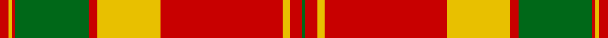

In pattern [GRYYRYRGRYR](/stripes/gryyryrgryr/).

This was sourced from tartans-authority.  It is a [11 stripe tartan](/stripes/stripes11/).

Original link http://www.tartansauthority.com/tartan-ferret/display/906/

## Thread count
R/5 Y2 R2 G42 R5 Y36 R70 Y2 Y2 R7 G/2

## Palette
Each colour and the base-6 reference it is a variant of.

| Colour | Shade | Base |
|---|---|---|
| G | <code style="background-color:#006818;">#006818</code> `oklch(45.0% 0.142 145.0)` <small>#006818</small> | G <code style="background-color:#006100;">#006100</code> |
| R | <code style="background-color:#C80000;">#C80000</code> `oklch(52.3% 0.215 29.2)` <small>#C80000</small> | R <code style="background-color:#CC0000;">#CC0000</code> |
| Y | <code style="background-color:#E8C000;">#E8C000</code> `oklch(81.9% 0.168 93.7)` <small>#E8C000</small> | Y <code style="background-color:#F2BF00;">#F2BF00</code> |

## Nearest tartans

The nearest existing variants by ΔTartan distance.

1. [Scott](/setts/s12/g4r3k1r28g14r4g4w3g4r4g4w3~x2/) — ΔT 1.41
1. [MacDonell of Keppoch](/setts/s11/r6db1r1g28r4db8w1r32g1r4g2~x2/) — ΔT 1.45
1. [Drummond](/setts/s12/r4g1r1g18k1g1k1g8r28g1r1g4~x2/) — ΔT 1.50
1. [MacDonell of Glengarry](/setts/s11/g18r3g2r2db6r2g2r24g1r2g6~x2/) — ΔT 1.54
1. [Spens](/setts/s8/r56w2db6w2g32r11db6w5/) — ΔT 1.55
1. [Drummond #3](/setts/s12/dg4r1dg1r28dg8k1dg1k1dg18r1dg1r4~x2/) — ΔT 1.55
1. [San Francisco](/setts/s14/r4lo4r1lo2r24w2db4w2r4db2lo18db2lo1w4~x2/) — ΔT 1.55
1. [Baluch Regiment](/setts/s9/r4g24r6g4r4g6r44g1w4~x2/) — ΔT 1.57
1. [Mordente](/setts/s14/r1w1g1r16g7r1w1g1w1r1g7w2r1g1~x2/) — ΔT 1.59
1. [Grant of Rothiemurchus](/setts/s13/r4db2r2db2r56db16r4g1r4g36r3g1r4~x2/) — ΔT 1.60

## Neighbour map

Every grey dot is one of 14299 variants placed by the first two principal components of the ΔTartan feature space (44% of its variance). Red is this tartan; blue dots are its nearest — click one to open its page.

<svg viewBox="0 0 640 380" role="img" style="max-width:100%;height:auto;border:1px solid #e0e0e0;border-radius:4px;display:block" xmlns="http://www.w3.org/2000/svg"><image href="/nn/cloud.v1.png" width="640" height="380"/><a href="/setts/s12/g4r3k1r28g14r4g4w3g4r4g4w3~x2/"><circle cx="334.7" cy="109.0" r="4" fill="#3465a4"><title>Scott</title></circle></a><a href="/setts/s11/r6db1r1g28r4db8w1r32g1r4g2~x2/"><circle cx="378.5" cy="109.6" r="4" fill="#3465a4"><title>MacDonell of Keppoch</title></circle></a><a href="/setts/s12/r4g1r1g18k1g1k1g8r28g1r1g4~x2/"><circle cx="390.3" cy="121.3" r="4" fill="#3465a4"><title>Drummond</title></circle></a><a href="/setts/s11/g18r3g2r2db6r2g2r24g1r2g6~x2/"><circle cx="363.3" cy="147.3" r="4" fill="#3465a4"><title>MacDonell of Glengarry</title></circle></a><a href="/setts/s8/r56w2db6w2g32r11db6w5/"><circle cx="360.3" cy="123.9" r="4" fill="#3465a4"><title>Spens</title></circle></a><a href="/setts/s12/dg4r1dg1r28dg8k1dg1k1dg18r1dg1r4~x2/"><circle cx="396.1" cy="120.3" r="4" fill="#3465a4"><title>Drummond #3</title></circle></a><a href="/setts/s14/r4lo4r1lo2r24w2db4w2r4db2lo18db2lo1w4~x2/"><circle cx="282.2" cy="91.0" r="4" fill="#3465a4"><title>San Francisco</title></circle></a><a href="/setts/s9/r4g24r6g4r4g6r44g1w4~x2/"><circle cx="449.0" cy="121.8" r="4" fill="#3465a4"><title>Baluch Regiment</title></circle></a><a href="/setts/s14/r1w1g1r16g7r1w1g1w1r1g7w2r1g1~x2/"><circle cx="320.6" cy="124.4" r="4" fill="#3465a4"><title>Mordente</title></circle></a><a href="/setts/s13/r4db2r2db2r56db16r4g1r4g36r3g1r4~x2/"><circle cx="439.5" cy="93.2" r="4" fill="#3465a4"><title>Grant of Rothiemurchus</title></circle></a><circle cx="363.1" cy="102.6" r="5" fill="#c00000"/></svg>

ID: /setts/s11/r5ly2r2g42r5ly36r70ly2ly2r7g2/
