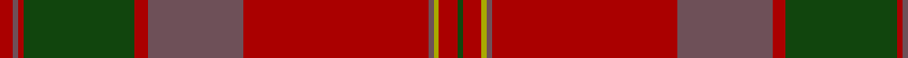

This page is one **sett** — a single exact thread-count. It belongs to the [tartan](/tartans/dr5n2dr2dg42dr5n36dr70n2lg2dr7dg2/)
(the same proportion at any scale), whose colour order is pattern [GRYBRBRGRBR](/stripes/grybrbrgrbr/).

Sourced from weddslist.  It is a [11 stripe tartan](/stripes/stripes11/).

Original link http://www.weddslist.com/cgi-bin/tartans/pg.pl?source=x

## Thread count
DR/5 N2 DR2 DG42 DR5 N36 DR70 N2 LG2 DR7 DG/2

## Palette
Each colour and the base-6 reference it is a variant of.

| Colour | Shade | Base |
|---|---|---|
| DG | <code style="background-color:#11450D;">#11450D</code> `oklch(34.4% 0.101 142.1)` <small>#11450D</small> | G <code style="background-color:#006100;">#006100</code> |
| DR | <code style="background-color:#AA0000;">#AA0000</code> `oklch(46.3% 0.190 29.2)` <small>#AA0000</small> | R <code style="background-color:#CC0000;">#CC0000</code> |
| LG | <code style="background-color:#AAAA00;">#AAAA00</code> `oklch(71.4% 0.156 109.8)` <small>#AAAA00</small> | Y <code style="background-color:#F2BF00;">#F2BF00</code> |
| N | <code style="background-color:#6E5058;">#6E5058</code> `oklch(46.6% 0.042 1.2)` <small>#6E5058</small> | B <code style="background-color:#2A418A;">#2A418A</code> |

## Nearest tartans

The nearest existing variants by ΔTartan distance, with this tartan at the top so the swatches line up against it.

ΔTartan

Tartan

Sett

—

<a href="/ttd/edit/#slug=r5n2r2dg42r5n36r70n2ly2r7dg2">MacPherson Of Cluny</a> <a class="nn-out" href="/setts/s11/r5n2r2dg42r5n36r70n2ly2r7dg2/" title="open its dictionary page">↗</a>

0.00

<a href="/ttd/edit/#slug=r5n2r2dg42r5n36r70n2ly2r7dg2~x2">MacPherson Of Cluny</a> <a class="nn-out" href="/setts/s11/r5n2r2dg42r5n36r70n2ly2r7dg2~x2/" title="open its dictionary page">↗</a>

0.96

<a href="/ttd/edit/#slug=r6lr1r24n6dg2n1dg2n1dg12r1~x2">Chisholm D</a> <a class="nn-out" href="/setts/s10/r6lr1r24n6dg2n1dg2n1dg12r1~x2/" title="open its dictionary page">↗</a>

0.96

<a href="/ttd/edit/#slug=r6lr1r24n6dg2n1dg2n1dg12r1">Chisholm D</a> <a class="nn-out" href="/setts/s10/r6lr1r24n6dg2n1dg2n1dg12r1/" title="open its dictionary page">↗</a>

1.22

<a href="/ttd/edit/#slug=o7dt2o3dg32o2dg2o2dt10o2lb2o31dt2o2dt1o6~x2">Drummond of Megginch - 1997 Kilt</a> <a class="nn-out" href="/setts/s15/o7dt2o3dg32o2dg2o2dt10o2lb2o31dt2o2dt1o6~x2/" title="open its dictionary page">↗</a>

1.24

<a href="/ttd/edit/#slug=dr44o5o8o2o2o2o2o14o9o2o4o2~x2">Waverly, Check</a> <a class="nn-out" href="/setts/s12/dr44o5o8o2o2o2o2o14o9o2o4o2~x2/" title="open its dictionary page">↗</a>

1.31

<a href="/ttd/edit/#slug=r7r2db2r2dg32r6db12r41dg2r5r2dg5~x2">MacDougall #5</a> <a class="nn-out" href="/setts/s12/r7r2db2r2dg32r6db12r41dg2r5r2dg5~x2/" title="open its dictionary page">↗</a>

1.34

<a href="/ttd/edit/#slug=o7r4o4r25dp1y32dp4y2w2y5~x2">Bell of Ardbel (Name)</a> <a class="nn-out" href="/setts/s10/o7r4o4r25dp1y32dp4y2w2y5~x2/" title="open its dictionary page">↗</a>

1.35

<a href="/ttd/edit/#slug=y8r6k4r64o1k28r6y40r6k4~x2">Laporte</a> <a class="nn-out" href="/setts/s10/y8r6k4r64o1k28r6y40r6k4~x2/" title="open its dictionary page">↗</a>

1.43

<a href="/ttd/edit/#slug=n9o2n2r2o18r2n2n1n1n19r33n2~x2">Pride of Scotland, Silver (Fashion)</a> <a class="nn-out" href="/setts/s12/n9o2n2r2o18r2n2n1n1n19r33n2~x2/" title="open its dictionary page">↗</a>

1.44

<a href="/ttd/edit/#slug=do7r4do4r25dp1y32dp4y2w2y5~x2">Bell of Ardbel (Personal)</a> <a class="nn-out" href="/setts/s10/do7r4do4r25dp1y32dp4y2w2y5~x2/" title="open its dictionary page">↗</a>

## Neighbour map

Every grey dot is one of 14299 variants placed by the first two principal components of the ΔTartan feature space (44% of its variance). Red is this tartan; blue dots are its nearest — click one to open its page.

<svg viewBox="0 0 640 380" role="img" style="max-width:100%;height:auto;border:1px solid #e0e0e0;border-radius:4px;display:block" xmlns="http://www.w3.org/2000/svg"><image href="/nn/cloud.v1.png" width="640" height="380"/><a href="/setts/s11/r5n2r2dg42r5n36r70n2ly2r7dg2~x2/"><circle cx="421.2" cy="135.6" r="4" fill="#3465a4"><title>MacPherson Of Cluny</title></circle></a><a href="/setts/s10/r6lr1r24n6dg2n1dg2n1dg12r1~x2/"><circle cx="418.9" cy="153.6" r="4" fill="#3465a4"><title>Chisholm D</title></circle></a><a href="/setts/s10/r6lr1r24n6dg2n1dg2n1dg12r1/"><circle cx="418.9" cy="153.6" r="4" fill="#3465a4"><title>Chisholm D</title></circle></a><a href="/setts/s15/o7dt2o3dg32o2dg2o2dt10o2lb2o31dt2o2dt1o6~x2/"><circle cx="433.7" cy="138.5" r="4" fill="#3465a4"><title>Drummond of Megginch - 1997 Kilt</title></circle></a><a href="/setts/s12/dr44o5o8o2o2o2o2o14o9o2o4o2~x2/"><circle cx="369.1" cy="152.3" r="4" fill="#3465a4"><title>Waverly, Check</title></circle></a><a href="/setts/s12/r7r2db2r2dg32r6db12r41dg2r5r2dg5~x2/"><circle cx="386.0" cy="152.9" r="4" fill="#3465a4"><title>MacDougall #5</title></circle></a><a href="/setts/s10/o7r4o4r25dp1y32dp4y2w2y5~x2/"><circle cx="360.3" cy="142.5" r="4" fill="#3465a4"><title>Bell of Ardbel (Name)</title></circle></a><a href="/setts/s10/y8r6k4r64o1k28r6y40r6k4~x2/"><circle cx="394.7" cy="129.9" r="4" fill="#3465a4"><title>Laporte</title></circle></a><a href="/setts/s12/n9o2n2r2o18r2n2n1n1n19r33n2~x2/"><circle cx="367.3" cy="139.9" r="4" fill="#3465a4"><title>Pride of Scotland, Silver (Fashion)</title></circle></a><a href="/setts/s10/do7r4do4r25dp1y32dp4y2w2y5~x2/"><circle cx="338.9" cy="130.3" r="4" fill="#3465a4"><title>Bell of Ardbel (Personal)</title></circle></a><circle cx="421.2" cy="135.6" r="5" fill="#c00000"/></svg>

ID: /setts/s11/r5n2r2dg42r5n36r70n2ly2r7dg2/
