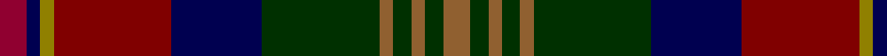

In pattern [RBGRBGRGRGR](/patterns/rbgrbgrgrgr/).

This was sourced from weddslist.  It is a [11 stripes tartan](/stripes/stripes11/).

Original link http://www.weddslist.com/cgi-bin/tartans/pg.pl?source=sts

## Thread count
DRa/6 DB3 LG3 DR26 DB20 DG26 LT3 DG4 LT3 DG4 LT/6

## Palette
Each colour and its ΔE from the base-6 reference it is a variant of.

| Colour | Shade | Base | ΔE (OKLab) |
|---|---|---|---|
| DB | <code style="background-color:#000050;">#000050</code> `#000050` | B <code style="background-color:#2A418A;">#2A418A</code> | 0.21 |
| DG | <code style="background-color:#003000;">#003000</code> `#003000` | G <code style="background-color:#006100;">#006100</code> | 0.17 |
| DR | <code style="background-color:#800000;">#800000</code> `#800000` | R <code style="background-color:#CC0000;">#CC0000</code> | 0.17 |
| DRa | <code style="background-color:#900030;">#900030</code> `#900030` | R <code style="background-color:#CC0000;">#CC0000</code> | 0.14 |
| LG | <code style="background-color:#908000;">#908000</code> `#908000` | G <code style="background-color:#006100;">#006100</code> | 0.20 |
| LT | <code style="background-color:#906030;">#906030</code> `#906030` | R <code style="background-color:#CC0000;">#CC0000</code> | 0.15 |

## Nearest tartans

The nearest existing variants by ΔTartan distance.

1. [Meath, County](/setts/s12/y5b2r14ba9g8b3r3b3r3b3g18ya3~b303070-ba4c3428-g003820-ra00000-ybc8c00-yac4b888~x2/) — ΔT 0.88
1. [Minster](/setts/s14/b6r2ba2r3ba3r18b16r2g18ra2b3bb3b2r6~b1c1c50-ba2c2c80-bb48788c-g006818-r880000-rac80000~x2/) — ΔT 0.92
1. [Cuthill (Personal)](/setts/s13/b3g4r2g3r3g16ba16ra16b3ra3b2ra4y3~b2c2c80-ba003c64-g006818-rc80000-ra880000-ye8c000~x2/) — ΔT 0.94
1. [Gotts (Personal)](/setts/s14/w2r19k2r2k3r2k8b8g2b3g2b2g19y2~b000064-g005020-k101010-r781c38-we0e0e0-yc89600~x2/) — ΔT 0.96
1. [Kinloch Anderson Castle Grey](/setts/s12/b8g8b4g28k12ba6k12r4ba8r4ba29y6~b3e3e3e-ba2c2c2c-g696969-k000000-r960028-y999999/) — ΔT 1.12
1. [Loch Freuchie District Tartan Tartan Number: 10725. Earliest known date: 25 October 2012 A tartan for the area around Loch Freuchie near Crieff. The tartan is based on the Murray of Atholl and Breadalbane setts, with differences, to relate the tartan to the particular Loch Freuchie area. Mr MacArthur-Fox has created a tartan for anyone to wear without fear of offending another person or group. See products available Copyright © Blair Urquhart, Comrie, 2015](/setts/s10/b3g3r2g20k25ka2ba13k2ba3r3~b4a708b-ba2c4e75-g124d36-k101010-ka000000-rff0000~x2/) — ΔT 1.16
1. [Kinloch Anderson Granite (Corporate)](/setts/s12/r8b8r4b28ba12bb6ba12ra4bb8ra4bb29w6~b14283c-ba1c1c1c-bb5c5c5c-r888888-ra880000-wc0c0c0/) — ΔT 1.21
1. [State Seal of Illinois (Fashion)](/setts/s13/g4b34g4ga4b4ga4g3ga13g21ga4w3r11y3~b2c2c80-g006818-ga604000-r880000-we8ccb8-ybc8c00~x2/) — ΔT 1.22
1. [Loch Freuchie](/setts/s10/b3g3r2g20k25y2ba13k2ba3r3~b4a708b-ba2c4e75-g124d36-k101010-rff0000-yf0da0f~x2/) — ΔT 1.22
1. [Galway County, Crest Range](/setts/s9/b10ba5bb15k3bb15k5r25k3w4~b505050-ba2c4084-bb141e46-k101010-r960000-we0e0e0~x2/) — ΔT 1.26

## Neighbour map

Every grey dot is one of 15726 variants placed by the first two principal components of the ΔTartan feature space (44% of its variance). Red is this tartan; blue dots are its nearest — click one to open its page.

<svg viewBox="0 0 640 380" role="img" style="max-width:100%;height:auto;border:1px solid #e0e0e0;border-radius:4px;display:block" xmlns="http://www.w3.org/2000/svg"><image href="/nn/cloud.v1.png" width="640" height="380"/><a href="/setts/s12/y5b2r14ba9g8b3r3b3r3b3g18ya3~b303070-ba4c3428-g003820-ra00000-ybc8c00-yac4b888~x2/"><circle cx="148.8" cy="163.2" r="4" fill="#3465a4"><title>Meath, County</title></circle></a><a href="/setts/s14/b6r2ba2r3ba3r18b16r2g18ra2b3bb3b2r6~b1c1c50-ba2c2c80-bb48788c-g006818-r880000-rac80000~x2/"><circle cx="184.2" cy="147.6" r="4" fill="#3465a4"><title>Minster</title></circle></a><a href="/setts/s13/b3g4r2g3r3g16ba16ra16b3ra3b2ra4y3~b2c2c80-ba003c64-g006818-rc80000-ra880000-ye8c000~x2/"><circle cx="123.3" cy="151.3" r="4" fill="#3465a4"><title>Cuthill (Personal)</title></circle></a><a href="/setts/s14/w2r19k2r2k3r2k8b8g2b3g2b2g19y2~b000064-g005020-k101010-r781c38-we0e0e0-yc89600~x2/"><circle cx="138.9" cy="133.1" r="4" fill="#3465a4"><title>Gotts (Personal)</title></circle></a><a href="/setts/s12/b8g8b4g28k12ba6k12r4ba8r4ba29y6~b3e3e3e-ba2c2c2c-g696969-k000000-r960028-y999999/"><circle cx="107.3" cy="168.6" r="4" fill="#3465a4"><title>Kinloch Anderson Castle Grey</title></circle></a><a href="/setts/s10/b3g3r2g20k25ka2ba13k2ba3r3~b4a708b-ba2c4e75-g124d36-k101010-ka000000-rff0000~x2/"><circle cx="190.9" cy="148.5" r="4" fill="#3465a4"><title>Loch Freuchie District Tartan Tartan Number: 10725. Earliest known date: 25 October 2012 A tartan for the area around Loch Freuchie near Crieff. The tartan is based on the Murray of Atholl and Breadalbane setts, with differences, to relate the tartan to the particular Loch Freuchie area. Mr MacArthur-Fox has created a tartan for anyone to wear without fear of offending another person or group. See products available Copyright © Blair Urquhart, Comrie, 2015</title></circle></a><a href="/setts/s12/r8b8r4b28ba12bb6ba12ra4bb8ra4bb29w6~b14283c-ba1c1c1c-bb5c5c5c-r888888-ra880000-wc0c0c0/"><circle cx="132.9" cy="178.2" r="4" fill="#3465a4"><title>Kinloch Anderson Granite (Corporate)</title></circle></a><a href="/setts/s13/g4b34g4ga4b4ga4g3ga13g21ga4w3r11y3~b2c2c80-g006818-ga604000-r880000-we8ccb8-ybc8c00~x2/"><circle cx="174.2" cy="138.7" r="4" fill="#3465a4"><title>State Seal of Illinois (Fashion)</title></circle></a><a href="/setts/s10/b3g3r2g20k25y2ba13k2ba3r3~b4a708b-ba2c4e75-g124d36-k101010-rff0000-yf0da0f~x2/"><circle cx="177.3" cy="141.9" r="4" fill="#3465a4"><title>Loch Freuchie</title></circle></a><a href="/setts/s9/b10ba5bb15k3bb15k5r25k3w4~b505050-ba2c4084-bb141e46-k101010-r960000-we0e0e0~x2/"><circle cx="140.0" cy="178.9" r="4" fill="#3465a4"><title>Galway County, Crest Range</title></circle></a><circle cx="151.8" cy="158.8" r="5" fill="#c00000"/></svg>

ID: /setts/s11/r6b3g3ra26b20ga26rb3ga4rb3ga4rb6~b000050-g908000-ga003000-r900030-ra800000-rb906030/
