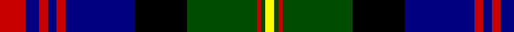

In pattern [RBRBRBKGRGY](/patterns/rbrbrbkgrgy/).

This was sourced from weddslist.  It is a [11 stripes tartan](/stripes/stripes11/).

Original link http://www.weddslist.com/cgi-bin/tartans/pg.pl?source=rb

## Thread count
R/12 DB6 R4 DB4 R4 DB32 K24 G32 R2 G2 Y/4

## Palette
Each colour and its ΔE from the base-6 reference it is a variant of.

| Colour | Shade | Base | ΔE (OKLab) |
|---|---|---|---|
| DB | <code style="background-color:#000080;">#000080</code> `#000080` | B <code style="background-color:#2A418A;">#2A418A</code> | 0.14 |
| G | <code style="background-color:#004C00;">#004C00</code> `#004C00` | G <code style="background-color:#006100;">#006100</code> | 0.07 |
| K | <code style="background-color:#000000;">#000000</code> `#000000` | K <code style="background-color:#000000;">#000000</code> | 0.00 |
| R | <code style="background-color:#C80000;">#C80000</code> `#C80000` | R <code style="background-color:#CC0000;">#CC0000</code> | 0.01 |
| Y | <code style="background-color:#FFFF00;">#FFFF00</code> `#FFFF00` | Y <code style="background-color:#F2BF00;">#F2BF00</code> | 0.16 |

## Nearest tartans

The nearest existing variants by ΔTartan distance.

1. [Clanranald, MacDonald of (Clan)](/setts/s13/b16r2b2r7b31r2k32w3g31r7g2r2g16~b000048-g045c38-k000000-rc80000-wc8c8c8~x2/) — ΔT 0.60
1. [MacDonell of Glengarry](/setts/s11/b16r5b30r2k33g30r5g2r2g7w2~b304080-g008000-k000000-rc00000-we0e0e0~x2/) — ΔT 0.75
1. [Logan and MacLennan](/setts/s11/r6b3r2b2r2b16k12g16r1k1y2~b000052-g11450d-k000000-raa0000-yaaaa00~x2/) — ΔT 0.78
1. [MacDonell of Glengarry D](/setts/s13/b8r1b2r3b12r1k12g12r3g2r1g4w1~b000064-g004c00-k000000-rc80000-wd0d0d0/) — ΔT 0.82
1. [Cameron of Erracht](/setts/s11/g8r1g1r3g16k16r1b16r3b8y2~b00004c-g004c00-k000000-rc80000-yffc800/) — ΔT 0.82
1. [MacDonell of Glengarry](/setts/s11/b8r4b12r1k12g12r3g2r1g4w1~b000064-g004c00-k000000-rc80000-wd0d0d0~x2/) — ΔT 0.87
1. [MacLennan, (or Logan)](/setts/s11/r6b3r2b2r2b16k12g16r1k1y2~b304080-g008000-k000000-rc00000-yf0c000~x2/) — ΔT 0.87
1. [MacRae, hunting](/setts/s9/g14k2g4r2g4k14b15k1w3~b800080-g006030-k000000-r900030-we0e0e0~x2/) — ΔT 0.88
1. [Lochaber, Cameron](/setts/s11/b8ba3b40r3k44ba3r3g40r2k4r7~b304080-ba5480b0-g008000-k000000-rc00000~x2/) — ΔT 0.88
1. [Clerke of Ulva](/setts/s11/b3g3k4g14k4g3k14ba18r1ba4r2~b5480b0-ba304080-g008000-k000000-r900030~x2/) — ΔT 0.89

## Neighbour map

Every grey dot is one of 15726 variants placed by the first two principal components of the ΔTartan feature space (44% of its variance). Red is this tartan; blue dots are its nearest — click one to open its page.

<svg viewBox="0 0 640 380" role="img" style="max-width:100%;height:auto;border:1px solid #e0e0e0;border-radius:4px;display:block" xmlns="http://www.w3.org/2000/svg"><image href="/nn/cloud.v1.png" width="640" height="380"/><a href="/setts/s13/b16r2b2r7b31r2k32w3g31r7g2r2g16~b000048-g045c38-k000000-rc80000-wc8c8c8~x2/"><circle cx="152.7" cy="133.8" r="4" fill="#3465a4"><title>Clanranald, MacDonald of (Clan)</title></circle></a><a href="/setts/s11/b16r5b30r2k33g30r5g2r2g7w2~b304080-g008000-k000000-rc00000-we0e0e0~x2/"><circle cx="154.4" cy="132.8" r="4" fill="#3465a4"><title>MacDonell of Glengarry</title></circle></a><a href="/setts/s11/r6b3r2b2r2b16k12g16r1k1y2~b000052-g11450d-k000000-raa0000-yaaaa00~x2/"><circle cx="163.9" cy="143.1" r="4" fill="#3465a4"><title>Logan and MacLennan</title></circle></a><a href="/setts/s13/b8r1b2r3b12r1k12g12r3g2r1g4w1~b000064-g004c00-k000000-rc80000-wd0d0d0/"><circle cx="149.6" cy="150.8" r="4" fill="#3465a4"><title>MacDonell of Glengarry D</title></circle></a><a href="/setts/s11/g8r1g1r3g16k16r1b16r3b8y2~b00004c-g004c00-k000000-rc80000-yffc800/"><circle cx="155.8" cy="150.8" r="4" fill="#3465a4"><title>Cameron of Erracht</title></circle></a><a href="/setts/s11/b8r4b12r1k12g12r3g2r1g4w1~b000064-g004c00-k000000-rc80000-wd0d0d0~x2/"><circle cx="135.6" cy="165.1" r="4" fill="#3465a4"><title>MacDonell of Glengarry</title></circle></a><a href="/setts/s11/r6b3r2b2r2b16k12g16r1k1y2~b304080-g008000-k000000-rc00000-yf0c000~x2/"><circle cx="142.5" cy="129.3" r="4" fill="#3465a4"><title>MacLennan, (or Logan)</title></circle></a><a href="/setts/s9/g14k2g4r2g4k14b15k1w3~b800080-g006030-k000000-r900030-we0e0e0~x2/"><circle cx="161.7" cy="154.1" r="4" fill="#3465a4"><title>MacRae, hunting</title></circle></a><a href="/setts/s11/b8ba3b40r3k44ba3r3g40r2k4r7~b304080-ba5480b0-g008000-k000000-rc00000~x2/"><circle cx="160.0" cy="112.3" r="4" fill="#3465a4"><title>Lochaber, Cameron</title></circle></a><a href="/setts/s11/b3g3k4g14k4g3k14ba18r1ba4r2~b5480b0-ba304080-g008000-k000000-r900030~x2/"><circle cx="144.1" cy="142.7" r="4" fill="#3465a4"><title>Clerke of Ulva</title></circle></a><circle cx="144.1" cy="133.8" r="5" fill="#c00000"/></svg>

ID: /setts/s11/r6b3r2b2r2b16k12g16r1g1y2~b000080-g004c00-k000000-rc80000-yffff00~x2/
