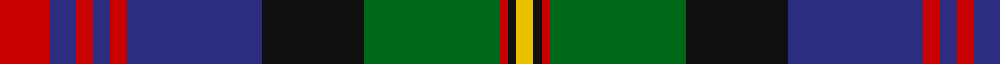

In pattern [RBRBRBKGRKY](/patterns/rbrbrbkgrky/).

This was sourced from register-of-tartans.  It is a [11 stripes tartan](/stripes/stripes11/).

Original link https://www.tartanregister.gov.uk/tartanDetails.aspx?ref=2187

## Attestations

This cloth appears in 4 source records; the oldest owns this page.

- 01/01/1831 — Logan #7 (register-of-tartans, [record](https://www.tartanregister.gov.uk/tartanDetails.aspx?ref=2187))
- 1831 — Logan (Clan) (tartans-authority, [record](http://www.tartansauthority.com/tartan-ferret/display/490/))
- undated — Logan or MacLennan Clan Tartan Tartan Number: 1429. Earliest known date: 1831 This sett is also recorded under MacLennan. Logans have another tartan also known as Skene or Rose. There is no conclusive explanation for the Logan - MacLennan connection, but it has been suggested that Logan or Lobban is an 'alias' for MacLennan, a common feature of early Scottish surnames. See products available Copyright © Blair Urquhart, Comrie, 2015 (house-of-tartan, [record](http://www.house-of-tartan.scotland.net/house/TartanViewjs.asp?colr=Def&tnam=1429))
- undated — MacLennan (or Logan) Clan Tartan Tartan Number: 2143. Earliest known date: 1831 This sett is also listed under Logan. D C Stewart says, "The group of five red lines is often seen with the lines equally spaced, and even equal width. The earlier arrangement here shown is preferable." Dr. Micheil MacDonald suggests that Logan (possibly Lobban) was an alternative name for MacLennan rather than a separate clan. Alternative names or aliases are not uncommon in early Scottish records. ('The Clans of Scotland', M. MacDonald, 1991) See products available Copyright © Blair Urquhart, Comrie, 2015 (house-of-tartan, [record](http://www.house-of-tartan.scotland.net/house/TartanViewjs.asp?colr=Def&tnam=2143))

## Thread count
R/12 DB6 R4 DB4 R4 DB32 K24 G32 R2 K2 Y/4

## Palette
Each colour and its ΔE from the base-6 reference it is a variant of.

| Colour | Shade | Base | ΔE (OKLab) |
|---|---|---|---|
| DB | <code style="background-color:#2C2C80;">#2C2C80</code> `#2C2C80` | B <code style="background-color:#2A418A;">#2A418A</code> | 0.06 |
| G | <code style="background-color:#006818;">#006818</code> `#006818` | G <code style="background-color:#006100;">#006100</code> | 0.02 |
| K | <code style="background-color:#101010;">#101010</code> `#101010` | K <code style="background-color:#000000;">#000000</code> | 0.17 |
| R | <code style="background-color:#C80000;">#C80000</code> `#C80000` | R <code style="background-color:#CC0000;">#CC0000</code> | 0.01 |
| Y | <code style="background-color:#E8C000;">#E8C000</code> `#E8C000` | Y <code style="background-color:#F2BF00;">#F2BF00</code> | 0.02 |

## Nearest tartans

The nearest existing variants by ΔTartan distance.

1. [MacLennan](/setts/s11/r6b3r2b2r2b16k12g16r1k1y2x2~b2c2c80-g285800-k101010-rc80000-ye8c000/) — ΔT 0.24
1. [MacDonell of Glengarry #3](/setts/s11/b16r5b30r2k33g30r5g2r2g7w4~b202060-g006818-k101010-rc80000-we0e0e0/) — ΔT 0.54
1. [Cameron of Erracht (Clan)](/setts/s11/g8r1g1r3g16k16r1b16r3b8y2x2~b2c2c80-g006818-k101010-rc80000-ye8c000/) — ΔT 0.63
1. [MacDonald of Clanranald #2](/setts/s13/b16r2b2r7b31r2k32w3g31r7g2r2g16x2~b2c4084-g005020-k101010-rdc0000-we0e0e0/) — ΔT 0.69
1. [MacLagan of Glenquiech](/setts/s11/r6b6r3b3r3b28k21g28r21k2y4~b2c2c80-g006818-k101010-rc80000-ye8c000/) — ΔT 0.70
1. [MacCandlish Dress Grey](/setts/s11/w3k1b12k1b1k2b1k6r12k1y1x4~b4c3428-k101010-r888888-wa8ace8-yd09800/) — ΔT 0.73
1. [MacDonell of Glengarry Clan Tartan Tartan Number: 471. Earliest known date: 1906 The Setts No: 112. W & A K Johnston (1906). There is a sample certified by 'Glengarry' in the collection of the Highland Society of London from the period 1815-16 but it is not known whether the threadcount corresponds to MacKays record illustrated here. See products available Copyright © Blair Urquhart, Comrie, 2015](/setts/s13/b8r1b2r3b12r1k12g12r3g2r1g4w1x2~b2c2c80-g006818-k101010-rc80000-we0e0e0/) — ΔT 0.73
1. [Unnamed C20th - Unregistered Error](/setts/s13/b13r2b2r6b25r2k27y2g25r6g2r2g13x2~b202060-g285800-k101010-rc80000-yfccc00/) — ΔT 0.83
1. [New Zealand (2003)](/setts/s10/k3b9k2y5b1y5k2g15k1r3x2~b2c2c80-g285800-k101010-rc80000-ya08858/) — ΔT 0.83
1. [Griffiths of Llangynin (Personal)](/setts/s10/g40k8r4k4r8k4r4k8b40y3x2~b202060-g285800-k101010-rc80000-ye8c000/) — ΔT 0.84

## Neighbour map

Every grey dot is one of 15726 variants placed by the first two principal components of the ΔTartan feature space (44% of its variance). Red is this tartan; blue dots are its nearest — click one to open its page.

<svg viewBox="0 0 640 380" role="img" style="max-width:100%;height:auto;border:1px solid #e0e0e0;border-radius:4px;display:block" xmlns="http://www.w3.org/2000/svg"><image href="/nn/cloud.v1.png" width="640" height="380"/><a href="/setts/s11/r6b3r2b2r2b16k12g16r1k1y2x2~b2c2c80-g285800-k101010-rc80000-ye8c000/"><circle cx="174.3" cy="139.8" r="4" fill="#3465a4"><title>MacLennan</title></circle></a><a href="/setts/s11/b16r5b30r2k33g30r5g2r2g7w4~b202060-g006818-k101010-rc80000-we0e0e0/"><circle cx="178.8" cy="145.3" r="4" fill="#3465a4"><title>MacDonell of Glengarry #3</title></circle></a><a href="/setts/s11/g8r1g1r3g16k16r1b16r3b8y2x2~b2c2c80-g006818-k101010-rc80000-ye8c000/"><circle cx="171.9" cy="151.6" r="4" fill="#3465a4"><title>Cameron of Erracht (Clan)</title></circle></a><a href="/setts/s13/b16r2b2r7b31r2k32w3g31r7g2r2g16x2~b2c4084-g005020-k101010-rdc0000-we0e0e0/"><circle cx="179.0" cy="139.3" r="4" fill="#3465a4"><title>MacDonald of Clanranald #2</title></circle></a><a href="/setts/s11/r6b6r3b3r3b28k21g28r21k2y4~b2c2c80-g006818-k101010-rc80000-ye8c000/"><circle cx="140.8" cy="144.8" r="4" fill="#3465a4"><title>MacLagan of Glenquiech</title></circle></a><a href="/setts/s11/w3k1b12k1b1k2b1k6r12k1y1x4~b4c3428-k101010-r888888-wa8ace8-yd09800/"><circle cx="176.3" cy="138.0" r="4" fill="#3465a4"><title>MacCandlish Dress Grey</title></circle></a><a href="/setts/s13/b8r1b2r3b12r1k12g12r3g2r1g4w1x2~b2c2c80-g006818-k101010-rc80000-we0e0e0/"><circle cx="166.7" cy="151.9" r="4" fill="#3465a4"><title>MacDonell of Glengarry Clan Tartan Tartan Number: 471. Earliest known date: 1906 The Setts No: 112. W &amp; A K Johnston (1906). There is a sample certified by 'Glengarry' in the collection of the Highland Society of London from the period 1815-16 but it is not known whether the threadcount corresponds to MacKays record illustrated here. See products available Copyright © Blair Urquhart, Comrie, 2015</title></circle></a><a href="/setts/s13/b13r2b2r6b25r2k27y2g25r6g2r2g13x2~b202060-g285800-k101010-rc80000-yfccc00/"><circle cx="172.6" cy="148.0" r="4" fill="#3465a4"><title>Unnamed C20th - Unregistered Error</title></circle></a><a href="/setts/s10/k3b9k2y5b1y5k2g15k1r3x2~b2c2c80-g285800-k101010-rc80000-ya08858/"><circle cx="159.4" cy="154.3" r="4" fill="#3465a4"><title>New Zealand (2003)</title></circle></a><a href="/setts/s10/g40k8r4k4r8k4r4k8b40y3x2~b202060-g285800-k101010-rc80000-ye8c000/"><circle cx="191.0" cy="148.6" r="4" fill="#3465a4"><title>Griffiths of Llangynin (Personal)</title></circle></a><circle cx="168.3" cy="138.1" r="5" fill="#c00000"/></svg>

ID: /setts/s11/r6b3r2b2r2b16k12g16r1k1y2x2~b2c2c80-g006818-k101010-rc80000-ye8c000/
