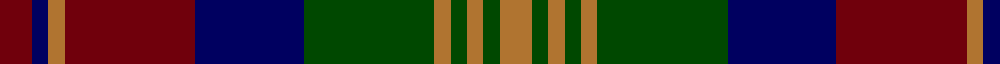

In pattern [RBRRBGRGRGR](/patterns/rbrrbgrgrgr/).

This was sourced from tartans-authority.  It is a [11 stripes tartan](/stripes/stripes11/).

Original link http://www.tartansauthority.com/tartan-ferret/display/1450/

## Thread count
DR/6 DB3 LT3 DR24 DB20 G24 LT3 G3 LT3 G3 LT/6

## Palette
Each colour and its ΔE from the base-6 reference it is a variant of.

| Colour | Shade | Base | ΔE (OKLab) |
|---|---|---|---|
| DB | <code style="background-color:#000060;">#000060</code> `#000060` | B <code style="background-color:#2C4084;">#2C4084</code> | 0.18 |
| DR | <code style="background-color:#70000C;">#70000C</code> `#70000C` | R <code style="background-color:#C80000;">#C80000</code> | 0.20 |
| G | <code style="background-color:#004800;">#004800</code> `#004800` | G <code style="background-color:#006400;">#006400</code> | 0.09 |
| LT | <code style="background-color:#B07430;">#B07430</code> `#B07430` | R <code style="background-color:#C80000;">#C80000</code> | 0.17 |

## Nearest tartans

The nearest existing variants by ΔTartan distance.

1. [Bonnie Brae School](/setts/s11/r6b3ra3r24b20g24ra3g3ra3g3ra6-b000060-g004800-r880000-rab07430/) — ΔT 0.25
1. [MacDonald #2](/setts/s12/b22r4b4r8b30r4k30g30r8g4r4g22-b2c4084-g005020-k101010-rdc0000/) — ΔT 0.86
1. [Matthew Gloag & Son Ltd (Corporate)](/setts/s10/g6r40k4b6k24b6k4g40r6b4-b003c64-g006818-k101010-r880000/) — ΔT 0.87
1. [Roxburgh, Red](/setts/s10/b6g52b6r6b40r6b6r52g10w6-b304080-g003000-rc00000-we0e0e0/) — ΔT 1.00
1. [MacDonald MINI Design Tartan Tartan Number: 4199. Earliest known date: Dupion Silk. Display Purposes Only. Reduced Copy of 419 MacDonald. See products available Copyright © Blair Urquhart, Comrie, 2015](/setts/s12/b8r2b2r3b12r2k12g12r3g2r2g8-b2c2c80-g006818-k101010-rc80000/) — ΔT 1.05
1. [MacDonald Clan Tartan Tartan Number: 419. Earliest known date: 1810-15 This is oldest recorded version of the Clan sett. It varies slightly from those recorded by Logan, Smibert, Grant etc., but the motif is the same throughout. Of the nine independant branches of the Clan Donald, there are at least 27 different setts. It was not until 1947 that the MacDonalds again had a high chief, MacDhomnuill, who by tradition has the final word on the tartans of the clan. That right was granted to Alexander MacDonald of MacDonald whose son Godfrey is now the 8th Chief. See products available Copyright © Blair Urquhart, Comrie, 2015](/setts/s12/b16r2b4r6b24r2k24g24r6g4r2g16-b2c2c80-g006818-k101010-rc80000/) — ΔT 1.09
1. [Urquhart - 1810 ((Clan)](/setts/s9/r18b22k6b6k6b6k40g40k6-b202060-g006818-k101010-rc80000/) — ΔT 1.10
1. [Urquhart Broad Red Clan Tartan Tartan Number: 1086. Earliest known date: 1810-15 Registered with Lord Lyon on 14th October, 1991. Lord Lyon also registered the 'Urquhart White Line' in the same entry. The proportions of the count given here are taken from the sample in the Cockburn Collection in the Mitchell Library in Glasgow. The sett also appears in the work of W and A Smith (1850) who claim that their sample was collected in the Highlands around 1822, possibly by George Hunter, the Army clothier. See products available Copyright © Blair Urquhart, Comrie, 2015](/setts/s9/r18b22k6b6k6b6k40g40k6-b2c2c80-g006818-k101010-rc80000/) — ΔT 1.11
1. [Balmoral Hotel (Corporate)](/setts/s13/r30b4r4b4r4ba24k24ba6k24ba24r24b4r4-b2c2c80-ba003c64-k101010-rc04c08/) — ΔT 1.16
1. [Clare Irish County Tartan Tartan Number: 2248. Earliest known date: 1995 One of a series of Irish District tartans designed by Polly Wittering of the House of Edgar, with colours reminiscent of the Country with soft warm colours dominating. See products available Copyright © Blair Urquhart, Comrie, 2015](/setts/s11/r6b28g28b4r28b4r28b4g28b4y6-b101448-g3c6838-r8c0020-yd09000/) — ΔT 1.17

## Neighbour map

Every grey dot is one of 15726 variants placed by the first two principal components of the ΔTartan feature space (44% of its variance). Red is this tartan; blue dots are its nearest — click one to open its page.

<svg viewBox="0 0 640 380" role="img" style="max-width:100%;height:auto;border:1px solid #e0e0e0;border-radius:4px;display:block" xmlns="http://www.w3.org/2000/svg"><image href="/nn/cloud.v1.png" width="640" height="380"/><a href="/setts/s11/r6b3ra3r24b20g24ra3g3ra3g3ra6-b000060-g004800-r880000-rab07430/"><circle cx="168.9" cy="186.4" r="4" fill="#3465a4"><title>Bonnie Brae School</title></circle></a><a href="/setts/s12/b22r4b4r8b30r4k30g30r8g4r4g22-b2c4084-g005020-k101010-rdc0000/"><circle cx="166.1" cy="205.8" r="4" fill="#3465a4"><title>MacDonald #2</title></circle></a><a href="/setts/s10/g6r40k4b6k24b6k4g40r6b4-b003c64-g006818-k101010-r880000/"><circle cx="214.0" cy="189.9" r="4" fill="#3465a4"><title>Matthew Gloag &amp; Son Ltd (Corporate)</title></circle></a><a href="/setts/s10/b6g52b6r6b40r6b6r52g10w6-b304080-g003000-rc00000-we0e0e0/"><circle cx="199.3" cy="178.0" r="4" fill="#3465a4"><title>Roxburgh, Red</title></circle></a><a href="/setts/s12/b8r2b2r3b12r2k12g12r3g2r2g8-b2c2c80-g006818-k101010-rc80000/"><circle cx="141.1" cy="211.9" r="4" fill="#3465a4"><title>MacDonald MINI Design Tartan Tartan Number: 4199. Earliest known date: Dupion Silk. Display Purposes Only. Reduced Copy of 419 MacDonald. See products available Copyright © Blair Urquhart, Comrie, 2015</title></circle></a><a href="/setts/s12/b16r2b4r6b24r2k24g24r6g4r2g16-b2c2c80-g006818-k101010-rc80000/"><circle cx="183.5" cy="183.8" r="4" fill="#3465a4"><title>MacDonald Clan Tartan Tartan Number: 419. Earliest known date: 1810-15 This is oldest recorded version of the Clan sett. It varies slightly from those recorded by Logan, Smibert, Grant etc., but the motif is the same throughout. Of the nine independant branches of the Clan Donald, there are at least 27 different setts. It was not until 1947 that the MacDonalds again had a high chief, MacDhomnuill, who by tradition has the final word on the tartans of the clan. That right was granted to Alexander MacDonald of MacDonald whose son Godfrey is now the 8th Chief. See products available Copyright © Blair Urquhart, Comrie, 2015</title></circle></a><a href="/setts/s9/r18b22k6b6k6b6k40g40k6-b202060-g006818-k101010-rc80000/"><circle cx="191.4" cy="220.9" r="4" fill="#3465a4"><title>Urquhart - 1810 ((Clan)</title></circle></a><a href="/setts/s9/r18b22k6b6k6b6k40g40k6-b2c2c80-g006818-k101010-rc80000/"><circle cx="186.3" cy="218.0" r="4" fill="#3465a4"><title>Urquhart Broad Red Clan Tartan Tartan Number: 1086. Earliest known date: 1810-15 Registered with Lord Lyon on 14th October, 1991. Lord Lyon also registered the 'Urquhart White Line' in the same entry. The proportions of the count given here are taken from the sample in the Cockburn Collection in the Mitchell Library in Glasgow. The sett also appears in the work of W and A Smith (1850) who claim that their sample was collected in the Highlands around 1822, possibly by George Hunter, the Army clothier. See products available Copyright © Blair Urquhart, Comrie, 2015</title></circle></a><a href="/setts/s13/r30b4r4b4r4ba24k24ba6k24ba24r24b4r4-b2c2c80-ba003c64-k101010-rc04c08/"><circle cx="174.5" cy="195.5" r="4" fill="#3465a4"><title>Balmoral Hotel (Corporate)</title></circle></a><a href="/setts/s11/r6b28g28b4r28b4r28b4g28b4y6-b101448-g3c6838-r8c0020-yd09000/"><circle cx="204.3" cy="212.8" r="4" fill="#3465a4"><title>Clare Irish County Tartan Tartan Number: 2248. Earliest known date: 1995 One of a series of Irish District tartans designed by Polly Wittering of the House of Edgar, with colours reminiscent of the Country with soft warm colours dominating. See products available Copyright © Blair Urquhart, Comrie, 2015</title></circle></a><circle cx="172.5" cy="189.8" r="5" fill="#c00000"/></svg>

ID: /setts/s11/r6b3ra3r24b20g24ra3g3ra3g3ra6-b000060-g004800-r70000c-rab07430/
