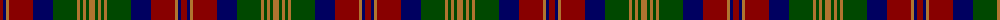

In pattern [RBRRBGRGRGR](/patterns/rbrrbgrgrgr/).

This was sourced from register-of-tartans.  It is a [11 stripes tartan](/stripes/stripes11/).

Original link https://www.tartanregister.gov.uk/tartanDetails.aspx?ref=309

## Thread count
DR/6 DB3 LT3 DR24 DB20 G24 LT3 G3 LT3 G3 LT/6

## Palette
Each colour and its ΔE from the base-6 reference it is a variant of.

| Colour | Shade | Base | ΔE (OKLab) |
|---|---|---|---|
| DB | <code style="background-color:#000060;">#000060</code> `#000060` | B <code style="background-color:#2C4084;">#2C4084</code> | 0.18 |
| DR | <code style="background-color:#880000;">#880000</code> `#880000` | R <code style="background-color:#C80000;">#C80000</code> | 0.14 |
| G | <code style="background-color:#004800;">#004800</code> `#004800` | G <code style="background-color:#006400;">#006400</code> | 0.09 |
| LT | <code style="background-color:#B07430;">#B07430</code> `#B07430` | R <code style="background-color:#C80000;">#C80000</code> | 0.17 |

## Nearest tartans

The nearest existing variants by ΔTartan distance.

1. [Bonnie Brae (School)](/setts/s11/r6b3ra3r24b20g24ra3g3ra3g3ra6-b000060-g004800-r70000c-rab07430/) — ΔT 0.25
1. [Roxburgh, Red](/setts/s10/b6g52b6r6b40r6b6r52g10w6-b304080-g003000-rc00000-we0e0e0/) — ΔT 0.85
1. [Matthew Gloag & Son Ltd (Corporate)](/setts/s10/g6r40k4b6k24b6k4g40r6b4-b003c64-g006818-k101010-r880000/) — ΔT 0.94
1. [MacDonald #2](/setts/s12/b22r4b4r8b30r4k30g30r8g4r4g22-b2c4084-g005020-k101010-rdc0000/) — ΔT 0.98
1. [MacDonald MINI Design Tartan Tartan Number: 4199. Earliest known date: Dupion Silk. Display Purposes Only. Reduced Copy of 419 MacDonald. See products available Copyright © Blair Urquhart, Comrie, 2015](/setts/s12/b8r2b2r3b12r2k12g12r3g2r2g8-b2c2c80-g006818-k101010-rc80000/) — ΔT 1.09
1. [MacIntyre of Glenorchy Clan Tartan Tartan Number: 402. Earliest known date: 1850 Smiths' version is also known as MacIntyre of Whitehouse. Though different from the sett recorded by Lord Lyon it is the one most often available in modern times. Before moving to Badenoch to take protection for Clan Chattan, the MacIntyres were listed as followers of Stewart of Appin. See products available Copyright © Blair Urquhart, Comrie, 2015](/setts/s15/b4r4ba4r8g32r4ba4r8g4r4ba32r8g4r4b4-b5c8ca8-ba2c2c80-g006818-rc80000/) — ΔT 1.09
1. [Roxburgh Red District Tartan Tartan Number: 140. Earliest known date: 1875 Roxburgh is in the heart of the Borders region of Scotland. The pattern was taken from a silk in Patterson's sample book (c.1875) now stored in the Scottish Tartan Society's archives. The tartan may have been in production before 1850, and is now woven commercially for the first time in perhaps a century and a half. See products available Copyright © Blair Urquhart, Comrie, 2015](/setts/s10/b6g52b6r6b40r6b6r52g10w6-b2c2c80-g003820-rc80000-we0e0e0/) — ΔT 1.09
1. [Balmoral Hotel (Corporate)](/setts/s13/r30b4r4b4r4ba24k24ba6k24ba24r24b4r4-b2c2c80-ba003c64-k101010-rc04c08/) — ΔT 1.11
1. [Roxburgh Red](/setts/s10/b6g52b6r6b40r6b6r52g10w6-b2c2c80-g006818-rc80000-wfcfcfc/) — ΔT 1.13
1. [North Berwick (Dance)](/setts/s11/b40r8b40r40g8r8g8r8g40r4w8-b003c64-g003820-rc80000-wfcfcfc/) — ΔT 1.14

## Neighbour map

Every grey dot is one of 15726 variants placed by the first two principal components of the ΔTartan feature space (44% of its variance). Red is this tartan; blue dots are its nearest — click one to open its page.

<svg viewBox="0 0 640 380" role="img" style="max-width:100%;height:auto;border:1px solid #e0e0e0;border-radius:4px;display:block" xmlns="http://www.w3.org/2000/svg"><image href="/nn/cloud.v1.png" width="640" height="380"/><a href="/setts/s11/r6b3ra3r24b20g24ra3g3ra3g3ra6-b000060-g004800-r70000c-rab07430/"><circle cx="172.5" cy="189.8" r="4" fill="#3465a4"><title>Bonnie Brae (School)</title></circle></a><a href="/setts/s10/b6g52b6r6b40r6b6r52g10w6-b304080-g003000-rc00000-we0e0e0/"><circle cx="199.3" cy="178.0" r="4" fill="#3465a4"><title>Roxburgh, Red</title></circle></a><a href="/setts/s10/g6r40k4b6k24b6k4g40r6b4-b003c64-g006818-k101010-r880000/"><circle cx="214.0" cy="189.9" r="4" fill="#3465a4"><title>Matthew Gloag &amp; Son Ltd (Corporate)</title></circle></a><a href="/setts/s12/b22r4b4r8b30r4k30g30r8g4r4g22-b2c4084-g005020-k101010-rdc0000/"><circle cx="166.1" cy="205.8" r="4" fill="#3465a4"><title>MacDonald #2</title></circle></a><a href="/setts/s12/b8r2b2r3b12r2k12g12r3g2r2g8-b2c2c80-g006818-k101010-rc80000/"><circle cx="141.1" cy="211.9" r="4" fill="#3465a4"><title>MacDonald MINI Design Tartan Tartan Number: 4199. Earliest known date: Dupion Silk. Display Purposes Only. Reduced Copy of 419 MacDonald. See products available Copyright © Blair Urquhart, Comrie, 2015</title></circle></a><a href="/setts/s15/b4r4ba4r8g32r4ba4r8g4r4ba32r8g4r4b4-b5c8ca8-ba2c2c80-g006818-rc80000/"><circle cx="181.5" cy="159.6" r="4" fill="#3465a4"><title>MacIntyre of Glenorchy Clan Tartan Tartan Number: 402. Earliest known date: 1850 Smiths' version is also known as MacIntyre of Whitehouse. Though different from the sett recorded by Lord Lyon it is the one most often available in modern times. Before moving to Badenoch to take protection for Clan Chattan, the MacIntyres were listed as followers of Stewart of Appin. See products available Copyright © Blair Urquhart, Comrie, 2015</title></circle></a><a href="/setts/s10/b6g52b6r6b40r6b6r52g10w6-b2c2c80-g003820-rc80000-we0e0e0/"><circle cx="198.4" cy="176.8" r="4" fill="#3465a4"><title>Roxburgh Red District Tartan Tartan Number: 140. Earliest known date: 1875 Roxburgh is in the heart of the Borders region of Scotland. The pattern was taken from a silk in Patterson's sample book (c.1875) now stored in the Scottish Tartan Society's archives. The tartan may have been in production before 1850, and is now woven commercially for the first time in perhaps a century and a half. See products available Copyright © Blair Urquhart, Comrie, 2015</title></circle></a><a href="/setts/s13/r30b4r4b4r4ba24k24ba6k24ba24r24b4r4-b2c2c80-ba003c64-k101010-rc04c08/"><circle cx="174.5" cy="195.5" r="4" fill="#3465a4"><title>Balmoral Hotel (Corporate)</title></circle></a><a href="/setts/s10/b6g52b6r6b40r6b6r52g10w6-b2c2c80-g006818-rc80000-wfcfcfc/"><circle cx="189.6" cy="172.7" r="4" fill="#3465a4"><title>Roxburgh Red</title></circle></a><a href="/setts/s11/b40r8b40r40g8r8g8r8g40r4w8-b003c64-g003820-rc80000-wfcfcfc/"><circle cx="197.5" cy="184.7" r="4" fill="#3465a4"><title>North Berwick (Dance)</title></circle></a><circle cx="168.9" cy="186.4" r="5" fill="#c00000"/></svg>

ID: /setts/s11/r6b3ra3r24b20g24ra3g3ra3g3ra6-b000060-g004800-r880000-rab07430/
