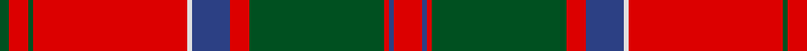

**Bands:** [RBRGRBWRGRG](/stripes/rbrgrbwrgrg/) · **Stripes:** [R DB R DG R DB W R DG R DG](/stripes/stripes11/) R DB R DG R DB W R DG R DG

This was sourced from register-of-tartans.  It is a [11 band tartan](/bands/bands11/).

Original link https://www.tartanregister.gov.uk/tartanDetails.aspx?ref=2389

## Register references

External register numbers recorded for this tartan.

- Scottish Register of Tartans: [2389](https://www.tartanregister.gov.uk/tartanDetails.aspx?ref=2389)
- Scottish Tartans World Register: 879

## Thread count
R/12 B2 R2 G56 R8 B16 LN2 R64 G2 R8 G/4

## Palette
Each colour and its ΔE from the base-6 reference it is a variant of.

| Colour | Shade | Base | ΔE (OKLab) |
|---|---|---|---|
| B | <code style="background-color:#2C4084;">#2C4084</code> `#2C4084` | B <code style="background-color:#2A418A;">#2A418A</code> | 0.01 |
| G | <code style="background-color:#005020;">#005020</code> `#005020` | G <code style="background-color:#006100;">#006100</code> | 0.07 |
| LN | <code style="background-color:#E0E0E0;">#E0E0E0</code> `#E0E0E0` | W <code style="background-color:#F7F7F7;">#F7F7F7</code> | 0.07 |
| R | <code style="background-color:#DC0000;">#DC0000</code> `#DC0000` | R <code style="background-color:#CC0000;">#CC0000</code> | 0.03 |

## Nearest tartans

The nearest existing variants by ΔTartan distance.

1. [Chisholm](/setts/s10/r6w1r24db6g2db1g2db1g12r1~x2/) — ΔT 0.55
1. [Unidentified Cant #12](/setts/s12/r60db2g24r8db2t3db2/) — ΔT 0.58
1. [Chisholm D](/setts/s10/r6lb1r24dp6dg2dp1dg2dp1dg12r1/) — ΔT 0.67
1. [MacDonell of Keppoch](/setts/s11/r6db1r1g28r4db8w1r32g1r4g2~x2/) — ΔT 0.74
1. [MacGillivray](/setts/s13/r4t1db1r32t2r2db12r2g16r4t1r4db2~x2/) — ΔT 0.76
1. [Grant or Drummond Clan Tartan Tartan Number: 1384. Earliest known date: 1831 The usual design is sometimes called Drummond. It is recorded by Logan (1831), Smibert (1850), and Smith (1850). McIan's drawing of the Grant tartan is too roughly done to make out the pattern details. A certain difficulty arises in establishing a single Grant tartan to represent the clan, illustrated by the existance of ten Grant portraits at Cullen House in which each brother is wearing a different tartan, and where a coat or plaid is worn, these also differ. The chief of the Grants is Lord Strathspey. See products available Copyright © Blair Urquhart, Comrie, 2015](/setts/s15/r6db2r2g24r2g2r2db8r2t2r32db2r2db1r6~x2/) — ΔT 0.78
1. [MacPherson Of Cluny](/setts/s11/r3dp1r1dg21r3dp18r35dp1ly1r4dg1/) — ΔT 0.80
1. [MacPherson of Cluny](/setts/s11/r5p2r2g42r5p36r70p2ly2r7g2~x2/) — ΔT 0.82
1. [MacPherson of Cluny](/setts/s11/r5k2r2g42r5k36r70k2ly2r7g2/) — ΔT 0.82
1. [MacDonell of Keppoch](/setts/s10/g2r2db1r24t1db6r3g12r4db1~x2/) — ΔT 0.84

## Neighbour map

Every grey dot is one of 14299 variants placed by the first two principal components of the ΔTartan feature space (44% of its variance). Red is this tartan; blue dots are its nearest — click one to open its page.

<svg viewBox="0 0 640 380" role="img" style="max-width:100%;height:auto;border:1px solid #e0e0e0;border-radius:4px;display:block" xmlns="http://www.w3.org/2000/svg"><image href="/nn/cloud.v1.png" width="640" height="380"/><a href="/setts/s10/r6w1r24db6g2db1g2db1g12r1~x2/"><circle cx="364.7" cy="123.0" r="4" fill="#3465a4"><title>Chisholm</title></circle></a><a href="/setts/s12/r60db2g24r8db2t3db2/"><circle cx="386.5" cy="105.3" r="4" fill="#3465a4"><title>Unidentified Cant #12</title></circle></a><a href="/setts/s10/r6lb1r24dp6dg2dp1dg2dp1dg12r1/"><circle cx="373.1" cy="125.5" r="4" fill="#3465a4"><title>Chisholm D</title></circle></a><a href="/setts/s11/r6db1r1g28r4db8w1r32g1r4g2~x2/"><circle cx="378.5" cy="109.6" r="4" fill="#3465a4"><title>MacDonell of Keppoch</title></circle></a><a href="/setts/s13/r4t1db1r32t2r2db12r2g16r4t1r4db2~x2/"><circle cx="395.5" cy="103.0" r="4" fill="#3465a4"><title>MacGillivray</title></circle></a><a href="/setts/s15/r6db2r2g24r2g2r2db8r2t2r32db2r2db1r6~x2/"><circle cx="391.0" cy="92.9" r="4" fill="#3465a4"><title>Grant or Drummond Clan Tartan Tartan Number: 1384. Earliest known date: 1831 The usual design is sometimes called Drummond. It is recorded by Logan (1831), Smibert (1850), and Smith (1850). McIan's drawing of the Grant tartan is too roughly done to make out the pattern details. A certain difficulty arises in establishing a single Grant tartan to represent the clan, illustrated by the existance of ten Grant portraits at Cullen House in which each brother is wearing a different tartan, and where a coat or plaid is worn, these also differ. The chief of the Grants is Lord Strathspey. See products available Copyright © Blair Urquhart, Comrie, 2015</title></circle></a><a href="/setts/s11/r3dp1r1dg21r3dp18r35dp1ly1r4dg1/"><circle cx="368.7" cy="103.5" r="4" fill="#3465a4"><title>MacPherson Of Cluny</title></circle></a><a href="/setts/s11/r5p2r2g42r5p36r70p2ly2r7g2~x2/"><circle cx="368.3" cy="100.3" r="4" fill="#3465a4"><title>MacPherson of Cluny</title></circle></a><a href="/setts/s11/r5k2r2g42r5k36r70k2ly2r7g2/"><circle cx="345.6" cy="94.0" r="4" fill="#3465a4"><title>MacPherson of Cluny</title></circle></a><a href="/setts/s10/g2r2db1r24t1db6r3g12r4db1~x2/"><circle cx="395.6" cy="130.2" r="4" fill="#3465a4"><title>MacDonell of Keppoch</title></circle></a><circle cx="374.9" cy="104.2" r="5" fill="#c00000"/></svg>

ID: /setts/s11/r6db1r1dg28r4db8w1r32dg1r4dg2~x2/
