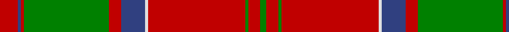

This page is one **sett** — a single exact thread-count. It belongs to the [tartan](/tartans/r6db1r1g28r4db8w1r32g1r4g2/)
(the same proportion at any scale), whose colour order is pattern [GRGRWBRGRBR](/stripes/grgrwbrgrbr/).

Sourced from weddslist.  It is a [11 stripe tartan](/stripes/stripes11/).

Original link http://www.weddslist.com/cgi-bin/tartans/pg.pl?source=sts

## Thread count
R/12 B2 R2 G56 R8 B16 LN2 R64 G2 R8 G/4

## Palette

Palette: <strong>Tartan Dictionary</strong> <small style="color:#888">(1 of 4 colours)</small>
<table><thead><tr><th>Colour</th><th>Threads</th><th>Shade</th><th>Base</th><th>OKLCh</th></tr></thead><tbody><tr><td>R/</td><td style="text-align:right;font-variant-numeric:tabular-nums">12</td><td><code style="background-color:#C00000;">#C00000</code> <small style="color:#888">#C00000</small></td><td>R <code style="background-color:#CC0000;">#CC0000</code></td><td><small style="color:#888">oklch(50.7% 0.208 29.2)</small></td></tr><tr><td>B</td><td style="text-align:right;font-variant-numeric:tabular-nums">2</td><td><code style="background-color:#304080;">#304080</code> <small style="color:#888">#304080</small></td><td>B <code style="background-color:#2A418A;">#2A418A</code></td><td><small style="color:#888">oklch(39.4% 0.109 270.2)</small></td></tr><tr><td>R</td><td style="text-align:right;font-variant-numeric:tabular-nums">2</td><td><code style="background-color:#C00000;">#C00000</code> <small style="color:#888">#C00000</small></td><td>R <code style="background-color:#CC0000;">#CC0000</code></td><td><small style="color:#888">oklch(50.7% 0.208 29.2)</small></td></tr><tr><td>G</td><td style="text-align:right;font-variant-numeric:tabular-nums">56</td><td><code style="background-color:#008000;">#008000</code> <small style="color:#888">#008000</small></td><td>G <code style="background-color:#006100;">#006100</code></td><td><small style="color:#888">oklch(52.0% 0.177 142.5)</small></td></tr><tr><td>R</td><td style="text-align:right;font-variant-numeric:tabular-nums">8</td><td><code style="background-color:#C00000;">#C00000</code> <small style="color:#888">#C00000</small></td><td>R <code style="background-color:#CC0000;">#CC0000</code></td><td><small style="color:#888">oklch(50.7% 0.208 29.2)</small></td></tr><tr><td>B</td><td style="text-align:right;font-variant-numeric:tabular-nums">16</td><td><code style="background-color:#304080;">#304080</code> <small style="color:#888">#304080</small></td><td>B <code style="background-color:#2A418A;">#2A418A</code></td><td><small style="color:#888">oklch(39.4% 0.109 270.2)</small></td></tr><tr><td>LN</td><td style="text-align:right;font-variant-numeric:tabular-nums">2</td><td><code style="background-color:#E0E0E0;">#E0E0E0</code> <small style="color:#888">#E0E0E0</small></td><td>W <code style="background-color:#F7F7F7;">#F7F7F7</code></td><td><small style="color:#888">oklch(90.7% 0.000 89.9)</small></td></tr><tr><td>R</td><td style="text-align:right;font-variant-numeric:tabular-nums">64</td><td><code style="background-color:#C00000;">#C00000</code> <small style="color:#888">#C00000</small></td><td>R <code style="background-color:#CC0000;">#CC0000</code></td><td><small style="color:#888">oklch(50.7% 0.208 29.2)</small></td></tr><tr><td>G</td><td style="text-align:right;font-variant-numeric:tabular-nums">2</td><td><code style="background-color:#008000;">#008000</code> <small style="color:#888">#008000</small></td><td>G <code style="background-color:#006100;">#006100</code></td><td><small style="color:#888">oklch(52.0% 0.177 142.5)</small></td></tr><tr><td>R</td><td style="text-align:right;font-variant-numeric:tabular-nums">8</td><td><code style="background-color:#C00000;">#C00000</code> <small style="color:#888">#C00000</small></td><td>R <code style="background-color:#CC0000;">#CC0000</code></td><td><small style="color:#888">oklch(50.7% 0.208 29.2)</small></td></tr><tr><td>G/</td><td style="text-align:right;font-variant-numeric:tabular-nums">4</td><td><code style="background-color:#008000;">#008000</code> <small style="color:#888">#008000</small></td><td>G <code style="background-color:#006100;">#006100</code></td><td><small style="color:#888">oklch(52.0% 0.177 142.5)</small></td></tr></tbody></table>

## Nearest tartans

The nearest existing variants by ΔTartan distance, with this tartan at the top so the swatches line up against it.

ΔTartan

Tartan

Sett

—

<a href="/ttd/edit/#slug=r6db1r1g28r4db8w1r32g1r4g2~x2">MacDonell of Keppoch</a> <a class="nn-out" href="/setts/s11/r6db1r1g28r4db8w1r32g1r4g2~x2/" title="open its dictionary page">↗</a>

0.49

<a href="/setts/s12/r60db2g24r8db2t3db2/">Unidentified Cant #12</a>

0.74

<a href="/ttd/edit/#slug=r6db1r1dg28r4db8w1r32dg1r4dg2~x2">MacDonell of Keppoch (artefact)</a> <a class="nn-out" href="/setts/s11/r6db1r1dg28r4db8w1r32dg1r4dg2~x2/" title="open its dictionary page">↗</a>

0.86

<a href="/ttd/edit/#slug=r6db2r2g24r2g2r2db8r2t1r32db2r2db1r6~x2">Grant, or Drummond</a> <a class="nn-out" href="/setts/s15/r6db2r2g24r2g2r2db8r2t1r32db2r2db1r6~x2/" title="open its dictionary page">↗</a>

0.90

<a href="/ttd/edit/#slug=r4g4w3g4r4g14r28k1r3g4~x2">Scott - 1842 (Clan)</a> <a class="nn-out" href="/setts/s10/r4g4w3g4r4g14r28k1r3g4~x2/" title="open its dictionary page">↗</a>

0.91

<a href="/ttd/edit/#slug=r6w1r24db6g2db1g2db1g12r1~x2">Chisholm</a> <a class="nn-out" href="/setts/s10/r6w1r24db6g2db1g2db1g12r1~x2/" title="open its dictionary page">↗</a>

0.91

<a href="/ttd/edit/#slug=g2r2db1r24t1db6r3g12r4db1~x2">MacDonell of Keppoch</a> <a class="nn-out" href="/setts/s10/g2r2db1r24t1db6r3g12r4db1~x2/" title="open its dictionary page">↗</a>

0.94

<a href="/ttd/edit/#slug=r6b2r2g24r2g2r2b8r2t1r32b2r2b1r6~x2">Drummond</a> <a class="nn-out" href="/setts/s15/r6b2r2g24r2g2r2b8r2t1r32b2r2b1r6~x2/" title="open its dictionary page">↗</a>

0.95

<a href="/ttd/edit/#slug=g4r3k1r28g14r4g4w3g4r4g4w3~x2">Scott</a> <a class="nn-out" href="/setts/s12/g4r3k1r28g14r4g4w3g4r4g4w3~x2/" title="open its dictionary page">↗</a>

0.95

<a href="/ttd/edit/#slug=r6db1r2db2r28t2r2db9r2g2r2g24r3db2r6db2~x2">Drummond</a> <a class="nn-out" href="/setts/s16/r6db1r2db2r28t2r2db9r2g2r2g24r3db2r6db2~x2/" title="open its dictionary page">↗</a>

0.96

<a href="/ttd/edit/#slug=r36g18r4g6k1lb2k1g2~x2">Strang (Personal)</a> <a class="nn-out" href="/setts/s8/r36g18r4g6k1lb2k1g2~x2/" title="open its dictionary page">↗</a>

## Neighbour map

Every grey dot is one of 14299 variants placed by the first two principal components of the ΔTartan feature space (44% of its variance). Red is this tartan; blue dots are its nearest — click one to open its page.

<svg viewBox="0 0 640 380" role="img" style="max-width:100%;height:auto;border:1px solid #e0e0e0;border-radius:4px;display:block" xmlns="http://www.w3.org/2000/svg"><image href="/nn/cloud.v1.png" width="640" height="380"/><a href="/setts/s12/r60db2g24r8db2t3db2/"><circle cx="386.5" cy="105.3" r="4" fill="#3465a4"><title>Unidentified Cant #12</title></circle></a><a href="/setts/s11/r6db1r1dg28r4db8w1r32dg1r4dg2~x2/"><circle cx="374.9" cy="104.2" r="4" fill="#3465a4"><title>MacDonell of Keppoch (artefact)</title></circle></a><a href="/setts/s15/r6db2r2g24r2g2r2db8r2t1r32db2r2db1r6~x2/"><circle cx="398.9" cy="93.8" r="4" fill="#3465a4"><title>Grant, or Drummond</title></circle></a><a href="/setts/s10/r4g4w3g4r4g14r28k1r3g4~x2/"><circle cx="381.8" cy="123.4" r="4" fill="#3465a4"><title>Scott - 1842 (Clan)</title></circle></a><a href="/setts/s10/r6w1r24db6g2db1g2db1g12r1~x2/"><circle cx="364.7" cy="123.0" r="4" fill="#3465a4"><title>Chisholm</title></circle></a><a href="/setts/s10/g2r2db1r24t1db6r3g12r4db1~x2/"><circle cx="395.6" cy="130.2" r="4" fill="#3465a4"><title>MacDonell of Keppoch</title></circle></a><a href="/setts/s15/r6b2r2g24r2g2r2b8r2t1r32b2r2b1r6~x2/"><circle cx="400.9" cy="94.4" r="4" fill="#3465a4"><title>Drummond</title></circle></a><a href="/setts/s12/g4r3k1r28g14r4g4w3g4r4g4w3~x2/"><circle cx="334.7" cy="109.0" r="4" fill="#3465a4"><title>Scott</title></circle></a><a href="/setts/s16/r6db1r2db2r28t2r2db9r2g2r2g24r3db2r6db2~x2/"><circle cx="360.9" cy="99.6" r="4" fill="#3465a4"><title>Drummond</title></circle></a><a href="/setts/s8/r36g18r4g6k1lb2k1g2~x2/"><circle cx="423.0" cy="123.2" r="4" fill="#3465a4"><title>Strang (Personal)</title></circle></a><circle cx="378.5" cy="109.6" r="5" fill="#c00000"/></svg>

ID: /setts/s11/r6db1r1g28r4db8w1r32g1r4g2~x2/
