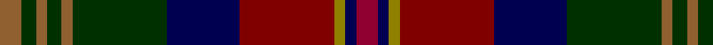

In pattern [RBGRBGRGRGR](/stripes/rbgrbgrgrgr/).

This was sourced from weddslist.  It is a [11 stripe tartan](/stripes/stripes11/).

Original link http://www.weddslist.com/cgi-bin/tartans/pg.pl?source=sts

## Thread count
LT/6 DG4 LT3 DG4 LT3 DG26 DB20 DR26 LG3 DB3 DRa/6

## Palette
Each colour and the base-6 reference it is a variant of.

| Colour | Shade | Base |
|---|---|---|
| DB | <code style="background-color:#000050;">#000050</code> `oklch(19.5% 0.135 264.1)` <small>#000050</small> | B <code style="background-color:#2A418A;">#2A418A</code> |
| DG | <code style="background-color:#003000;">#003000</code> `oklch(26.8% 0.091 142.5)` <small>#003000</small> | G <code style="background-color:#006100;">#006100</code> |
| DR | <code style="background-color:#800000;">#800000</code> `oklch(37.7% 0.155 29.2)` <small>#800000</small> | R <code style="background-color:#CC0000;">#CC0000</code> |
| DRa | <code style="background-color:#900030;">#900030</code> `oklch(41.6% 0.166 13.6)` <small>#900030</small> | R <code style="background-color:#CC0000;">#CC0000</code> |
| LG | <code style="background-color:#908000;">#908000</code> `oklch(59.6% 0.124 100.6)` <small>#908000</small> | G <code style="background-color:#006100;">#006100</code> |
| LT | <code style="background-color:#906030;">#906030</code> `oklch(53.1% 0.089 63.7)` <small>#906030</small> | R <code style="background-color:#CC0000;">#CC0000</code> |

## Nearest tartans

The nearest existing variants by ΔTartan distance, with this tartan at the top so the swatches line up against it.

ΔTartan

Tartan

Sett

—

<a href="/ttd/edit/#slug=r6db3y3r26db20dg26o3dg4o3dg4o6">Bonnie Brae</a> <a class="nn-out" href="/setts/s11/r6db3y3r26db20dg26o3dg4o3dg4o6/" title="open its dictionary page">↗</a>

0.88

<a href="/ttd/edit/#slug=lo5db2r14do9dg8db3r3db3r3db3dg18ly3~x2">Meath, County</a> <a class="nn-out" href="/setts/s12/lo5db2r14do9dg8db3r3db3r3db3dg18ly3~x2/" title="open its dictionary page">↗</a>

0.91

<a href="/ttd/edit/#slug=db6r2db2r3db3r18db16r2g18r2db3t3db2r6~x2">Minster</a> <a class="nn-out" href="/setts/s14/db6r2db2r3db3r18db16r2g18r2db3t3db2r6~x2/" title="open its dictionary page">↗</a>

0.94

<a href="/ttd/edit/#slug=db3g4r2g3r3g16dt16r16db3r3db2r4ly3~x2">Cuthill (Personal)</a> <a class="nn-out" href="/setts/s13/db3g4r2g3r3g16dt16r16db3r3db2r4ly3~x2/" title="open its dictionary page">↗</a>

0.96

<a href="/ttd/edit/#slug=w2m19k2m2k3m2k8db8dg2db3dg2db2dg19lo2~x2">Gotts (Personal)</a> <a class="nn-out" href="/setts/s14/w2m19k2m2k3m2k8db8dg2db3dg2db2dg19lo2~x2/" title="open its dictionary page">↗</a>

1.12

<a href="/ttd/edit/#slug=do8y8do4y28k12dt6k12r4dt8r4dt29lr6">Kinloch Anderson Castle Grey</a> <a class="nn-out" href="/setts/s12/do8y8do4y28k12dt6k12r4dt8r4dt29lr6/" title="open its dictionary page">↗</a>

1.16

<a href="/ttd/edit/#slug=n3dg3r2dg20k25k2n13k2n3r3~x2">Loch Freuchie District Tartan Tartan Number: 10725. Earliest known date: 25 October 2012 A tartan for the area around Loch Freuchie near Crieff. The tartan is based on the Murray of Atholl and Breadalbane setts, with differences, to relate the tartan to the particular Loch Freuchie area. Mr MacArthur-Fox has created a tartan for anyone to wear without fear of offending another person or group. See products available Copyright © Blair Urquhart, Comrie, 2015</a> <a class="nn-out" href="/setts/s10/n3dg3r2dg20k25k2n13k2n3r3~x2/" title="open its dictionary page">↗</a>

1.21

<a href="/ttd/edit/#slug=o8dt8o4dt28dt12n6dt12r4n8r4n29lb6">Kinloch Anderson Granite (Corporate)</a> <a class="nn-out" href="/setts/s12/o8dt8o4dt28dt12n6dt12r4n8r4n29lb6/" title="open its dictionary page">↗</a>

1.22

<a href="/ttd/edit/#slug=n3dg3r2dg20k25ly2n13k2n3r3~x2">Loch Freuchie</a> <a class="nn-out" href="/setts/s10/n3dg3r2dg20k25ly2n13k2n3r3~x2/" title="open its dictionary page">↗</a>

1.22

<a href="/ttd/edit/#slug=g4db34g4dy4db4dy4g3dy13g21dy4lb3r11lo3~x2">State Seal of Illinois (Fashion)</a> <a class="nn-out" href="/setts/s13/g4db34g4dy4db4dy4g3dy13g21dy4lb3r11lo3~x2/" title="open its dictionary page">↗</a>

1.26

<a href="/ttd/edit/#slug=db24k6lo4k6lb4k6g24r48db5r6k5~x2">Unidentified Furnishing</a> <a class="nn-out" href="/setts/s11/db24k6lo4k6lb4k6g24r48db5r6k5~x2/" title="open its dictionary page">↗</a>

## Neighbour map

Every grey dot is one of 14299 variants placed by the first two principal components of the ΔTartan feature space (44% of its variance). Red is this tartan; blue dots are its nearest — click one to open its page.

<svg viewBox="0 0 640 380" role="img" style="max-width:100%;height:auto;border:1px solid #e0e0e0;border-radius:4px;display:block" xmlns="http://www.w3.org/2000/svg"><image href="/nn/cloud.v1.png" width="640" height="380"/><a href="/setts/s12/lo5db2r14do9dg8db3r3db3r3db3dg18ly3~x2/"><circle cx="150.7" cy="170.6" r="4" fill="#3465a4"><title>Meath, County</title></circle></a><a href="/setts/s14/db6r2db2r3db3r18db16r2g18r2db3t3db2r6~x2/"><circle cx="186.2" cy="155.4" r="4" fill="#3465a4"><title>Minster</title></circle></a><a href="/setts/s13/db3g4r2g3r3g16dt16r16db3r3db2r4ly3~x2/"><circle cx="125.6" cy="158.7" r="4" fill="#3465a4"><title>Cuthill (Personal)</title></circle></a><a href="/setts/s14/w2m19k2m2k3m2k8db8dg2db3dg2db2dg19lo2~x2/"><circle cx="142.0" cy="140.4" r="4" fill="#3465a4"><title>Gotts (Personal)</title></circle></a><a href="/setts/s12/do8y8do4y28k12dt6k12r4dt8r4dt29lr6/"><circle cx="110.3" cy="174.3" r="4" fill="#3465a4"><title>Kinloch Anderson Castle Grey</title></circle></a><a href="/setts/s10/n3dg3r2dg20k25k2n13k2n3r3~x2/"><circle cx="193.9" cy="156.7" r="4" fill="#3465a4"><title>Loch Freuchie District Tartan Tartan Number: 10725. Earliest known date: 25 October 2012 A tartan for the area around Loch Freuchie near Crieff. The tartan is based on the Murray of Atholl and Breadalbane setts, with differences, to relate the tartan to the particular Loch Freuchie area. Mr MacArthur-Fox has created a tartan for anyone to wear without fear of offending another person or group. See products available Copyright © Blair Urquhart, Comrie, 2015</title></circle></a><a href="/setts/s12/o8dt8o4dt28dt12n6dt12r4n8r4n29lb6/"><circle cx="135.5" cy="187.4" r="4" fill="#3465a4"><title>Kinloch Anderson Granite (Corporate)</title></circle></a><a href="/setts/s10/n3dg3r2dg20k25ly2n13k2n3r3~x2/"><circle cx="180.5" cy="148.6" r="4" fill="#3465a4"><title>Loch Freuchie</title></circle></a><a href="/setts/s13/g4db34g4dy4db4dy4g3dy13g21dy4lb3r11lo3~x2/"><circle cx="176.9" cy="147.5" r="4" fill="#3465a4"><title>State Seal of Illinois (Fashion)</title></circle></a><a href="/setts/s11/db24k6lo4k6lb4k6g24r48db5r6k5~x2/"><circle cx="180.3" cy="132.3" r="4" fill="#3465a4"><title>Unidentified Furnishing</title></circle></a><circle cx="154.3" cy="166.5" r="5" fill="#c00000"/></svg>

ID: /setts/s11/r6db3y3r26db20dg26o3dg4o3dg4o6/
