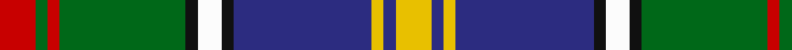

In pattern [RGRGKWKBYBY](/patterns/rgrgkwkbyby/).

This was sourced from register-of-tartans.  It is a [11 stripes tartan](/stripes/stripes11/).

Original link https://www.tartanregister.gov.uk/tartanDetails.aspx?ref=1359

## Attestations

This cloth appears in 2 source records; the oldest owns this page.

- 01/01/1989 — Glasgow, City of Culture (register-of-tartans, [record](https://www.tartanregister.gov.uk/tartanDetails.aspx?ref=1359))
- 1990? — Culture, The (Corporate) (tartans-authority, [record](http://www.tartansauthority.com/tartan-ferret/display/1534/))

## Thread count
R/12 G4 R4 G42 K4 W8 K4 DB46 Y4 DB4 Y/12

## Palette
Each colour and its ΔE from the base-6 reference it is a variant of.

| Colour | Shade | Base | ΔE (OKLab) |
|---|---|---|---|
| DB | <code style="background-color:#2C2C80;">#2C2C80</code> `#2C2C80` | B <code style="background-color:#2A418A;">#2A418A</code> | 0.06 |
| G | <code style="background-color:#006818;">#006818</code> `#006818` | G <code style="background-color:#006100;">#006100</code> | 0.02 |
| K | <code style="background-color:#101010;">#101010</code> `#101010` | K <code style="background-color:#000000;">#000000</code> | 0.17 |
| R | <code style="background-color:#C80000;">#C80000</code> `#C80000` | R <code style="background-color:#CC0000;">#CC0000</code> | 0.01 |
| W | <code style="background-color:#FCFCFC;">#FCFCFC</code> `#FCFCFC` | W <code style="background-color:#F7F7F7;">#F7F7F7</code> | 0.01 |
| Y | <code style="background-color:#E8C000;">#E8C000</code> `#E8C000` | Y <code style="background-color:#F2BF00;">#F2BF00</code> | 0.02 |

## Nearest tartans

The nearest existing variants by ΔTartan distance.

1. [Culture The... Corporate Tartan Tartan Number: 1534. Earliest known date: 1989 Colours chosen to reflect a European essence that will endure beyond the 1990 'Year of Culture'. Supply and manufacture only at MacDonald MacKay (Kiltmakers) Ltd., Glasgow. See products available Copyright © Blair Urquhart, Comrie, 2015](/setts/s11/r6g2r2g21k2w4k2b23y2b2y6~b2c2c80-g006818-k101010-rc80000-we0e0e0-ye8c000~x2/) — ΔT 0.13
1. [Culture, The...](/setts/s11/r6g2r2g21k2w4k2b23y2b2y6~b304080-g008000-k000000-rc00000-we0e0e0-yf0c000~x2/) — ΔT 0.50
1. [Dunedin (USA) (District)](/setts/s9/w3b25k3r3k3r8g21k3k2~b2888c4-g006818-k101010-rc80000-wfcfcfc~x2/) — ΔT 0.70
1. [Mary, Queen of Scots](/setts/s9/r5w1b10g10w1y1g2ba2w1~b2c2c80-ba5c8ca8-g006818-rc80000-we0e0e0-ye8c000~x2/) — ΔT 0.76
1. [Ayrton](/setts/s11/r4k2g25k2b10k2g4k2ba25k2y4~b5480b0-ba304080-g008000-k000000-rc00000-yf0c000~x2/) — ΔT 0.80
1. [Federated Women's Institutes of](/setts/s9/r2k1y2g3y4g3b12k1w2~b003478-g007800-k000000-r8c0000-wc8c8c8-yc88c00~x4/) — ΔT 0.83
1. [Crosser, Crozier](/setts/s11/w4b5r3b22y4k3g17r7k2r7y2~b304080-g008000-k000000-rc00000-we0e0e0-yf0c000~x2/) — ΔT 0.86
1. [Quebec, Plaid Du](/setts/s12/b25g5b2y2k2r3g20r20b2w2k2r2~b000050-g008000-k000000-rc00000-we0e0e0-yf0c000~x2/) — ΔT 0.91
1. [Dunedin](/setts/s9/k3r3g21ra8r3ra4k3b26w3~b304080-g008000-k000000-rc00000-ra900030-we0e0e0~x2/) — ΔT 0.92
1. [Royal Scottish P.B. Assoc. (Corp.)](/setts/s12/w6k1b20r2g3r2k15r2g3r2k6y3~b5c8ca8-g006818-k101010-rc80000-wc0c0c0-yfccc00~x2/) — ΔT 0.94

## Neighbour map

Every grey dot is one of 15726 variants placed by the first two principal components of the ΔTartan feature space (44% of its variance). Red is this tartan; blue dots are its nearest — click one to open its page.

<svg viewBox="0 0 640 380" role="img" style="max-width:100%;height:auto;border:1px solid #e0e0e0;border-radius:4px;display:block" xmlns="http://www.w3.org/2000/svg"><image href="/nn/cloud.v1.png" width="640" height="380"/><a href="/setts/s11/r6g2r2g21k2w4k2b23y2b2y6~b2c2c80-g006818-k101010-rc80000-we0e0e0-ye8c000~x2/"><circle cx="130.2" cy="114.0" r="4" fill="#3465a4"><title>Culture The... Corporate Tartan Tartan Number: 1534. Earliest known date: 1989 Colours chosen to reflect a European essence that will endure beyond the 1990 'Year of Culture'. Supply and manufacture only at MacDonald MacKay (Kiltmakers) Ltd., Glasgow. See products available Copyright © Blair Urquhart, Comrie, 2015</title></circle></a><a href="/setts/s11/r6g2r2g21k2w4k2b23y2b2y6~b304080-g008000-k000000-rc00000-we0e0e0-yf0c000~x2/"><circle cx="124.1" cy="111.7" r="4" fill="#3465a4"><title>Culture, The...</title></circle></a><a href="/setts/s9/w3b25k3r3k3r8g21k3k2~b2888c4-g006818-k101010-rc80000-wfcfcfc~x2/"><circle cx="136.9" cy="128.4" r="4" fill="#3465a4"><title>Dunedin (USA) (District)</title></circle></a><a href="/setts/s9/r5w1b10g10w1y1g2ba2w1~b2c2c80-ba5c8ca8-g006818-rc80000-we0e0e0-ye8c000~x2/"><circle cx="133.2" cy="140.4" r="4" fill="#3465a4"><title>Mary, Queen of Scots</title></circle></a><a href="/setts/s11/r4k2g25k2b10k2g4k2ba25k2y4~b5480b0-ba304080-g008000-k000000-rc00000-yf0c000~x2/"><circle cx="134.0" cy="116.6" r="4" fill="#3465a4"><title>Ayrton</title></circle></a><a href="/setts/s9/r2k1y2g3y4g3b12k1w2~b003478-g007800-k000000-r8c0000-wc8c8c8-yc88c00~x4/"><circle cx="138.7" cy="135.2" r="4" fill="#3465a4"><title>Federated Women's Institutes of</title></circle></a><a href="/setts/s11/w4b5r3b22y4k3g17r7k2r7y2~b304080-g008000-k000000-rc00000-we0e0e0-yf0c000~x2/"><circle cx="109.5" cy="126.7" r="4" fill="#3465a4"><title>Crosser, Crozier</title></circle></a><a href="/setts/s12/b25g5b2y2k2r3g20r20b2w2k2r2~b000050-g008000-k000000-rc00000-we0e0e0-yf0c000~x2/"><circle cx="135.6" cy="105.3" r="4" fill="#3465a4"><title>Quebec, Plaid Du</title></circle></a><a href="/setts/s9/k3r3g21ra8r3ra4k3b26w3~b304080-g008000-k000000-rc00000-ra900030-we0e0e0~x2/"><circle cx="125.6" cy="144.2" r="4" fill="#3465a4"><title>Dunedin</title></circle></a><a href="/setts/s12/w6k1b20r2g3r2k15r2g3r2k6y3~b5c8ca8-g006818-k101010-rc80000-wc0c0c0-yfccc00~x2/"><circle cx="131.9" cy="92.2" r="4" fill="#3465a4"><title>Royal Scottish P.B. Assoc. (Corp.)</title></circle></a><circle cx="126.5" cy="112.3" r="5" fill="#c00000"/></svg>

ID: /setts/s11/r6g2r2g21k2w4k2b23y2b2y6~b2c2c80-g006818-k101010-rc80000-wfcfcfc-ye8c000~x2/
