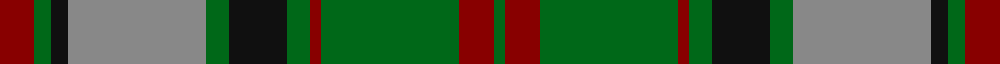

This page is one **sett** — a single exact thread-count. It belongs to the [tartan](/tartans/r6g3k3o24g4k10g4r2g24r6g2/)
(the same proportion at any scale), whose colour order is pattern [GRGRGKGRKGR](/stripes/grgrgkgrkgr/).

Sourced from tartans-authority.  It is a [11 stripe tartan](/stripes/stripes11/).

Original link http://www.tartansauthority.com/tartan-ferret/display/3510/

## Also known as

This cloth is also recorded under:

- MacNeish Hunting

2 attestations — the source records this cloth was collapsed from (oldest owns this page)

<ul>
<li>pre 2002 — MacNeish Htg (tartans-authority, <a href="http://www.tartansauthority.com/tartan-ferret/display/3510/">record</a>)</li>
<li>undated — MacNeish Hunting (register-of-tartans, <a href="https://www.tartanregister.gov.uk/tartanDetails.aspx?ref=5195">record</a>)</li>
</ul>

## Register references

External register numbers recorded for this tartan.

- Scottish Register of Tartans: [5195](https://www.tartanregister.gov.uk/tartanDetails.aspx?ref=5195)
- Scottish Tartans Authority (ITI): 3510

## Thread count
DR/12 G6 K6 N48 G8 K20 G8 DR4 G48 DR12 G/4

## Palette

Palette: <strong>Tartan Register</strong>
<table><thead><tr><th>Colour</th><th>Threads</th><th>Shade</th><th>Base</th><th>OKLCh</th></tr></thead><tbody><tr><td>DR/</td><td style="text-align:right;font-variant-numeric:tabular-nums">12</td><td><code style="background-color:#880000;">#880000</code> <small style="color:#888">#880000</small></td><td>R <code style="background-color:#CC0000;">#CC0000</code></td><td><small style="color:#888">oklch(39.4% 0.162 29.2)</small></td></tr><tr><td>G</td><td style="text-align:right;font-variant-numeric:tabular-nums">6</td><td><code style="background-color:#006818;">#006818</code> <small style="color:#888">#006818</small></td><td>G <code style="background-color:#006100;">#006100</code></td><td><small style="color:#888">oklch(45.0% 0.142 145.0)</small></td></tr><tr><td>K</td><td style="text-align:right;font-variant-numeric:tabular-nums">6</td><td><code style="background-color:#101010;">#101010</code> <small style="color:#888">#101010</small></td><td>K <code style="background-color:#000000;">#000000</code></td><td><small style="color:#888">oklch(17.3% 0.000 89.9)</small></td></tr><tr><td>N</td><td style="text-align:right;font-variant-numeric:tabular-nums">48</td><td><code style="background-color:#888888;">#888888</code> <small style="color:#888">#888888</small></td><td>R <code style="background-color:#CC0000;">#CC0000</code></td><td><small style="color:#888">oklch(62.7% 0.000 89.9)</small></td></tr><tr><td>G</td><td style="text-align:right;font-variant-numeric:tabular-nums">8</td><td><code style="background-color:#006818;">#006818</code> <small style="color:#888">#006818</small></td><td>G <code style="background-color:#006100;">#006100</code></td><td><small style="color:#888">oklch(45.0% 0.142 145.0)</small></td></tr><tr><td>K</td><td style="text-align:right;font-variant-numeric:tabular-nums">20</td><td><code style="background-color:#101010;">#101010</code> <small style="color:#888">#101010</small></td><td>K <code style="background-color:#000000;">#000000</code></td><td><small style="color:#888">oklch(17.3% 0.000 89.9)</small></td></tr><tr><td>G</td><td style="text-align:right;font-variant-numeric:tabular-nums">8</td><td><code style="background-color:#006818;">#006818</code> <small style="color:#888">#006818</small></td><td>G <code style="background-color:#006100;">#006100</code></td><td><small style="color:#888">oklch(45.0% 0.142 145.0)</small></td></tr><tr><td>DR</td><td style="text-align:right;font-variant-numeric:tabular-nums">4</td><td><code style="background-color:#880000;">#880000</code> <small style="color:#888">#880000</small></td><td>R <code style="background-color:#CC0000;">#CC0000</code></td><td><small style="color:#888">oklch(39.4% 0.162 29.2)</small></td></tr><tr><td>G</td><td style="text-align:right;font-variant-numeric:tabular-nums">48</td><td><code style="background-color:#006818;">#006818</code> <small style="color:#888">#006818</small></td><td>G <code style="background-color:#006100;">#006100</code></td><td><small style="color:#888">oklch(45.0% 0.142 145.0)</small></td></tr><tr><td>DR</td><td style="text-align:right;font-variant-numeric:tabular-nums">12</td><td><code style="background-color:#880000;">#880000</code> <small style="color:#888">#880000</small></td><td>R <code style="background-color:#CC0000;">#CC0000</code></td><td><small style="color:#888">oklch(39.4% 0.162 29.2)</small></td></tr><tr><td>G/</td><td style="text-align:right;font-variant-numeric:tabular-nums">4</td><td><code style="background-color:#006818;">#006818</code> <small style="color:#888">#006818</small></td><td>G <code style="background-color:#006100;">#006100</code></td><td><small style="color:#888">oklch(45.0% 0.142 145.0)</small></td></tr></tbody></table>

## Nearest tartans

The nearest existing variants by ΔTartan distance, with this tartan at the top so the swatches line up against it.

ΔTartan

Tartan

Sett

—

<a href="/ttd/edit/#slug=r6g3k3o24g4k10g4r2g24r6g2~x2">MacNeish Htg</a> <a class="nn-out" href="/setts/s11/r6g3k3o24g4k10g4r2g24r6g2~x2/" title="open its dictionary page">↗</a>

0.90

<a href="/ttd/edit/#slug=r4t3r32db30r4g32r3g32r3g3~x2">Unidentified Plaid 6</a> <a class="nn-out" href="/setts/s10/r4t3r32db30r4g32r3g32r3g3~x2/" title="open its dictionary page">↗</a>

0.98

<a href="/ttd/edit/#slug=oi28g2oi4db18g23db2g3o4~x2">Dalbraith-Eastern Western Motor Group</a> <a class="nn-out" href="/setts/s8/oi28g2oi4db18g23db2g3o4~x2/" title="open its dictionary page">↗</a>

1.00

<a href="/ttd/edit/#slug=w1r1g1r11t6r1g14r1g1w1~x4">Glen Tilt #2</a> <a class="nn-out" href="/setts/s10/w1r1g1r11t6r1g14r1g1w1~x4/" title="open its dictionary page">↗</a>

1.07

<a href="/ttd/edit/#slug=db4o17db4y4db2y4db4y27db4ly4~x2">Cape Breton University Chemistry Society</a> <a class="nn-out" href="/setts/s10/db4o17db4y4db2y4db4y27db4ly4~x2/" title="open its dictionary page">↗</a>

1.08

<a href="/ttd/edit/#slug=g28r12g4db20ly2db3ly2db3g7~x2">Cork</a> <a class="nn-out" href="/setts/s9/g28r12g4db20ly2db3ly2db3g7~x2/" title="open its dictionary page">↗</a>

1.08

<a href="/ttd/edit/#slug=t39g3t3g20k3g20k3g3k20r3~x2">Dunedin Chapter (Corporate)</a> <a class="nn-out" href="/setts/s10/t39g3t3g20k3g20k3g3k20r3~x2/" title="open its dictionary page">↗</a>

1.12

<a href="/ttd/edit/#slug=k1db1g16r16k12db8g16db1k1~x2">MacNett</a> <a class="nn-out" href="/setts/s9/k1db1g16r16k12db8g16db1k1~x2/" title="open its dictionary page">↗</a>

1.13

<a href="/ttd/edit/#slug=db4o17db4g4db2g4db4g27db4ly4~x2">Cape Breton University</a> <a class="nn-out" href="/setts/s10/db4o17db4g4db2g4db4g27db4ly4~x2/" title="open its dictionary page">↗</a>

1.13

<a href="/ttd/edit/#slug=dy4k2lo3k2dy7k9g20k2t3k2g4~x2">Choinka Family (Personal)</a> <a class="nn-out" href="/setts/s11/dy4k2lo3k2dy7k9g20k2t3k2g4~x2/" title="open its dictionary page">↗</a>

1.13

<a href="/ttd/edit/#slug=y24dp3y3dp3y3dp7dg20r3~x2">Crantock</a> <a class="nn-out" href="/setts/s8/y24dp3y3dp3y3dp7dg20r3~x2/" title="open its dictionary page">↗</a>

## Neighbour map

Every grey dot is one of 14359 variants placed by the first two principal components of the ΔTartan feature space (44% of its variance). Red is this tartan; blue dots are its nearest — click one to open its page.

<svg viewBox="0 0 640 380" role="img" style="max-width:100%;height:auto;border:1px solid #e0e0e0;border-radius:4px;display:block" xmlns="http://www.w3.org/2000/svg"><image href="/nn/cloud.v1.png" width="640" height="380"/><a href="/setts/s10/r4t3r32db30r4g32r3g32r3g3~x2/"><circle cx="260.7" cy="183.7" r="4" fill="#3465a4"><title>Unidentified Plaid 6</title></circle></a><a href="/setts/s8/oi28g2oi4db18g23db2g3o4~x2/"><circle cx="231.4" cy="188.8" r="4" fill="#3465a4"><title>Dalbraith-Eastern Western Motor Group</title></circle></a><a href="/setts/s10/w1r1g1r11t6r1g14r1g1w1~x4/"><circle cx="266.4" cy="154.2" r="4" fill="#3465a4"><title>Glen Tilt #2</title></circle></a><a href="/setts/s10/db4o17db4y4db2y4db4y27db4ly4~x2/"><circle cx="280.5" cy="176.0" r="4" fill="#3465a4"><title>Cape Breton University Chemistry Society</title></circle></a><a href="/setts/s9/g28r12g4db20ly2db3ly2db3g7~x2/"><circle cx="274.0" cy="178.5" r="4" fill="#3465a4"><title>Cork</title></circle></a><a href="/setts/s10/t39g3t3g20k3g20k3g3k20r3~x2/"><circle cx="231.3" cy="177.6" r="4" fill="#3465a4"><title>Dunedin Chapter (Corporate)</title></circle></a><a href="/setts/s9/k1db1g16r16k12db8g16db1k1~x2/"><circle cx="235.7" cy="178.2" r="4" fill="#3465a4"><title>MacNett</title></circle></a><a href="/setts/s10/db4o17db4g4db2g4db4g27db4ly4~x2/"><circle cx="250.9" cy="159.9" r="4" fill="#3465a4"><title>Cape Breton University</title></circle></a><a href="/setts/s11/dy4k2lo3k2dy7k9g20k2t3k2g4~x2/"><circle cx="211.9" cy="178.2" r="4" fill="#3465a4"><title>Choinka Family (Personal)</title></circle></a><a href="/setts/s8/y24dp3y3dp3y3dp7dg20r3~x2/"><circle cx="268.1" cy="216.0" r="4" fill="#3465a4"><title>Crantock</title></circle></a><circle cx="234.6" cy="178.4" r="5" fill="#c00000"/></svg>

ID: /setts/s11/r6g3k3o24g4k10g4r2g24r6g2~x2/
