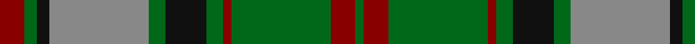

In pattern [GRGRGKGRKGR](/patterns/grgrgkgrkgr/).

This was sourced from tartans-authority.  It is a [11 stripes tartan](/stripes/stripes11/).

Original link http://www.tartansauthority.com/tartan-ferret/display/3510/

## Attestations

This cloth appears in 2 source records; the oldest owns this page.

- pre 2002 — MacNeish Htg (tartans-authority, [record](http://www.tartansauthority.com/tartan-ferret/display/3510/))
- undated — MacNeish Hunting (register-of-tartans, [record](https://www.tartanregister.gov.uk/tartanDetails.aspx?ref=5195))

## Thread count
DR/12 G6 K6 N48 G8 K20 G8 DR4 G48 DR12 G/4

## Palette
Each colour and its ΔE from the base-6 reference it is a variant of.

| Colour | Shade | Base | ΔE (OKLab) |
|---|---|---|---|
| DR | <code style="background-color:#880000;">#880000</code> `#880000` | R <code style="background-color:#CC0000;">#CC0000</code> | 0.15 |
| G | <code style="background-color:#006818;">#006818</code> `#006818` | G <code style="background-color:#006100;">#006100</code> | 0.02 |
| K | <code style="background-color:#101010;">#101010</code> `#101010` | K <code style="background-color:#000000;">#000000</code> | 0.17 |
| N | <code style="background-color:#888888;">#888888</code> `#888888` | R <code style="background-color:#CC0000;">#CC0000</code> | 0.24 |

## Nearest tartans

The nearest existing variants by ΔTartan distance.

1. [Unidentified Plaid 6](/setts/s10/r4b3r32ba30r4g32r3g32r3g3~b5480b0-ba304080-g008000-rc00000~x2/) — ΔT 0.90
1. [Dalbraith-Eastern Western Motor Group](/setts/s8/r28g2r4b18g23b2g3ra4~b000050-g008000-r806050-ra906030~x2/) — ΔT 0.98
1. [Glen Tilt #2](/setts/s10/w1g1r1g14r1b6r11g1r1w1~b2888c4-g006818-r880000-we0e0e0~x4/) — ΔT 1.00
1. [Cape Breton University Chemistry Society](/setts/s10/b4r17b4g4b2g4b4g27b4y4~b000080-g546c3a-r943602-yc49d38~x2/) — ΔT 1.07
1. [Cork](/setts/s9/g28r12g4b20y2b3y2b3g7~b304080-g008000-rc00000-yf0c000~x2/) — ΔT 1.08
1. [Dunedin Chapter (Corporate)](/setts/s10/b39g3b3g20k3g20k3g3k20r3~b5c8ca8-g006818-k101010-rc80000~x2/) — ΔT 1.08
1. [MacNett](/setts/s9/k1b1g16r16k12b8g16b1k1~b2c2c80-g347400-k101010-rc80000~x2/) — ΔT 1.12
1. [Choinka Family (Personal)](/setts/s11/g4k2b3k2g20k9ga7k2y3k2ga4~b5c8ca8-g006818-ga604000-k101010-ydc943c~x2/) — ΔT 1.13
1. [Crantock](/setts/s8/g24b3g3b3g3b7ga20r3~b4c1864-g647c00-ga004028-rc80000~x2/) — ΔT 1.14
1. [Cape Breton University](/setts/s10/b4r17b4g4b2g4b4g27b4y4~b202060-g006818-re86000-yfccc00~x2/) — ΔT 1.14

## Neighbour map

Every grey dot is one of 15726 variants placed by the first two principal components of the ΔTartan feature space (44% of its variance). Red is this tartan; blue dots are its nearest — click one to open its page.

<svg viewBox="0 0 640 380" role="img" style="max-width:100%;height:auto;border:1px solid #e0e0e0;border-radius:4px;display:block" xmlns="http://www.w3.org/2000/svg"><image href="/nn/cloud.v1.png" width="640" height="380"/><a href="/setts/s10/r4b3r32ba30r4g32r3g32r3g3~b5480b0-ba304080-g008000-rc00000~x2/"><circle cx="259.5" cy="181.0" r="4" fill="#3465a4"><title>Unidentified Plaid 6</title></circle></a><a href="/setts/s8/r28g2r4b18g23b2g3ra4~b000050-g008000-r806050-ra906030~x2/"><circle cx="228.7" cy="184.3" r="4" fill="#3465a4"><title>Dalbraith-Eastern Western Motor Group</title></circle></a><a href="/setts/s10/w1g1r1g14r1b6r11g1r1w1~b2888c4-g006818-r880000-we0e0e0~x4/"><circle cx="264.8" cy="151.6" r="4" fill="#3465a4"><title>Glen Tilt #2</title></circle></a><a href="/setts/s10/b4r17b4g4b2g4b4g27b4y4~b000080-g546c3a-r943602-yc49d38~x2/"><circle cx="278.7" cy="171.9" r="4" fill="#3465a4"><title>Cape Breton University Chemistry Society</title></circle></a><a href="/setts/s9/g28r12g4b20y2b3y2b3g7~b304080-g008000-rc00000-yf0c000~x2/"><circle cx="272.0" cy="175.9" r="4" fill="#3465a4"><title>Cork</title></circle></a><a href="/setts/s10/b39g3b3g20k3g20k3g3k20r3~b5c8ca8-g006818-k101010-rc80000~x2/"><circle cx="228.2" cy="173.3" r="4" fill="#3465a4"><title>Dunedin Chapter (Corporate)</title></circle></a><a href="/setts/s9/k1b1g16r16k12b8g16b1k1~b2c2c80-g347400-k101010-rc80000~x2/"><circle cx="234.0" cy="176.1" r="4" fill="#3465a4"><title>MacNett</title></circle></a><a href="/setts/s11/g4k2b3k2g20k9ga7k2y3k2ga4~b5c8ca8-g006818-ga604000-k101010-ydc943c~x2/"><circle cx="209.3" cy="171.6" r="4" fill="#3465a4"><title>Choinka Family (Personal)</title></circle></a><a href="/setts/s8/g24b3g3b3g3b7ga20r3~b4c1864-g647c00-ga004028-rc80000~x2/"><circle cx="266.3" cy="210.4" r="4" fill="#3465a4"><title>Crantock</title></circle></a><a href="/setts/s10/b4r17b4g4b2g4b4g27b4y4~b202060-g006818-re86000-yfccc00~x2/"><circle cx="249.2" cy="159.2" r="4" fill="#3465a4"><title>Cape Breton University</title></circle></a><circle cx="232.5" cy="173.6" r="5" fill="#c00000"/></svg>

ID: /setts/s11/r6g3k3ra24g4k10g4r2g24r6g2~g006818-k101010-r880000-ra888888~x2/
