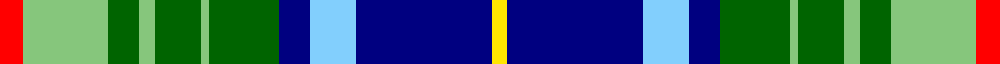

In pattern [RYGYGYGBWBY](/stripes/rygygygbwby/).

This was sourced from register-of-tartans.  It is a [11 stripe tartan](/stripes/stripes11/).

Original link https://www.tartanregister.gov.uk/tartanDetails.aspx?ref=10316

## Register references

External register numbers recorded for this tartan.

- Scottish Register of Tartans: [10316](https://www.tartanregister.gov.uk/tartanDetails.aspx?ref=10316)

## Thread count
R/6 LG22 G8 LG4 G12 LG2 G18 DB8 LB12 DB35 Y/4

## Palette
Each colour and the base-6 reference it is a variant of.

| Colour | Shade | Base |
|---|---|---|
| DB | <code style="background-color:#000080;">#000080</code> `oklch(27.1% 0.188 264.1)` <small>#000080</small> | B <code style="background-color:#2A418A;">#2A418A</code> |
| G | <code style="background-color:#006400;">#006400</code> `oklch(43.6% 0.148 142.5)` <small>#006400</small> | G <code style="background-color:#006100;">#006100</code> |
| LB | <code style="background-color:#82CFFD;">#82CFFD</code> `oklch(82.2% 0.100 236.0)` <small>#82CFFD</small> | W <code style="background-color:#F7F7F7;">#F7F7F7</code> |
| LG | <code style="background-color:#86C67C;">#86C67C</code> `oklch(76.5% 0.122 141.1)` <small>#86C67C</small> | Y <code style="background-color:#F2BF00;">#F2BF00</code> |
| R | <code style="background-color:#FF0000;">#FF0000</code> `oklch(62.8% 0.258 29.2)` <small>#FF0000</small> | R <code style="background-color:#CC0000;">#CC0000</code> |
| Y | <code style="background-color:#FFE600;">#FFE600</code> `oklch(91.7% 0.192 101.4)` <small>#FFE600</small> | Y <code style="background-color:#F2BF00;">#F2BF00</code> |

## Nearest tartans

The nearest existing variants by ΔTartan distance.

1. [Scottish Motor Trade Association](/setts/s11/g12db4g54db26k4w8db18db44w3db12w4/) — ΔT 0.87
1. [Auchinachie](/setts/s12/k2db12k8lg10w1lg10k4r1k4db12k2g2~x2/) — ΔT 1.12
1. [Hogg Dress](/setts/s9/t34r3t8dt4t8k24g34k2w6/) — ΔT 1.14
1. [Copar a'Beannichte Dress (Personal)](/setts/s10/g6g20g6w15dt5w2dt15o4dt10r2~x2/) — ΔT 1.16
1. [Pearl of the Orient](/setts/s13/dp4dt20db4dt6g6w2ly4g4r2g18db4r1w4~x2/) — ΔT 1.19
1. [Copar a'Beannichte Dress (Personal)](/setts/s9/g20g6w15dt5w2dt15o4dt10r2~x2/) — ΔT 1.21
1. [Iroquois Falls Centenary](/setts/s8/g18lg6dy3w1dy3w1lt6db6~x2/) — ΔT 1.31
1. [Order of Saint Lazarus](/setts/s10/g9w9k2w2k2ly2dg28g2db12g4~x2/) — ΔT 1.31
1. [Holroyd, John (Personal](/setts/s12/w3g7db2g5db8db3ly3db3g3db12t21ly3~x2/) — ΔT 1.32
1. [Murray of Atholl Dress](/setts/s12/w5db1w16db4w4k6g10r2g10k6db10r2~x2/) — ΔT 1.33

## Neighbour map

Every grey dot is one of 14299 variants placed by the first two principal components of the ΔTartan feature space (44% of its variance). Red is this tartan; blue dots are its nearest — click one to open its page.

<svg viewBox="0 0 640 380" role="img" style="max-width:100%;height:auto;border:1px solid #e0e0e0;border-radius:4px;display:block" xmlns="http://www.w3.org/2000/svg"><image href="/nn/cloud.v1.png" width="640" height="380"/><a href="/setts/s11/g12db4g54db26k4w8db18db44w3db12w4/"><circle cx="140.3" cy="118.5" r="4" fill="#3465a4"><title>Scottish Motor Trade Association</title></circle></a><a href="/setts/s12/k2db12k8lg10w1lg10k4r1k4db12k2g2~x2/"><circle cx="110.1" cy="142.8" r="4" fill="#3465a4"><title>Auchinachie</title></circle></a><a href="/setts/s9/t34r3t8dt4t8k24g34k2w6/"><circle cx="168.1" cy="136.3" r="4" fill="#3465a4"><title>Hogg Dress</title></circle></a><a href="/setts/s10/g6g20g6w15dt5w2dt15o4dt10r2~x2/"><circle cx="91.2" cy="163.5" r="4" fill="#3465a4"><title>Copar a'Beannichte Dress (Personal)</title></circle></a><a href="/setts/s13/dp4dt20db4dt6g6w2ly4g4r2g18db4r1w4~x2/"><circle cx="113.2" cy="90.9" r="4" fill="#3465a4"><title>Pearl of the Orient</title></circle></a><a href="/setts/s9/g20g6w15dt5w2dt15o4dt10r2~x2/"><circle cx="107.8" cy="165.8" r="4" fill="#3465a4"><title>Copar a'Beannichte Dress (Personal)</title></circle></a><a href="/setts/s8/g18lg6dy3w1dy3w1lt6db6~x2/"><circle cx="146.9" cy="129.0" r="4" fill="#3465a4"><title>Iroquois Falls Centenary</title></circle></a><a href="/setts/s10/g9w9k2w2k2ly2dg28g2db12g4~x2/"><circle cx="130.1" cy="114.5" r="4" fill="#3465a4"><title>Order of Saint Lazarus</title></circle></a><a href="/setts/s12/w3g7db2g5db8db3ly3db3g3db12t21ly3~x2/"><circle cx="79.8" cy="138.9" r="4" fill="#3465a4"><title>Holroyd, John (Personal</title></circle></a><a href="/setts/s12/w5db1w16db4w4k6g10r2g10k6db10r2~x2/"><circle cx="90.9" cy="141.7" r="4" fill="#3465a4"><title>Murray of Atholl Dress</title></circle></a><circle cx="96.0" cy="125.6" r="5" fill="#c00000"/></svg>

ID: /setts/s11/r6lg22g8lg4g12lg2g18db8lt12db35ly4/
