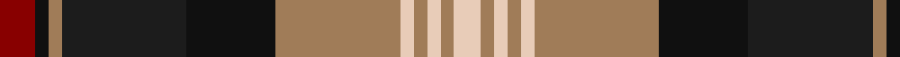

In pattern [RKRBKRWRWRW](/patterns/rkrbkrwrwrw/).

This was sourced from register-of-tartans.  It is a [11 stripes tartan](/stripes/stripes11/).

Original link https://www.tartanregister.gov.uk/tartanDetails.aspx?ref=2186

## Attestations

This cloth appears in 2 source records; the oldest owns this page.

- 01/01/2002 — Logan #6 (register-of-tartans, [record](https://www.tartanregister.gov.uk/tartanDetails.aspx?ref=2186))
- pre 2002 — Logan (Fashion) (tartans-authority, [record](http://www.tartansauthority.com/tartan-ferret/display/5477/))

## Thread count
DR/8 Ka3 LT3 K28 Ka20 LT28 LR3 LT3 LR3 LT3 LR/6

## Palette
Each colour and its ΔE from the base-6 reference it is a variant of.

| Colour | Shade | Base | ΔE (OKLab) |
|---|---|---|---|
| DR | <code style="background-color:#880000;">#880000</code> `#880000` | R <code style="background-color:#C80000;">#C80000</code> | 0.14 |
| K | <code style="background-color:#1C1C1C;">#1C1C1C</code> `#1C1C1C` | B <code style="background-color:#2C4084;">#2C4084</code> | 0.20 |
| Ka | <code style="background-color:#101010;">#101010</code> `#101010` | K <code style="background-color:#000000;">#000000</code> | 0.17 |
| LR | <code style="background-color:#E8CCB8;">#E8CCB8</code> `#E8CCB8` | W <code style="background-color:#F4F4F0;">#F4F4F0</code> | 0.11 |
| LT | <code style="background-color:#A07C58;">#A07C58</code> `#A07C58` | R <code style="background-color:#C80000;">#C80000</code> | 0.19 |

ID: /setts/s11/r8k3ra3b28k20ra28w3ra3w3ra3w6-b1c1c1c-k101010-r880000-raa07c58-we8ccb8/
