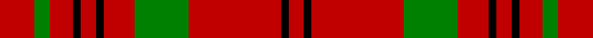

In pattern [RGRKRKRGRKR](/stripes/rgrkrkrgrkr/).

This was sourced from weddslist.  It is a [11 stripe tartan](/stripes/stripes11/).

Original link http://www.weddslist.com/cgi-bin/tartans/pg.pl?source=sts

## Thread count
R/18 G8 R12 K4 R8 K4 R16 G28 R48 K4 R/8

## Palette
Each colour and the base-6 reference it is a variant of.

| Colour | Shade | Base |
|---|---|---|
| G | <code style="background-color:#008000;">#008000</code> `oklch(52.0% 0.177 142.5)` <small>#008000</small> | G <code style="background-color:#006100;">#006100</code> |
| K | <code style="background-color:#000000;">#000000</code> `oklch(0.0% 0.000 0.0)` <small>#000000</small> | K <code style="background-color:#000000;">#000000</code> |
| R | <code style="background-color:#C00000;">#C00000</code> `oklch(50.7% 0.208 29.2)` <small>#C00000</small> | R <code style="background-color:#CC0000;">#CC0000</code> |

## Nearest tartans

The nearest existing variants by ΔTartan distance.

1. [MacDonell of Keppach](/setts/s11/r9dg4r6k2r4k2r8dg14r24k2r4~x2/) — ΔT 0.68
1. [MacDonell of Keppoch #2](/setts/s11/r8dg2r6db1r2db1r8dg12r14db1r2~x2/) — ΔT 1.01
1. [Auld Reekie Trade Tartan Tartan Number: 2381. Earliest known date: Pre 1997 Produced by or for Barkraft Lt for use as a blanket or rug. See products available Copyright © Blair Urquhart, Comrie, 2015](/setts/s10/db4r3db3r22g8r2~x2/) — ΔT 1.18
1. [MacDonell of Keppoch](/setts/s11/r8g2r6db1r2db1r8g12r14db1r2~x2/) — ΔT 1.18
1. [MacQuarrie #7](/setts/s7/r4dg5r2k6r18k2r4~x2/) — ΔT 1.28
1. [MacDonald of Belfinlay](/setts/s10/k8g4r4g3r32g3r4g3r4k4~x2/) — ΔT 1.35
1. [Auld Lang Syne (red) Tartan Tartan Number: 2402. Earliest known date: Threadcount and colours aren't 100% original. Generated manually. See products available Copyright © Blair Urquhart, Comrie, 2015](/setts/s7/r4g14r5k6r24g2r4~x2/) — ΔT 1.36
1. [Crawford](/setts/s7/r6lb2r30dg12r3dg12r3/) — ΔT 1.36
1. [MacQuarrie 5](/setts/s7/r4g5r2k6r18k2r4~x2/) — ΔT 1.39
1. [Macan, of Lurgyvallan (Hose)](/setts/s6/r10k1r4g6~x2/) — ΔT 1.40

## Neighbour map

Every grey dot is one of 14299 variants placed by the first two principal components of the ΔTartan feature space (44% of its variance). Red is this tartan; blue dots are its nearest — click one to open its page.

<svg viewBox="0 0 640 380" role="img" style="max-width:100%;height:auto;border:1px solid #e0e0e0;border-radius:4px;display:block" xmlns="http://www.w3.org/2000/svg"><image href="/nn/cloud.v1.png" width="640" height="380"/><a href="/setts/s11/r9dg4r6k2r4k2r8dg14r24k2r4~x2/"><circle cx="433.4" cy="179.5" r="4" fill="#3465a4"><title>MacDonell of Keppach</title></circle></a><a href="/setts/s11/r8dg2r6db1r2db1r8dg12r14db1r2~x2/"><circle cx="454.5" cy="180.4" r="4" fill="#3465a4"><title>MacDonell of Keppoch #2</title></circle></a><a href="/setts/s10/db4r3db3r22g8r2~x2/"><circle cx="424.2" cy="191.2" r="4" fill="#3465a4"><title>Auld Reekie Trade Tartan Tartan Number: 2381. Earliest known date: Pre 1997 Produced by or for Barkraft Lt for use as a blanket or rug. See products available Copyright © Blair Urquhart, Comrie, 2015</title></circle></a><a href="/setts/s11/r8g2r6db1r2db1r8g12r14db1r2~x2/"><circle cx="462.4" cy="189.2" r="4" fill="#3465a4"><title>MacDonell of Keppoch</title></circle></a><a href="/setts/s7/r4dg5r2k6r18k2r4~x2/"><circle cx="408.1" cy="203.4" r="4" fill="#3465a4"><title>MacQuarrie #7</title></circle></a><a href="/setts/s10/k8g4r4g3r32g3r4g3r4k4~x2/"><circle cx="405.8" cy="166.1" r="4" fill="#3465a4"><title>MacDonald of Belfinlay</title></circle></a><a href="/setts/s7/r4g14r5k6r24g2r4~x2/"><circle cx="394.7" cy="205.8" r="4" fill="#3465a4"><title>Auld Lang Syne (red) Tartan Tartan Number: 2402. Earliest known date: Threadcount and colours aren't 100% original. Generated manually. See products available Copyright © Blair Urquhart, Comrie, 2015</title></circle></a><a href="/setts/s7/r6lb2r30dg12r3dg12r3/"><circle cx="417.2" cy="193.4" r="4" fill="#3465a4"><title>Crawford</title></circle></a><a href="/setts/s7/r4g5r2k6r18k2r4~x2/"><circle cx="390.1" cy="200.8" r="4" fill="#3465a4"><title>MacQuarrie 5</title></circle></a><a href="/setts/s6/r10k1r4g6~x2/"><circle cx="407.9" cy="224.9" r="4" fill="#3465a4"><title>Macan, of Lurgyvallan (Hose)</title></circle></a><circle cx="420.4" cy="178.5" r="5" fill="#c00000"/></svg>

ID: /setts/s11/r9g4r6k2r4k2r8g14r24k2r4~x2/
