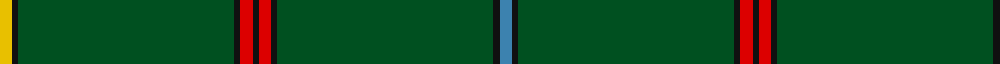

In pattern [BKGKRKRKGKY](/stripes/bkgkrkrkgky/).

This was sourced from register-of-tartans.  It is a [11 stripe tartan](/stripes/stripes11/).

Original link https://www.tartanregister.gov.uk/tartanDetails.aspx?ref=4213

## Also known as

This cloth is also recorded under:

- Unidentified #12

## Register references

External register numbers recorded for this tartan.

- Scottish Register of Tartans: [4213](https://www.tartanregister.gov.uk/tartanDetails.aspx?ref=4213)
- Scottish Tartans World Register: 346

## Thread count
Y/4 K2 G72 K2 R4 K2 R4 K2 G72 K2 B/4

## Palette
Each colour and its ΔE from the base-6 reference it is a variant of.

| Colour | Shade | Base | ΔE (OKLab) |
|---|---|---|---|
| B | <code style="background-color:#3C82AF;">#3C82AF</code> `#3C82AF` | B <code style="background-color:#2A418A;">#2A418A</code> | 0.19 |
| G | <code style="background-color:#005020;">#005020</code> `#005020` | G <code style="background-color:#006100;">#006100</code> | 0.07 |
| K | <code style="background-color:#101010;">#101010</code> `#101010` | K <code style="background-color:#000000;">#000000</code> | 0.17 |
| R | <code style="background-color:#DC0000;">#DC0000</code> `#DC0000` | R <code style="background-color:#CC0000;">#CC0000</code> | 0.03 |
| Y | <code style="background-color:#E8C000;">#E8C000</code> `#E8C000` | Y <code style="background-color:#F2BF00;">#F2BF00</code> | 0.02 |

## Nearest tartans

The nearest existing variants by ΔTartan distance.

1. [Hilton Check](/setts/s13/dg25k1lr2k1dg4k1r2k1dg4k1ly2k1dg25~x4/) — ΔT 1.23
1. [Stewart from Cairnie](/setts/s8/dg83k6dg3k9r2k5dg2ly2~x2/) — ΔT 1.53
1. [Crane of Cluny (Personal)](/setts/s8/g82k6g3k9r2k5g2ly2~x2/) — ΔT 1.62
1. [Women's Royal Army Corps Ass. (Corp.](/setts/s12/dg10w2dg10ly1dg10r2dg24g1dg2g1dg2g2~x2/) — ΔT 1.77
1. [MacFie](/setts/s7/lr1r12dg2r1dg162r12ly1~x2/) — ΔT 1.81
1. [Holmston Primary (School)](/setts/s10/g14w2g14r1g14ly2g30t2g2t4~x2/) — ΔT 1.91
1. [Asher (Personal)](/setts/s8/g40ly2db3r4db3ly2g40w3~x2/) — ΔT 1.91
1. [U.S. Seabees (Military)](/setts/s13/g72lo2g10r9g2dy9g2db9g2b9g9lo2g72~x2/) — ΔT 1.92
1. [Coeur D'Alene Firefighters (Corporat](/setts/s13/g61g1g1db2g1g1g16g1db4g2db6g1db4~x2/) — ΔT 1.96
1. [Braemar Royal Highland Gathering](/setts/s6/r3k4lb2g64k6ly3~x2/) — ΔT 2.05

## Neighbour map

Every grey dot is one of 14299 variants placed by the first two principal components of the ΔTartan feature space (44% of its variance). Red is this tartan; blue dots are its nearest — click one to open its page.

<svg viewBox="0 0 640 380" role="img" style="max-width:100%;height:auto;border:1px solid #e0e0e0;border-radius:4px;display:block" xmlns="http://www.w3.org/2000/svg"><image href="/nn/cloud.v1.png" width="640" height="380"/><a href="/setts/s13/dg25k1lr2k1dg4k1r2k1dg4k1ly2k1dg25~x4/"><circle cx="583.0" cy="136.0" r="4" fill="#3465a4"><title>Hilton Check</title></circle></a><a href="/setts/s8/dg83k6dg3k9r2k5dg2ly2~x2/"><circle cx="622.7" cy="148.5" r="4" fill="#3465a4"><title>Stewart from Cairnie</title></circle></a><a href="/setts/s8/g82k6g3k9r2k5g2ly2~x2/"><circle cx="589.7" cy="132.9" r="4" fill="#3465a4"><title>Crane of Cluny (Personal)</title></circle></a><a href="/setts/s12/dg10w2dg10ly1dg10r2dg24g1dg2g1dg2g2~x2/"><circle cx="571.6" cy="147.0" r="4" fill="#3465a4"><title>Women's Royal Army Corps Ass. (Corp.</title></circle></a><a href="/setts/s7/lr1r12dg2r1dg162r12ly1~x2/"><circle cx="626.0" cy="149.2" r="4" fill="#3465a4"><title>MacFie</title></circle></a><a href="/setts/s10/g14w2g14r1g14ly2g30t2g2t4~x2/"><circle cx="612.5" cy="171.8" r="4" fill="#3465a4"><title>Holmston Primary (School)</title></circle></a><a href="/setts/s8/g40ly2db3r4db3ly2g40w3~x2/"><circle cx="541.4" cy="156.6" r="4" fill="#3465a4"><title>Asher (Personal)</title></circle></a><a href="/setts/s13/g72lo2g10r9g2dy9g2db9g2b9g9lo2g72~x2/"><circle cx="590.7" cy="126.8" r="4" fill="#3465a4"><title>U.S. Seabees (Military)</title></circle></a><a href="/setts/s13/g61g1g1db2g1g1g16g1db4g2db6g1db4~x2/"><circle cx="626.0" cy="129.1" r="4" fill="#3465a4"><title>Coeur D'Alene Firefighters (Corporat</title></circle></a><a href="/setts/s6/r3k4lb2g64k6ly3~x2/"><circle cx="539.5" cy="136.6" r="4" fill="#3465a4"><title>Braemar Royal Highland Gathering</title></circle></a><circle cx="626.0" cy="124.3" r="5" fill="#c00000"/></svg>

ID: /setts/s11/t2k1dg36k1r2k1r2k1dg36k1ly2~x2/
