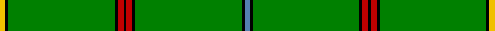

In pattern [BKGKRKRKGKY](/stripes/bkgkrkrkgky/).

This was sourced from weddslist.  It is a [11 stripe tartan](/stripes/stripes11/).

Original link http://www.weddslist.com/cgi-bin/tartans/pg.pl?source=sts

## Also known as

This cloth is also recorded under:

- Unidentified #12

## Thread count
Y/4 K2 G72 K2 R4 K2 R4 K2 G72 K2 B/4

## Palette
Each colour and the base-6 reference it is a variant of.

| Colour | Shade | Base |
|---|---|---|
| B | <code style="background-color:#5480B0;">#5480B0</code> `oklch(58.8% 0.089 251.5)` <small>#5480B0</small> | B <code style="background-color:#2A418A;">#2A418A</code> |
| G | <code style="background-color:#008000;">#008000</code> `oklch(52.0% 0.177 142.5)` <small>#008000</small> | G <code style="background-color:#006100;">#006100</code> |
| K | <code style="background-color:#000000;">#000000</code> `oklch(0.0% 0.000 0.0)` <small>#000000</small> | K <code style="background-color:#000000;">#000000</code> |
| R | <code style="background-color:#C00000;">#C00000</code> `oklch(50.7% 0.208 29.2)` <small>#C00000</small> | R <code style="background-color:#CC0000;">#CC0000</code> |
| Y | <code style="background-color:#F0C000;">#F0C000</code> `oklch(82.7% 0.169 90.5)` <small>#F0C000</small> | Y <code style="background-color:#F2BF00;">#F2BF00</code> |

## Nearest tartans

The nearest existing variants by ΔTartan distance.

1. [Delta Lambda Phi (Corporate)](/setts/s12/lo5k1lo6g20w1g3w1g3w1g30k1lo2~x2/) — ΔT 1.86
1. [Crane of Clunie](/setts/s8/g165k12g6k18r4k10g4y4/) — ΔT 1.89
1. [Braemar Royal Highland Gathering](/setts/s6/r3k4lb2g64k6ly3~x2/) — ΔT 1.90
1. [Crane of Cluny (Personal)](/setts/s8/g82k6g3k9r2k5g2ly2~x2/) — ΔT 1.93
1. [Asher (Personal)](/setts/s8/g40ly2db3r4db3ly2g40w3~x2/) — ΔT 1.98
1. [Suffolk County Police](/setts/s11/g74g6k12ly3k3w3g16g8k3g4w3~x2/) — ΔT 1.99
1. [Delta Lambda Phi](/setts/s12/ly5k1ly6g20w1g3w1g3w1g30k1ly2~x2/) — ΔT 2.02
1. [Unidentified #12](/setts/s11/t2k1dg36k1r2k1r2k1dg36k1ly2~x2/) — ΔT 2.06
1. [Stirling Castle (Corporate)](/setts/s13/db2k6db2g34w1g5w1g5w1g34ly1k13db1~x2/) — ΔT 2.21
1. [Loch Laggan](/setts/s10/r4g2r1g19k1g2~x4/) — ΔT 2.27

## Neighbour map

Every grey dot is one of 14299 variants placed by the first two principal components of the ΔTartan feature space (44% of its variance). Red is this tartan; blue dots are its nearest — click one to open its page.

<svg viewBox="0 0 640 380" role="img" style="max-width:100%;height:auto;border:1px solid #e0e0e0;border-radius:4px;display:block" xmlns="http://www.w3.org/2000/svg"><image href="/nn/cloud.v1.png" width="640" height="380"/><a href="/setts/s12/lo5k1lo6g20w1g3w1g3w1g30k1lo2~x2/"><circle cx="514.6" cy="131.6" r="4" fill="#3465a4"><title>Delta Lambda Phi (Corporate)</title></circle></a><a href="/setts/s8/g165k12g6k18r4k10g4y4/"><circle cx="536.0" cy="107.9" r="4" fill="#3465a4"><title>Crane of Clunie</title></circle></a><a href="/setts/s6/r3k4lb2g64k6ly3~x2/"><circle cx="539.5" cy="136.6" r="4" fill="#3465a4"><title>Braemar Royal Highland Gathering</title></circle></a><a href="/setts/s8/g82k6g3k9r2k5g2ly2~x2/"><circle cx="589.7" cy="132.9" r="4" fill="#3465a4"><title>Crane of Cluny (Personal)</title></circle></a><a href="/setts/s8/g40ly2db3r4db3ly2g40w3~x2/"><circle cx="541.4" cy="156.6" r="4" fill="#3465a4"><title>Asher (Personal)</title></circle></a><a href="/setts/s11/g74g6k12ly3k3w3g16g8k3g4w3~x2/"><circle cx="494.5" cy="110.6" r="4" fill="#3465a4"><title>Suffolk County Police</title></circle></a><a href="/setts/s12/ly5k1ly6g20w1g3w1g3w1g30k1ly2~x2/"><circle cx="475.9" cy="111.1" r="4" fill="#3465a4"><title>Delta Lambda Phi</title></circle></a><a href="/setts/s11/t2k1dg36k1r2k1r2k1dg36k1ly2~x2/"><circle cx="626.0" cy="124.3" r="4" fill="#3465a4"><title>Unidentified #12</title></circle></a><a href="/setts/s13/db2k6db2g34w1g5w1g5w1g34ly1k13db1~x2/"><circle cx="479.3" cy="112.5" r="4" fill="#3465a4"><title>Stirling Castle (Corporate)</title></circle></a><a href="/setts/s10/r4g2r1g19k1g2~x4/"><circle cx="589.1" cy="176.3" r="4" fill="#3465a4"><title>Loch Laggan</title></circle></a><circle cx="579.5" cy="102.3" r="5" fill="#c00000"/></svg>

ID: /setts/s11/t2k1g36k1r2k1r2k1g36k1ly2~x2/
