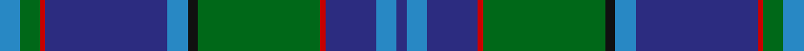

In pattern [BBBRGKBBRGB](/stripes/bbbrgkbbrgb/).

This was sourced from register-of-tartans.  It is a [11 stripe tartan](/stripes/stripes11/).

Original link https://www.tartanregister.gov.uk/tartanDetails.aspx?ref=756

## Attestations

This cloth appears in 2 source records; the oldest owns this page.

- 01/01/1996 — Coopers & Lybrand (register-of-tartans, [record](https://www.tartanregister.gov.uk/tartanDetails.aspx?ref=756))
- 1996 — Coopers & Lybrand (Corporate) (tartans-authority, [record](http://www.tartansauthority.com/tartan-ferret/display/2303/))

## Register references

External register numbers recorded for this tartan.

- Scottish Register of Tartans: [756](https://www.tartanregister.gov.uk/tartanDetails.aspx?ref=756)
- Scottish Tartans Authority (ITI): 2303
- Scottish Tartans World Register: 2303

## Thread count
B/8 G8 R2 DB48 B8 K4 G48 R2 DB20 B8 DB/4

## Palette
Each colour and the base-6 reference it is a variant of.

| Colour | Shade | Base |
|---|---|---|
| B | <code style="background-color:#2888C4;">#2888C4</code> `oklch(60.1% 0.125 241.5)` <small>#2888C4</small> | B <code style="background-color:#2A418A;">#2A418A</code> |
| DB | <code style="background-color:#2C2C80;">#2C2C80</code> `oklch(35.0% 0.138 276.6)` <small>#2C2C80</small> | B <code style="background-color:#2A418A;">#2A418A</code> |
| G | <code style="background-color:#006818;">#006818</code> `oklch(45.0% 0.142 145.0)` <small>#006818</small> | G <code style="background-color:#006100;">#006100</code> |
| K | <code style="background-color:#101010;">#101010</code> `oklch(17.3% 0.000 89.9)` <small>#101010</small> | K <code style="background-color:#000000;">#000000</code> |
| R | <code style="background-color:#C80000;">#C80000</code> `oklch(52.3% 0.215 29.2)` <small>#C80000</small> | R <code style="background-color:#CC0000;">#CC0000</code> |

## Nearest tartans

The nearest existing variants by ΔTartan distance.

1. [Weisfeld](/setts/s12/k6db3g28w1db28db2w3~x2/) — ΔT 0.66
1. [Spirit of Morningside (Fashion)](/setts/s10/dp4db5dp3db50k15g3k5g32w2g3/) — ΔT 0.79
1. [Polkemmet (Corporate)](/setts/s11/k7lo3db62o16g5o5g5o5g16db16k4/) — ΔT 1.04
1. [Ellis (Welsh Name)](/setts/s12/k4t26k2t4k2t26k3dt36k3g30k3w2/) — ΔT 1.10
1. [Dollar Academy (1999) (Corporate)](/setts/s8/w2db19k4db4k4g9db2k1~x4/) — ΔT 1.11
1. [Huaumé, Patrick Antoine (Personal)](/setts/s11/g10db9m4r2m4g6k10w4g24db60k4/) — ΔT 1.13
1. [Heriot Watt University (Corporate)](/setts/s10/dg5lo1b4dt18dg2r2dg16db1b32dt3~x2/) — ΔT 1.14
1. [Lowry](/setts/s7/dp6ly2dp1g25db16k2db4~x2/) — ΔT 1.14
1. [Kilkenny Irish County Tartan Tartan Number: 2280. Earliest known date: 1995 One of a series of Irish District tartans designed by Polly Wittering of the House of Edgar, with colours reminiscent of the Country with soft warm colours dominating. See products available Copyright © Blair Urquhart, Comrie, 2015](/setts/s13/dg25o2db25ly5dg3dp3dg3ly5db25o2dg27dp5dg2~x2/) — ΔT 1.14
1. [Lawrie](/setts/s7/dp6y2dp1g25db16k2db4~x2/) — ΔT 1.15

## Neighbour map

Every grey dot is one of 14299 variants placed by the first two principal components of the ΔTartan feature space (44% of its variance). Red is this tartan; blue dots are its nearest — click one to open its page.

<svg viewBox="0 0 640 380" role="img" style="max-width:100%;height:auto;border:1px solid #e0e0e0;border-radius:4px;display:block" xmlns="http://www.w3.org/2000/svg"><image href="/nn/cloud.v1.png" width="640" height="380"/><a href="/setts/s12/k6db3g28w1db28db2w3~x2/"><circle cx="292.3" cy="141.3" r="4" fill="#3465a4"><title>Weisfeld</title></circle></a><a href="/setts/s10/dp4db5dp3db50k15g3k5g32w2g3/"><circle cx="293.4" cy="135.4" r="4" fill="#3465a4"><title>Spirit of Morningside (Fashion)</title></circle></a><a href="/setts/s11/k7lo3db62o16g5o5g5o5g16db16k4/"><circle cx="323.1" cy="135.9" r="4" fill="#3465a4"><title>Polkemmet (Corporate)</title></circle></a><a href="/setts/s12/k4t26k2t4k2t26k3dt36k3g30k3w2/"><circle cx="227.6" cy="143.2" r="4" fill="#3465a4"><title>Ellis (Welsh Name)</title></circle></a><a href="/setts/s8/w2db19k4db4k4g9db2k1~x4/"><circle cx="284.3" cy="169.8" r="4" fill="#3465a4"><title>Dollar Academy (1999) (Corporate)</title></circle></a><a href="/setts/s11/g10db9m4r2m4g6k10w4g24db60k4/"><circle cx="301.3" cy="106.7" r="4" fill="#3465a4"><title>Huaumé, Patrick Antoine (Personal)</title></circle></a><a href="/setts/s10/dg5lo1b4dt18dg2r2dg16db1b32dt3~x2/"><circle cx="280.2" cy="124.1" r="4" fill="#3465a4"><title>Heriot Watt University (Corporate)</title></circle></a><a href="/setts/s7/dp6ly2dp1g25db16k2db4~x2/"><circle cx="304.0" cy="169.6" r="4" fill="#3465a4"><title>Lowry</title></circle></a><a href="/setts/s13/dg25o2db25ly5dg3dp3dg3ly5db25o2dg27dp5dg2~x2/"><circle cx="263.7" cy="161.5" r="4" fill="#3465a4"><title>Kilkenny Irish County Tartan Tartan Number: 2280. Earliest known date: 1995 One of a series of Irish District tartans designed by Polly Wittering of the House of Edgar, with colours reminiscent of the Country with soft warm colours dominating. See products available Copyright © Blair Urquhart, Comrie, 2015</title></circle></a><a href="/setts/s7/dp6y2dp1g25db16k2db4~x2/"><circle cx="311.0" cy="171.6" r="4" fill="#3465a4"><title>Lawrie</title></circle></a><circle cx="291.4" cy="143.0" r="5" fill="#c00000"/></svg>

ID: /setts/s11/t4g4r1db24t4k2g24r1db10t4db2~x2/
