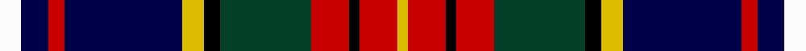

In pattern [WBRBYKGRKRY](/stripes/wbrbykgrkry/).

This was sourced from register-of-tartans.  It is a [11 stripe tartan](/stripes/stripes11/).

Original link https://www.tartanregister.gov.uk/tartanDetails.aspx?ref=816

## Also known as

This cloth is also recorded under:

- Crozier/Crosser

## Attestations

This cloth appears in 2 source records; the oldest owns this page.

- 01/01/1983 — Crozier/Crosser (register-of-tartans, [record](https://www.tartanregister.gov.uk/tartanDetails.aspx?ref=816))
- 1983 — Crozier (Clan) (tartans-authority, [record](http://www.tartansauthority.com/tartan-ferret/display/1779/))

## Register references

External register numbers recorded for this tartan.

- Scottish Register of Tartans: [816](https://www.tartanregister.gov.uk/tartanDetails.aspx?ref=816)
- Scottish Tartans Authority (ITI): 1779
- Scottish Tartans World Register: 1779

## Thread count
W/8 DB10 R6 DB44 Y8 K6 DG34 R14 K4 R14 Y/4

## Palette
Each colour and the base-6 reference it is a variant of.

| Colour | Shade | Base |
|---|---|---|
| DB | <code style="background-color:#000048;">#000048</code> `oklch(18.2% 0.126 264.1)` <small>#000048</small> | B <code style="background-color:#2A418A;">#2A418A</code> |
| DG | <code style="background-color:#044028;">#044028</code> `oklch(32.9% 0.072 160.0)` <small>#044028</small> | G <code style="background-color:#006100;">#006100</code> |
| K | <code style="background-color:#000000;">#000000</code> `oklch(0.0% 0.000 0.0)` <small>#000000</small> | K <code style="background-color:#000000;">#000000</code> |
| R | <code style="background-color:#C80000;">#C80000</code> `oklch(52.3% 0.215 29.2)` <small>#C80000</small> | R <code style="background-color:#CC0000;">#CC0000</code> |
| W | <code style="background-color:#FCFCFC;">#FCFCFC</code> `oklch(99.1% 0.000 89.9)` <small>#FCFCFC</small> | W <code style="background-color:#F7F7F7;">#F7F7F7</code> |
| Y | <code style="background-color:#DCBC00;">#DCBC00</code> `oklch(79.9% 0.165 96.7)` <small>#DCBC00</small> | Y <code style="background-color:#F2BF00;">#F2BF00</code> |

## Nearest tartans

The nearest existing variants by ΔTartan distance, with this tartan at the top so the swatches line up against it.

ΔTartan

Tartan

Sett

—

<a href="/ttd/edit/#slug=w4db5r3db22ly4k3dg17r7k2r7ly2~x2">Crozier/Crosser</a> <a class="nn-out" href="/setts/s11/w4db5r3db22ly4k3dg17r7k2r7ly2~x2/" title="open its dictionary page">↗</a>

0.53

<a href="/ttd/edit/#slug=w3db21k2r7k2g10k2r7k21ly3~x2">Tantallon</a> <a class="nn-out" href="/setts/s10/w3db21k2r7k2g10k2r7k21ly3~x2/" title="open its dictionary page">↗</a>

0.60

<a href="/ttd/edit/#slug=w3db22k2r7k2dg10k2r7k22ly3~x2">Tantallon #2</a> <a class="nn-out" href="/setts/s10/w3db22k2r7k2dg10k2r7k22ly3~x2/" title="open its dictionary page">↗</a>

0.76

<a href="/ttd/edit/#slug=k9w6k46db24r8db6r6db6r16g6r6ly6">Fowdar (Personal)</a> <a class="nn-out" href="/setts/s12/k9w6k46db24r8db6r6db6r16g6r6ly6/" title="open its dictionary page">↗</a>

0.79

<a href="/ttd/edit/#slug=r12db22dg5db3ly3db3dg17b9dr7r2~x2">Royal Dornoch Golf Club, The</a> <a class="nn-out" href="/setts/s10/r12db22dg5db3ly3db3dg17b9dr7r2~x2/" title="open its dictionary page">↗</a>

0.80

<a href="/ttd/edit/#slug=k4r3k20k6w2r6w2o6db22ly3db4~x2">Asman, Dress (Name)</a> <a class="nn-out" href="/setts/s11/k4r3k20k6w2r6w2o6db22ly3db4~x2/" title="open its dictionary page">↗</a>

0.82

<a href="/ttd/edit/#slug=db23r6db6k10ly3k2w2k2g11r12k2r10w2~x2">Prince Albert</a> <a class="nn-out" href="/setts/s13/db23r6db6k10ly3k2w2k2g11r12k2r10w2~x2/" title="open its dictionary page">↗</a>

0.90

<a href="/ttd/edit/#slug=r17k5w4k6ly5db31k5g6w3~x2">Dean/Dundas (Personal)</a> <a class="nn-out" href="/setts/s9/r17k5w4k6ly5db31k5g6w3~x2/" title="open its dictionary page">↗</a>

0.92

<a href="/ttd/edit/#slug=r17k5n4k6ly5db31k5g6n3~x2">Dean/Dundas (Melbourne, Australia) (Personal)</a> <a class="nn-out" href="/setts/s9/r17k5n4k6ly5db31k5g6n3~x2/" title="open its dictionary page">↗</a>

1.00

<a href="/ttd/edit/#slug=r2k8ly2k7ly1k1w3k2dg9db8r2~x2">Hislop/Hyslop Hunting #2</a> <a class="nn-out" href="/setts/s11/r2k8ly2k7ly1k1w3k2dg9db8r2~x2/" title="open its dictionary page">↗</a>

1.01

<a href="/ttd/edit/#slug=o4k12db2k2db2k2db2o16dr3o2lr2o4~x2">Cailean #2 (Fashion)</a> <a class="nn-out" href="/setts/s12/o4k12db2k2db2k2db2o16dr3o2lr2o4~x2/" title="open its dictionary page">↗</a>

## Neighbour map

Every grey dot is one of 14299 variants placed by the first two principal components of the ΔTartan feature space (44% of its variance). Red is this tartan; blue dots are its nearest — click one to open its page.

<svg viewBox="0 0 640 380" role="img" style="max-width:100%;height:auto;border:1px solid #e0e0e0;border-radius:4px;display:block" xmlns="http://www.w3.org/2000/svg"><image href="/nn/cloud.v1.png" width="640" height="380"/><a href="/setts/s10/w3db21k2r7k2g10k2r7k21ly3~x2/"><circle cx="118.5" cy="141.2" r="4" fill="#3465a4"><title>Tantallon</title></circle></a><a href="/setts/s10/w3db22k2r7k2dg10k2r7k22ly3~x2/"><circle cx="125.4" cy="140.4" r="4" fill="#3465a4"><title>Tantallon #2</title></circle></a><a href="/setts/s12/k9w6k46db24r8db6r6db6r16g6r6ly6/"><circle cx="119.2" cy="135.1" r="4" fill="#3465a4"><title>Fowdar (Personal)</title></circle></a><a href="/setts/s10/r12db22dg5db3ly3db3dg17b9dr7r2~x2/"><circle cx="97.6" cy="150.1" r="4" fill="#3465a4"><title>Royal Dornoch Golf Club, The</title></circle></a><a href="/setts/s11/k4r3k20k6w2r6w2o6db22ly3db4~x2/"><circle cx="146.3" cy="132.7" r="4" fill="#3465a4"><title>Asman, Dress (Name)</title></circle></a><a href="/setts/s13/db23r6db6k10ly3k2w2k2g11r12k2r10w2~x2/"><circle cx="96.5" cy="121.7" r="4" fill="#3465a4"><title>Prince Albert</title></circle></a><a href="/setts/s9/r17k5w4k6ly5db31k5g6w3~x2/"><circle cx="122.5" cy="132.0" r="4" fill="#3465a4"><title>Dean/Dundas (Personal)</title></circle></a><a href="/setts/s9/r17k5n4k6ly5db31k5g6n3~x2/"><circle cx="132.4" cy="137.4" r="4" fill="#3465a4"><title>Dean/Dundas (Melbourne, Australia) (Personal)</title></circle></a><a href="/setts/s11/r2k8ly2k7ly1k1w3k2dg9db8r2~x2/"><circle cx="110.5" cy="158.7" r="4" fill="#3465a4"><title>Hislop/Hyslop Hunting #2</title></circle></a><a href="/setts/s12/o4k12db2k2db2k2db2o16dr3o2lr2o4~x2/"><circle cx="136.6" cy="130.7" r="4" fill="#3465a4"><title>Cailean #2 (Fashion)</title></circle></a><circle cx="106.7" cy="129.0" r="5" fill="#c00000"/></svg>

ID: /setts/s11/w4db5r3db22ly4k3dg17r7k2r7ly2~x2/
