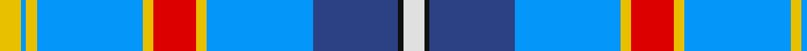

**Bands:** [YBYBYRYBBKW](/stripes/ybybyrybbkw/) · **Stripes:** [LY B LY B LY R LY B DB K W](/stripes/stripes11/) LY B LY B LY R LY B DB K W

This was sourced from register-of-tartans.  It is a [11 band tartan](/bands/bands11/).

Original link https://www.tartanregister.gov.uk/tartanDetails.aspx?ref=5883

## Register references

External register numbers recorded for this tartan.

- Scottish Register of Tartans: [5883](https://www.tartanregister.gov.uk/tartanDetails.aspx?ref=5883)
- Scottish Tartans World Register: 3228

## Thread count
Y/8 Ba2 Y4 Ba40 Y4 R16 Y4 Ba40 B32 K2 LN/8

## Palette
Each colour and its ΔE from the base-6 reference it is a variant of.

| Colour | Shade | Base | ΔE (OKLab) |
|---|---|---|---|
| B | <code style="background-color:#2C4084;">#2C4084</code> `#2C4084` | B <code style="background-color:#2A418A;">#2A418A</code> | 0.01 |
| Ba | <code style="background-color:#0596FA;">#0596FA</code> `#0596FA` | B <code style="background-color:#2A418A;">#2A418A</code> | 0.27 |
| K | <code style="background-color:#101010;">#101010</code> `#101010` | K <code style="background-color:#000000;">#000000</code> | 0.17 |
| LN | <code style="background-color:#E0E0E0;">#E0E0E0</code> `#E0E0E0` | W <code style="background-color:#F7F7F7;">#F7F7F7</code> | 0.07 |
| R | <code style="background-color:#DC0000;">#DC0000</code> `#DC0000` | R <code style="background-color:#CC0000;">#CC0000</code> | 0.03 |
| Y | <code style="background-color:#E8C000;">#E8C000</code> `#E8C000` | Y <code style="background-color:#F2BF00;">#F2BF00</code> | 0.02 |

## Nearest tartans

The nearest existing variants by ΔTartan distance.

1. [Corryvrechan Dress (Corporate)](/setts/s10/t40db12ly2db2t2db2g6w21r2t2~x2/) — ΔT 0.96
1. [Cahaba Memorial](/setts/s13/lo2w3k1db9k1t6g1t3g1t19k2w7lo1~x2/) — ΔT 1.02
1. [Ethiopia](/setts/s14/w4k1b24k1r8lo8g8k1b16lo2b1lo2b1lo4~x2/) — ΔT 1.14
1. [Jubilee, South Canterbury Centre Piping & Dancing Association](/setts/s8/b36db5g5w2r4w2m9w22~x2/) — ΔT 1.15
1. [Queensferry High (School)](/setts/s9/lr5lb3lb7lr5lb27b8dt43w3lb3/) — ΔT 1.22
1. [Los Angeles](/setts/s8/ly4db24t5g2db3k5t33r2~x2/) — ΔT 1.28
1. [Wiegratz Alba (Personal)](/setts/s9/w3k2t30k5r5ly5t5db12w1~x2/) — ΔT 1.30
1. [Kirk in the Hills](/setts/s10/lb16db6k1ly1k1db1lb4dy4k1r1~x4/) — ΔT 1.33
1. [South Canterbury Jubillee (Corporate](/setts/s8/t36db5g5w2r4w2r9w22~x2/) — ΔT 1.34
1. [Queen Margaret University](/setts/s9/db4w3db17lb10k1dp5k1lb6dg3~x2/) — ΔT 1.36

## Neighbour map

Every grey dot is one of 14299 variants placed by the first two principal components of the ΔTartan feature space (44% of its variance). Red is this tartan; blue dots are its nearest — click one to open its page.

<svg viewBox="0 0 640 380" role="img" style="max-width:100%;height:auto;border:1px solid #e0e0e0;border-radius:4px;display:block" xmlns="http://www.w3.org/2000/svg"><image href="/nn/cloud.v1.png" width="640" height="380"/><a href="/setts/s10/t40db12ly2db2t2db2g6w21r2t2~x2/"><circle cx="228.7" cy="91.4" r="4" fill="#3465a4"><title>Corryvrechan Dress (Corporate)</title></circle></a><a href="/setts/s13/lo2w3k1db9k1t6g1t3g1t19k2w7lo1~x2/"><circle cx="206.5" cy="82.1" r="4" fill="#3465a4"><title>Cahaba Memorial</title></circle></a><a href="/setts/s14/w4k1b24k1r8lo8g8k1b16lo2b1lo2b1lo4~x2/"><circle cx="242.9" cy="82.8" r="4" fill="#3465a4"><title>Ethiopia</title></circle></a><a href="/setts/s8/b36db5g5w2r4w2m9w22~x2/"><circle cx="189.3" cy="113.5" r="4" fill="#3465a4"><title>Jubilee, South Canterbury Centre Piping &amp; Dancing Association</title></circle></a><a href="/setts/s9/lr5lb3lb7lr5lb27b8dt43w3lb3/"><circle cx="196.9" cy="122.1" r="4" fill="#3465a4"><title>Queensferry High (School)</title></circle></a><a href="/setts/s8/ly4db24t5g2db3k5t33r2~x2/"><circle cx="251.2" cy="128.4" r="4" fill="#3465a4"><title>Los Angeles</title></circle></a><a href="/setts/s9/w3k2t30k5r5ly5t5db12w1~x2/"><circle cx="245.3" cy="93.4" r="4" fill="#3465a4"><title>Wiegratz Alba (Personal)</title></circle></a><a href="/setts/s10/lb16db6k1ly1k1db1lb4dy4k1r1~x4/"><circle cx="256.0" cy="99.1" r="4" fill="#3465a4"><title>Kirk in the Hills</title></circle></a><a href="/setts/s8/t36db5g5w2r4w2r9w22~x2/"><circle cx="194.5" cy="115.3" r="4" fill="#3465a4"><title>South Canterbury Jubillee (Corporate</title></circle></a><a href="/setts/s9/db4w3db17lb10k1dp5k1lb6dg3~x2/"><circle cx="169.7" cy="127.5" r="4" fill="#3465a4"><title>Queen Margaret University</title></circle></a><circle cx="226.7" cy="106.8" r="5" fill="#c00000"/></svg>

ID: /setts/s11/w4k1db16b20ly2r8ly2b20ly2b1ly4~x2/
