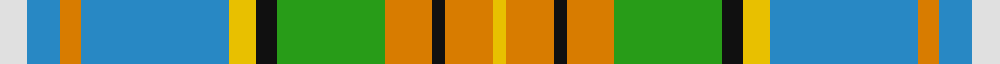

**Bands:** [YYKYGKYBYBW](/stripes/yykygkybybw/) · **Stripes:** [LY LO K LO G K LY T LO T W](/stripes/stripes11/) LY LO K LO G K LY T LO T W

This was sourced from tartans-authority.  It is a [11 band tartan](/bands/bands11/).

Original link http://www.tartansauthority.com/tartan-ferret/display/3947/

## Attestations

This cloth appears in 2 source records; the oldest owns this page.

- pre 2002 — Cossar (Personal) (tartans-authority, [record](http://www.tartansauthority.com/tartan-ferret/display/3947/))
- undated — Cossar (Personal) (register-of-tartans, [record](https://www.tartanregister.gov.uk/tartanDetails.aspx?ref=5230))

## Register references

External register numbers recorded for this tartan.

- Scottish Register of Tartans: [5230](https://www.tartanregister.gov.uk/tartanDetails.aspx?ref=5230)
- Scottish Tartans Authority (ITI): 3947

## Thread count
LN/8 B10 O6 B44 Y8 K6 G32 O14 K4 O14 Y/4

## Palette
Each colour and its ΔE from the base-6 reference it is a variant of.

| Colour | Shade | Base | ΔE (OKLab) |
|---|---|---|---|
| B | <code style="background-color:#2888C4;">#2888C4</code> `#2888C4` | B <code style="background-color:#2A418A;">#2A418A</code> | 0.21 |
| G | <code style="background-color:#289C18;">#289C18</code> `#289C18` | G <code style="background-color:#006100;">#006100</code> | 0.19 |
| K | <code style="background-color:#101010;">#101010</code> `#101010` | K <code style="background-color:#000000;">#000000</code> | 0.17 |
| LN | <code style="background-color:#E0E0E0;">#E0E0E0</code> `#E0E0E0` | W <code style="background-color:#F7F7F7;">#F7F7F7</code> | 0.07 |
| O | <code style="background-color:#D87C00;">#D87C00</code> `#D87C00` | Y <code style="background-color:#F2BF00;">#F2BF00</code> | 0.17 |
| Y | <code style="background-color:#E8C000;">#E8C000</code> `#E8C000` | Y <code style="background-color:#F2BF00;">#F2BF00</code> | 0.02 |

## Nearest tartans

The nearest existing variants by ΔTartan distance.

1. [Fredericton](/setts/s12/p3t1w9r6g5t2w2t2w2t2g12ly2~x2/) — ΔT 0.75
1. [Fredericton District Tartan Tartan Number: 96. Earliest known date: 1967 Fredericton, capital city of New Brunswick, takes its name from Prince Frederick, the second son of King George III. The tartan was designed and woven by the Loomcrofters of Frederickton who weave in their own homes on their own looms. (From 'District Tartans', G. Teall and P. Smith, 1992) See products available Copyright © Blair Urquhart, Comrie, 2015](/setts/s12/dp3t1w9r6g5t2w2t2w2t2g12ly2~x2/) — ΔT 0.87
1. [Currie of Arran (Clan/family)](/setts/s11/b16w3b2ly4g24r2g4r5g4r2lb8~x2/) — ΔT 0.89
1. [State Seal of Delaware (Fashion)](/setts/s10/lb38dt18lb4ly3g10lo3g4lb3lo17r4~x2/) — ΔT 1.01
1. [Fredericton #1](/setts/s12/dp3t1w9r6dg5t2w2t2w2t2dg12ly2~x4/) — ΔT 1.09
1. [Alexander of Menstry Hunting](/setts/s8/m5g2m2g26k9lr9lb13w5~x2/) — ΔT 1.14
1. [Royal Pharmaceutical, Society](/setts/s9/o3lb2g19lb6g2lb6o14m4w2~x2/) — ΔT 1.18
1. [Highlands of Haliburton Dress (Dist.](/setts/s15/lg4w2lg1w14r2do4lg8g4w2lg3lo2g2do2w2lo2~x2/) — ΔT 1.19
1. [State Seal of California (Fashion)](/setts/s10/lo29ly3b19lb3b3r3g17b3g4lb3~x2/) — ΔT 1.24
1. [Derry Family (Personal)](/setts/s9/w6t36lo12g19g6r6g6r28g4/) — ΔT 1.24

## Neighbour map

Every grey dot is one of 14299 variants placed by the first two principal components of the ΔTartan feature space (44% of its variance). Red is this tartan; blue dots are its nearest — click one to open its page.

<svg viewBox="0 0 640 380" role="img" style="max-width:100%;height:auto;border:1px solid #e0e0e0;border-radius:4px;display:block" xmlns="http://www.w3.org/2000/svg"><image href="/nn/cloud.v1.png" width="640" height="380"/><a href="/setts/s12/p3t1w9r6g5t2w2t2w2t2g12ly2~x2/"><circle cx="104.6" cy="125.3" r="4" fill="#3465a4"><title>Fredericton</title></circle></a><a href="/setts/s12/dp3t1w9r6g5t2w2t2w2t2g12ly2~x2/"><circle cx="103.5" cy="124.5" r="4" fill="#3465a4"><title>Fredericton District Tartan Tartan Number: 96. Earliest known date: 1967 Fredericton, capital city of New Brunswick, takes its name from Prince Frederick, the second son of King George III. The tartan was designed and woven by the Loomcrofters of Frederickton who weave in their own homes on their own looms. (From 'District Tartans', G. Teall and P. Smith, 1992) See products available Copyright © Blair Urquhart, Comrie, 2015</title></circle></a><a href="/setts/s11/b16w3b2ly4g24r2g4r5g4r2lb8~x2/"><circle cx="163.7" cy="126.4" r="4" fill="#3465a4"><title>Currie of Arran (Clan/family)</title></circle></a><a href="/setts/s10/lb38dt18lb4ly3g10lo3g4lb3lo17r4~x2/"><circle cx="176.8" cy="122.3" r="4" fill="#3465a4"><title>State Seal of Delaware (Fashion)</title></circle></a><a href="/setts/s12/dp3t1w9r6dg5t2w2t2w2t2dg12ly2~x4/"><circle cx="102.6" cy="122.6" r="4" fill="#3465a4"><title>Fredericton #1</title></circle></a><a href="/setts/s8/m5g2m2g26k9lr9lb13w5~x2/"><circle cx="132.4" cy="145.8" r="4" fill="#3465a4"><title>Alexander of Menstry Hunting</title></circle></a><a href="/setts/s9/o3lb2g19lb6g2lb6o14m4w2~x2/"><circle cx="155.0" cy="164.4" r="4" fill="#3465a4"><title>Royal Pharmaceutical, Society</title></circle></a><a href="/setts/s15/lg4w2lg1w14r2do4lg8g4w2lg3lo2g2do2w2lo2~x2/"><circle cx="119.4" cy="102.7" r="4" fill="#3465a4"><title>Highlands of Haliburton Dress (Dist.</title></circle></a><a href="/setts/s10/lo29ly3b19lb3b3r3g17b3g4lb3~x2/"><circle cx="159.9" cy="153.6" r="4" fill="#3465a4"><title>State Seal of California (Fashion)</title></circle></a><a href="/setts/s9/w6t36lo12g19g6r6g6r28g4/"><circle cx="96.3" cy="161.8" r="4" fill="#3465a4"><title>Derry Family (Personal)</title></circle></a><circle cx="123.0" cy="136.5" r="5" fill="#c00000"/></svg>

ID: /setts/s11/w4t5lo3t22ly4k3g16lo7k2lo7ly2~x2/
