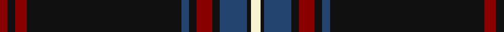

In pattern [RKRKBKRKBKW](/patterns/rkrkbkrkbkw/).

This was sourced from register-of-tartans.  It is a [11 stripes tartan](/stripes/stripes11/).

Original link https://www.tartanregister.gov.uk/tartanDetails.aspx?ref=69

## Thread count
DR/4 K4 DR6 K80 B4 K4 DR8 K4 B14 K2 LY/5

## Palette
Each colour and its ΔE from the base-6 reference it is a variant of.

| Colour | Shade | Base | ΔE (OKLab) |
|---|---|---|---|
| B | <code style="background-color:#244470;">#244470</code> `#244470` | B <code style="background-color:#2C4084;">#2C4084</code> | 0.04 |
| DR | <code style="background-color:#880000;">#880000</code> `#880000` | R <code style="background-color:#C80000;">#C80000</code> | 0.14 |
| K | <code style="background-color:#101010;">#101010</code> `#101010` | K <code style="background-color:#000000;">#000000</code> | 0.17 |
| LY | <code style="background-color:#F8F4D0;">#F8F4D0</code> `#F8F4D0` | W <code style="background-color:#F4F4F0;">#F4F4F0</code> | 0.04 |

ID: /setts/s11/w5k2b14k4r8k4b4k80r6k4r4-b244470-k101010-r880000-wf8f4d0/
