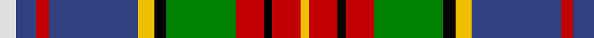

In pattern [WBRBYKGRKRY](/patterns/wbrbykgrkry/).

This was sourced from weddslist.  It is a [11 stripes tartan](/stripes/stripes11/).

Original link http://www.weddslist.com/cgi-bin/tartans/pg.pl?source=sts

## Thread count
LN/8 B10 R6 B44 Y8 K6 G34 R14 K4 R14 Y/4

## Palette
Each colour and its ΔE from the base-6 reference it is a variant of.

| Colour | Shade | Base | ΔE (OKLab) |
|---|---|---|---|
| B | <code style="background-color:#304080;">#304080</code> `#304080` | B <code style="background-color:#2C4084;">#2C4084</code> | 0.01 |
| G | <code style="background-color:#008000;">#008000</code> `#008000` | G <code style="background-color:#006400;">#006400</code> | 0.09 |
| K | <code style="background-color:#000000;">#000000</code> `#000000` | K <code style="background-color:#000000;">#000000</code> | 0.00 |
| LN | <code style="background-color:#E0E0E0;">#E0E0E0</code> `#E0E0E0` | W <code style="background-color:#F4F4F0;">#F4F4F0</code> | 0.06 |
| R | <code style="background-color:#C00000;">#C00000</code> `#C00000` | R <code style="background-color:#C80000;">#C80000</code> | 0.02 |
| Y | <code style="background-color:#F0C000;">#F0C000</code> `#F0C000` | Y <code style="background-color:#E8C000;">#E8C000</code> | 0.01 |

## Nearest tartans

The nearest existing variants by ΔTartan distance.

1. [Crosser Crozier Family Tartan Tartan Number: 1779. Earliest known date: 1983 Count taken from a sample in a pattern book belonging to Jardines Outfitters, Glasgow 27/05/1983 See products available Copyright © Blair Urquhart, Comrie, 2015](/setts/s11/w8b10r6b44y8k6g34r14k4r14y4-b2c2c80-g006818-k101010-rc80000-we0e0e0-ye8c000/) — ΔT 0.45
1. [Gordonstoun (Corporate)](/setts/s12/y10g38r4b22w4r22g22r4k40r4k4w4-b5c8ca8-g408060-k101010-r800028-wa8ace8-ye8c000/) — ΔT 0.65
1. [Isle of Skye (District)](/setts/s11/w48g6w6g6w6g20r24b24r24r4r6-b440044-g003820-r8c5c00-wc0c0c0/) — ΔT 0.76
1. [MacLean](/setts/s11/b16k16y4k6w6k6g48r32b6r8k4-b2c4084-g005020-k101010-rdc0000-we0e0e0-ye8c000/) — ΔT 0.84
1. [Glasgow, City of Culture](/setts/s11/r12g4r4g42k4w8k4b46y4b4y12-b2c2c80-g006818-k101010-rc80000-wfcfcfc-ye8c000/) — ΔT 0.86
1. [Mary, Queen of Scots](/setts/s9/r10w2b20g20w2y2g4ba4w2-b2c2c80-ba5c8ca8-g006818-rc80000-we0e0e0-ye8c000/) — ΔT 0.86
1. [Culture The... Corporate Tartan Tartan Number: 1534. Earliest known date: 1989 Colours chosen to reflect a European essence that will endure beyond the 1990 'Year of Culture'. Supply and manufacture only at MacDonald MacKay (Kiltmakers) Ltd., Glasgow. See products available Copyright © Blair Urquhart, Comrie, 2015](/setts/s11/r12g4r4g42k4w8k4b46y4b4y12-b2c2c80-g006818-k101010-rc80000-we0e0e0-ye8c000/) — ΔT 0.87
1. [Kapasi (Personal)](/setts/s13/w4k24g4k4g4k4g32k6wa6k6r24g12y4-g408060-k101010-rc80000-wc49cd8-wafcfcfc-yd87c00/) — ΔT 0.89
1. [Dunedin](/setts/s9/k6r6g42ra16r6ra8k6b52w6-b304080-g008000-k000000-rc00000-ra900030-we0e0e0/) — ΔT 0.94
1. [Leitrim Irish County Tartan Tartan Number: 2271. Earliest known date: 1996 One of a series of Irish District tartans designed by Polly Wittering of the House of Edgar, with colours reminiscent of the Country with soft warm colours dominating. See products available Copyright © Blair Urquhart, Comrie, 2015](/setts/s10/y6k36y8b6y8r26y6ya36k4yb6-b28200c-k000000-rc05830-y749cb0-yaa4a8a8-ybd88c74/) — ΔT 0.94

## Neighbour map

Every grey dot is one of 15726 variants placed by the first two principal components of the ΔTartan feature space (44% of its variance). Red is this tartan; blue dots are its nearest — click one to open its page.

<svg viewBox="0 0 640 380" role="img" style="max-width:100%;height:auto;border:1px solid #e0e0e0;border-radius:4px;display:block" xmlns="http://www.w3.org/2000/svg"><image href="/nn/cloud.v1.png" width="640" height="380"/><a href="/setts/s11/w8b10r6b44y8k6g34r14k4r14y4-b2c2c80-g006818-k101010-rc80000-we0e0e0-ye8c000/"><circle cx="114.2" cy="129.6" r="4" fill="#3465a4"><title>Crosser Crozier Family Tartan Tartan Number: 1779. Earliest known date: 1983 Count taken from a sample in a pattern book belonging to Jardines Outfitters, Glasgow 27/05/1983 See products available Copyright © Blair Urquhart, Comrie, 2015</title></circle></a><a href="/setts/s12/y10g38r4b22w4r22g22r4k40r4k4w4-b5c8ca8-g408060-k101010-r800028-wa8ace8-ye8c000/"><circle cx="103.7" cy="137.4" r="4" fill="#3465a4"><title>Gordonstoun (Corporate)</title></circle></a><a href="/setts/s11/w48g6w6g6w6g20r24b24r24r4r6-b440044-g003820-r8c5c00-wc0c0c0/"><circle cx="101.4" cy="130.5" r="4" fill="#3465a4"><title>Isle of Skye (District)</title></circle></a><a href="/setts/s11/b16k16y4k6w6k6g48r32b6r8k4-b2c4084-g005020-k101010-rdc0000-we0e0e0-ye8c000/"><circle cx="115.9" cy="125.1" r="4" fill="#3465a4"><title>MacLean</title></circle></a><a href="/setts/s11/r12g4r4g42k4w8k4b46y4b4y12-b2c2c80-g006818-k101010-rc80000-wfcfcfc-ye8c000/"><circle cx="124.3" cy="113.0" r="4" fill="#3465a4"><title>Glasgow, City of Culture</title></circle></a><a href="/setts/s9/r10w2b20g20w2y2g4ba4w2-b2c2c80-ba5c8ca8-g006818-rc80000-we0e0e0-ye8c000/"><circle cx="131.5" cy="141.3" r="4" fill="#3465a4"><title>Mary, Queen of Scots</title></circle></a><a href="/setts/s11/r12g4r4g42k4w8k4b46y4b4y12-b2c2c80-g006818-k101010-rc80000-we0e0e0-ye8c000/"><circle cx="127.9" cy="114.7" r="4" fill="#3465a4"><title>Culture The... Corporate Tartan Tartan Number: 1534. Earliest known date: 1989 Colours chosen to reflect a European essence that will endure beyond the 1990 'Year of Culture'. Supply and manufacture only at MacDonald MacKay (Kiltmakers) Ltd., Glasgow. See products available Copyright © Blair Urquhart, Comrie, 2015</title></circle></a><a href="/setts/s13/w4k24g4k4g4k4g32k6wa6k6r24g12y4-g408060-k101010-rc80000-wc49cd8-wafcfcfc-yd87c00/"><circle cx="127.0" cy="135.5" r="4" fill="#3465a4"><title>Kapasi (Personal)</title></circle></a><a href="/setts/s9/k6r6g42ra16r6ra8k6b52w6-b304080-g008000-k000000-rc00000-ra900030-we0e0e0/"><circle cx="123.8" cy="145.1" r="4" fill="#3465a4"><title>Dunedin</title></circle></a><a href="/setts/s10/y6k36y8b6y8r26y6ya36k4yb6-b28200c-k000000-rc05830-y749cb0-yaa4a8a8-ybd88c74/"><circle cx="53.9" cy="133.9" r="4" fill="#3465a4"><title>Leitrim Irish County Tartan Tartan Number: 2271. Earliest known date: 1996 One of a series of Irish District tartans designed by Polly Wittering of the House of Edgar, with colours reminiscent of the Country with soft warm colours dominating. See products available Copyright © Blair Urquhart, Comrie, 2015</title></circle></a><circle cx="107.8" cy="127.4" r="5" fill="#c00000"/></svg>

ID: /setts/s11/w8b10r6b44y8k6g34r14k4r14y4-b304080-g008000-k000000-rc00000-we0e0e0-yf0c000/
