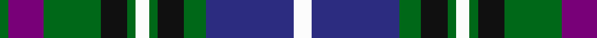

In pattern [GBGKGWGKGBW](/patterns/gbgkgwgkgbw/).

This was sourced from tartans-authority.  It is a [11 stripes tartan](/stripes/stripes11/).

Original link http://www.tartansauthority.com/tartan-ferret/display/2625/

## Thread count
G/4 P16 G26 K12 G4 W6 G4 K12 G10 DB40 W/8

## Palette
Each colour and its ΔE from the base-6 reference it is a variant of.

| Colour | Shade | Base | ΔE (OKLab) |
|---|---|---|---|
| DB | <code style="background-color:#2C2C80;">#2C2C80</code> `#2C2C80` | B <code style="background-color:#2C4084;">#2C4084</code> | 0.05 |
| G | <code style="background-color:#006818;">#006818</code> `#006818` | G <code style="background-color:#006400;">#006400</code> | 0.02 |
| K | <code style="background-color:#101010;">#101010</code> `#101010` | K <code style="background-color:#000000;">#000000</code> | 0.17 |
| P | <code style="background-color:#780078;">#780078</code> `#780078` | B <code style="background-color:#2C4084;">#2C4084</code> | 0.16 |
| W | <code style="background-color:#FCFCFC;">#FCFCFC</code> `#FCFCFC` | W <code style="background-color:#F4F4F0;">#F4F4F0</code> | 0.03 |

## Nearest tartans

The nearest existing variants by ΔTartan distance.

1. [Elwyn Glen (Scottish Borders)](/setts/s11/k4g20ga8r10ga4r6ga4r10ga8k30w4-g648070-ga006818-k000034-ra08cb0-wc8c8c8/) — ΔT 0.56
1. [Bowlers](/setts/s11/w8b40g10k12g4w6g4k12g26ba16g4-b304080-ba800080-g008000-k000000-we0e0e0/) — ΔT 0.56
1. [Patterson (blue) family Tartan Tartan Number: 2325. Earliest known date: 1996 A second tartan for the family of John Patterson. Assume same designer as the first Patterson (Red). See products available Copyright © Blair Urquhart, Comrie, 2015](/setts/s10/g8r6g22k20w4b44w4k20g22r6-b2c2c80-g006818-k101010-rc80000-we0e0e0/) — ΔT 0.81
1. [Royal College of Surgeons of Edinburgh, The](/setts/s9/b8ba32k4ba4k4ba4k26r40w8-b5c8ca8-ba305870-k101010-r888888-wfcfcfc/) — ΔT 0.82
1. [MacDonell of Glengarry](/setts/s11/b16r8b24r2k24g24r6g4r2g8w2-b304080-g008000-k000000-rc00000-we0e0e0/) — ΔT 0.87
1. [MacKusick (Piper) #1 (Personal)](/setts/s13/b8k2b4k2b12r4k8r4k16w4g24r4g8-b2c2c80-g006818-k101010-rb468ac-wc0c0c0/) — ΔT 0.87
1. [Highfield Dress (Name)](/setts/s11/b40k8g8r8g8k8w8k8w16k4w8-b1c0070-g006818-k101010-rc80000-we0e0e0/) — ΔT 0.87
1. [Glenfalloch](/setts/s12/k8r2k24w2r8w2g8w2ra8g24k2w4-g006030-k000030-rd03030-ra802040-we0e0e0/) — ΔT 0.89
1. [MacMillan Hunting Clan Tartan Tartan Number: 668. Earliest known date: 1906 The Setts No: 160. W & A K Johnston See products available Copyright © Blair Urquhart, Comrie, 2015](/setts/s10/b12y4b36k12y6k12g28r6g20r4-b2c2c80-g006818-k101010-rc80000-ye8c000/) — ΔT 0.89
1. [MacDonell of Glengarry](/setts/s13/b16r2b4r6b24r2k24g24r6g4r2g8w2-b304080-g008000-k000000-rc00000-we0e0e0/) — ΔT 0.94

## Neighbour map

Every grey dot is one of 15726 variants placed by the first two principal components of the ΔTartan feature space (44% of its variance). Red is this tartan; blue dots are its nearest — click one to open its page.

<svg viewBox="0 0 640 380" role="img" style="max-width:100%;height:auto;border:1px solid #e0e0e0;border-radius:4px;display:block" xmlns="http://www.w3.org/2000/svg"><image href="/nn/cloud.v1.png" width="640" height="380"/><a href="/setts/s11/k4g20ga8r10ga4r6ga4r10ga8k30w4-g648070-ga006818-k000034-ra08cb0-wc8c8c8/"><circle cx="88.8" cy="174.7" r="4" fill="#3465a4"><title>Elwyn Glen (Scottish Borders)</title></circle></a><a href="/setts/s11/w8b40g10k12g4w6g4k12g26ba16g4-b304080-ba800080-g008000-k000000-we0e0e0/"><circle cx="98.6" cy="157.6" r="4" fill="#3465a4"><title>Bowlers</title></circle></a><a href="/setts/s10/g8r6g22k20w4b44w4k20g22r6-b2c2c80-g006818-k101010-rc80000-we0e0e0/"><circle cx="134.4" cy="176.3" r="4" fill="#3465a4"><title>Patterson (blue) family Tartan Tartan Number: 2325. Earliest known date: 1996 A second tartan for the family of John Patterson. Assume same designer as the first Patterson (Red). See products available Copyright © Blair Urquhart, Comrie, 2015</title></circle></a><a href="/setts/s9/b8ba32k4ba4k4ba4k26r40w8-b5c8ca8-ba305870-k101010-r888888-wfcfcfc/"><circle cx="129.0" cy="163.1" r="4" fill="#3465a4"><title>Royal College of Surgeons of Edinburgh, The</title></circle></a><a href="/setts/s11/b16r8b24r2k24g24r6g4r2g8w2-b304080-g008000-k000000-rc00000-we0e0e0/"><circle cx="122.3" cy="156.2" r="4" fill="#3465a4"><title>MacDonell of Glengarry</title></circle></a><a href="/setts/s13/b8k2b4k2b12r4k8r4k16w4g24r4g8-b2c2c80-g006818-k101010-rb468ac-wc0c0c0/"><circle cx="129.3" cy="161.1" r="4" fill="#3465a4"><title>MacKusick (Piper) #1 (Personal)</title></circle></a><a href="/setts/s11/b40k8g8r8g8k8w8k8w16k4w8-b1c0070-g006818-k101010-rc80000-we0e0e0/"><circle cx="88.8" cy="148.2" r="4" fill="#3465a4"><title>Highfield Dress (Name)</title></circle></a><a href="/setts/s12/k8r2k24w2r8w2g8w2ra8g24k2w4-g006030-k000030-rd03030-ra802040-we0e0e0/"><circle cx="142.9" cy="137.4" r="4" fill="#3465a4"><title>Glenfalloch</title></circle></a><a href="/setts/s10/b12y4b36k12y6k12g28r6g20r4-b2c2c80-g006818-k101010-rc80000-ye8c000/"><circle cx="131.6" cy="186.5" r="4" fill="#3465a4"><title>MacMillan Hunting Clan Tartan Tartan Number: 668. Earliest known date: 1906 The Setts No: 160. W &amp; A K Johnston See products available Copyright © Blair Urquhart, Comrie, 2015</title></circle></a><a href="/setts/s13/b16r2b4r6b24r2k24g24r6g4r2g8w2-b304080-g008000-k000000-rc00000-we0e0e0/"><circle cx="136.1" cy="141.8" r="4" fill="#3465a4"><title>MacDonell of Glengarry</title></circle></a><circle cx="110.4" cy="161.7" r="5" fill="#c00000"/></svg>

ID: /setts/s11/w8b40g10k12g4w6g4k12g26ba16g4-b2c2c80-ba780078-g006818-k101010-wfcfcfc/
