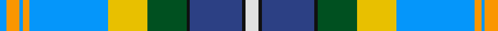

In pattern [BYBYBYGKBKW](/patterns/bybybygkbkw/).

This was sourced from register-of-tartans.  It is a [11 stripes tartan](/stripes/stripes11/).

Original link https://www.tartanregister.gov.uk/tartanDetails.aspx?ref=5947

## Thread count
Ba/4 DY8 Ba2 DY4 Ba48 Y24 G24 K2 B32 K2 LN/8

## Palette
Each colour and its ΔE from the base-6 reference it is a variant of.

| Colour | Shade | Base | ΔE (OKLab) |
|---|---|---|---|
| B | <code style="background-color:#2C4084;">#2C4084</code> `#2C4084` | B <code style="background-color:#2A418A;">#2A418A</code> | 0.01 |
| Ba | <code style="background-color:#0596FA;">#0596FA</code> `#0596FA` | B <code style="background-color:#2A418A;">#2A418A</code> | 0.27 |
| DY | <code style="background-color:#FA9600;">#FA9600</code> `#FA9600` | Y <code style="background-color:#F2BF00;">#F2BF00</code> | 0.10 |
| G | <code style="background-color:#005020;">#005020</code> `#005020` | G <code style="background-color:#006100;">#006100</code> | 0.07 |
| K | <code style="background-color:#101010;">#101010</code> `#101010` | K <code style="background-color:#000000;">#000000</code> | 0.17 |
| LN | <code style="background-color:#E0E0E0;">#E0E0E0</code> `#E0E0E0` | W <code style="background-color:#F7F7F7;">#F7F7F7</code> | 0.07 |
| Y | <code style="background-color:#E8C000;">#E8C000</code> `#E8C000` | Y <code style="background-color:#F2BF00;">#F2BF00</code> | 0.02 |

## Nearest tartans

The nearest existing variants by ΔTartan distance.

1. [Thistle Stop LLC](/setts/s9/y32g2ga2g2b48k24r32ba4g4-b5c8ca8-ba780078-g289c18-ga006818-k101010-r9c68a4-y00b8b4/) — ΔT 1.09
1. [Dundee Carers' Centre](/setts/s11/w66b2y14b2ya5ba8b12g60ga60w2b25-b202060-ba9058d8-g006818-ga048888-wc49cd8-yd87c00-yafccc00/) — ΔT 1.16
1. [Nova Scotia Dress (District)](/setts/s11/b4w40r2y4g16ga8g4ga4g4b40w4-b1474b4-g003820-ga006818-rc80000-we0e0e0-ye8c000/) — ΔT 1.19
1. [Anstey in New Scotland (Personal)](/setts/s15/w6b6w3b44g20ga8g2ga8g6r3g2r3g4w25y4-b1b6cc5-g006666-ga019101-r980020-wf4f4fc-ye0b000/) — ΔT 1.22
1. [Tanzania](/setts/s12/b8ba2b4ba32y4k16y4g32k2b48k2w8-b2c4084-ba0596fa-g309c18-k101010-we0e0e0-ye8c000/) — ΔT 1.22
1. [Nova Scotia Dress](/setts/s11/b4w40r2y4g16ga8g4ga4g4b40w4-b2c4084-g002814-ga309c18-rdc0000-we0e0e0-ye8c000/) — ΔT 1.33
1. [Nova Scotia Dress Canadian Tartan Tartan Number: 660. Earliest known date: 1982 Yarmouth See products available Copyright © Blair Urquhart, Comrie, 2015](/setts/s11/b4w40r2y4g16ga8g4ga4g4b40w4-b2c2c80-g003820-ga289c18-rc80000-we0e0e0-ye8c000/) — ΔT 1.33
1. [Nova Scotia, dress](/setts/s11/b4w40r2y4g16ga8g4ga4g4b40w4-b304080-g003000-ga30a010-rc00000-we0e0e0-yf0c000/) — ΔT 1.37
1. [Arisaig (District)](/setts/s11/b8r8b24w24k8g8ba16r2w2ba2y2-b5c8ca8-ba003c64-g006818-k101010-rc8002c-we0e0e0-ye8c000/) — ΔT 1.40
1. [Philpotts, Brian](/setts/s8/y16b48ba42g36ya8w6ga4yb2-b2888c4-ba2c2c80-g289c18-ga604000-wc0c0c0-ye8c000-yad09800-ybfcb464/) — ΔT 1.42

## Neighbour map

Every grey dot is one of 15726 variants placed by the first two principal components of the ΔTartan feature space (44% of its variance). Red is this tartan; blue dots are its nearest — click one to open its page.

<svg viewBox="0 0 640 380" role="img" style="max-width:100%;height:auto;border:1px solid #e0e0e0;border-radius:4px;display:block" xmlns="http://www.w3.org/2000/svg"><image href="/nn/cloud.v1.png" width="640" height="380"/><a href="/setts/s9/y32g2ga2g2b48k24r32ba4g4-b5c8ca8-ba780078-g289c18-ga006818-k101010-r9c68a4-y00b8b4/"><circle cx="129.4" cy="100.0" r="4" fill="#3465a4"><title>Thistle Stop LLC</title></circle></a><a href="/setts/s11/w66b2y14b2ya5ba8b12g60ga60w2b25-b202060-ba9058d8-g006818-ga048888-wc49cd8-yd87c00-yafccc00/"><circle cx="114.5" cy="71.6" r="4" fill="#3465a4"><title>Dundee Carers' Centre</title></circle></a><a href="/setts/s11/b4w40r2y4g16ga8g4ga4g4b40w4-b1474b4-g003820-ga006818-rc80000-we0e0e0-ye8c000/"><circle cx="138.6" cy="87.5" r="4" fill="#3465a4"><title>Nova Scotia Dress (District)</title></circle></a><a href="/setts/s15/w6b6w3b44g20ga8g2ga8g6r3g2r3g4w25y4-b1b6cc5-g006666-ga019101-r980020-wf4f4fc-ye0b000/"><circle cx="134.9" cy="74.2" r="4" fill="#3465a4"><title>Anstey in New Scotland (Personal)</title></circle></a><a href="/setts/s12/b8ba2b4ba32y4k16y4g32k2b48k2w8-b2c4084-ba0596fa-g309c18-k101010-we0e0e0-ye8c000/"><circle cx="144.9" cy="90.8" r="4" fill="#3465a4"><title>Tanzania</title></circle></a><a href="/setts/s11/b4w40r2y4g16ga8g4ga4g4b40w4-b2c4084-g002814-ga309c18-rdc0000-we0e0e0-ye8c000/"><circle cx="132.3" cy="83.6" r="4" fill="#3465a4"><title>Nova Scotia Dress</title></circle></a><a href="/setts/s11/b4w40r2y4g16ga8g4ga4g4b40w4-b2c2c80-g003820-ga289c18-rc80000-we0e0e0-ye8c000/"><circle cx="132.1" cy="83.4" r="4" fill="#3465a4"><title>Nova Scotia Dress Canadian Tartan Tartan Number: 660. Earliest known date: 1982 Yarmouth See products available Copyright © Blair Urquhart, Comrie, 2015</title></circle></a><a href="/setts/s11/b4w40r2y4g16ga8g4ga4g4b40w4-b304080-g003000-ga30a010-rc00000-we0e0e0-yf0c000/"><circle cx="132.9" cy="83.7" r="4" fill="#3465a4"><title>Nova Scotia, dress</title></circle></a><a href="/setts/s11/b8r8b24w24k8g8ba16r2w2ba2y2-b5c8ca8-ba003c64-g006818-k101010-rc8002c-we0e0e0-ye8c000/"><circle cx="53.7" cy="109.6" r="4" fill="#3465a4"><title>Arisaig (District)</title></circle></a><a href="/setts/s8/y16b48ba42g36ya8w6ga4yb2-b2888c4-ba2c2c80-g289c18-ga604000-wc0c0c0-ye8c000-yad09800-ybfcb464/"><circle cx="83.0" cy="94.7" r="4" fill="#3465a4"><title>Philpotts, Brian</title></circle></a><circle cx="103.5" cy="75.9" r="5" fill="#c00000"/></svg>

ID: /setts/s11/w8k2b32k2g24y24ba48ya4ba2ya8ba4-b2c4084-ba0596fa-g005020-k101010-we0e0e0-ye8c000-yafa9600/
