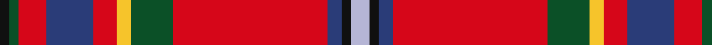

In pattern [KGRBRYGRBKW](/patterns/kgrbrygrbkw/).

This was sourced from register-of-tartans.  It is a [11 stripes tartan](/stripes/stripes11/).

Original link https://www.tartanregister.gov.uk/tartanDetails.aspx?ref=2284

## Thread count
K/4 G4 R12 B20 R10 Y6 G18 R66 B6 K4 LP/8

## Palette
Each colour and its ΔE from the base-6 reference it is a variant of.

| Colour | Shade | Base | ΔE (OKLab) |
|---|---|---|---|
| B | <code style="background-color:#2A3C78;">#2A3C78</code> `#2A3C78` | B <code style="background-color:#2C4084;">#2C4084</code> | 0.02 |
| G | <code style="background-color:#0B5027;">#0B5027</code> `#0B5027` | G <code style="background-color:#006400;">#006400</code> | 0.08 |
| K | <code style="background-color:#101010;">#101010</code> `#101010` | K <code style="background-color:#000000;">#000000</code> | 0.17 |
| LP | <code style="background-color:#B5B5D5;">#B5B5D5</code> `#B5B5D5` | W <code style="background-color:#F4F4F0;">#F4F4F0</code> | 0.19 |
| R | <code style="background-color:#D60619;">#D60619</code> `#D60619` | R <code style="background-color:#C80000;">#C80000</code> | 0.03 |
| Y | <code style="background-color:#F6C42B;">#F6C42B</code> `#F6C42B` | Y <code style="background-color:#E8C000;">#E8C000</code> | 0.03 |

ID: /setts/s11/w8k4b6r66g18y6r10b20r12g4k4-b2a3c78-g0b5027-k101010-rd60619-wb5b5d5-yf6c42b/
