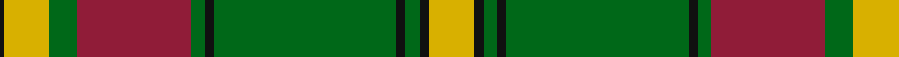

In pattern [KYGRGKGKGKY](/patterns/kygrgkgkgky/).

This was sourced from register-of-tartans.  It is a [11 stripes tartan](/stripes/stripes11/).

Original link https://www.tartanregister.gov.uk/tartanDetails.aspx?ref=2656

## Thread count
K/2 Y20 G12 DR50 G6 K4 G80 K4 G6 K4 Y/20

## Palette
Each colour and its ΔE from the base-6 reference it is a variant of.

| Colour | Shade | Base | ΔE (OKLab) |
|---|---|---|---|
| DR | <code style="background-color:#901C38;">#901C38</code> `#901C38` | R <code style="background-color:#CC0000;">#CC0000</code> | 0.13 |
| G | <code style="background-color:#006818;">#006818</code> `#006818` | G <code style="background-color:#006100;">#006100</code> | 0.02 |
| K | <code style="background-color:#101010;">#101010</code> `#101010` | K <code style="background-color:#000000;">#000000</code> | 0.17 |
| Y | <code style="background-color:#D8B000;">#D8B000</code> `#D8B000` | Y <code style="background-color:#F2BF00;">#F2BF00</code> | 0.06 |
| Ya | <code style="background-color:#E8C000;">#E8C000</code> `#E8C000` | Y <code style="background-color:#F2BF00;">#F2BF00</code> | 0.02 |

## Nearest tartans

The nearest existing variants by ΔTartan distance.

1. [MacDonald of Kingsburgh -1746 (Clan)](/setts/s9/g8ga1g1ga42w2r40g2ga2r3x2~g308024-ga003814-rc85840-wfcfcfc/) — ΔT 1.14
1. [Gray, hunting](/setts/s11/k3w1g29ga8r2ga2r2ga2r8g7k2x2~g008000-ga808080-k000000-r900030-we0e0e0/) — ΔT 1.21
1. [Valdres, Kvam & Vang #2](/setts/s11/k4w1r4k2g2r3k2g20r2k2r2x2~g006818-k101010-rc80000-we0e0e0/) — ΔT 1.29
1. [Gleneil](/setts/s8/k2r2k2r24g31k1g2y2x2~g008000-k000000-rc00000-yf0c000/) — ΔT 1.30
1. [Strang (Personal)](/setts/s14/r36g18r4g6k1w2k1g2k1w2k1g6r4g18x2~g146400-k000000-rb00000-wc8c8c8/) — ΔT 1.37
1. [Lomond (1983)](/setts/s13/g30k2ga2k2ga2w3k1w2k1w1ga12y2k6x4~g8c7038-ga006818-k101010-wc0c0c0-yd09800/) — ΔT 1.37
1. [MacMillan - 1847 (Clan)](/setts/s12/g7k3g53k3g8k3b24g8y18k3y18k3x2~b680028-g006818-k101010-ybc8c00/) — ΔT 1.38
1. [Pollock Clan Tartan Tartan Number: 867. Earliest known date: 1980 Based on the Maxwell sett which in turn comes from the Vestiarium Scoticum (1842). Details of the Clan Society's design came from Rhys A Pollock in America. Pollocks were feudal dependents of the Maxwells who lived in the Scottish Lowlands. See products available Copyright © Blair Urquhart, Comrie, 2015](/setts/s7/g3r16w4k6g28r1g3x2~g006818-k101010-rc80000-we0e0e0/) — ΔT 1.41
1. [Gray Hunting Family Tartan Tartan Number: 1079. Earliest known date: 1990 There is also a Gray tartan designed by Mrs G. Gray some years earlier. See products available Copyright © Blair Urquhart, Comrie, 2015](/setts/s11/k3w1g29r8ra2r2ra2r2ra8g7k2x2~g006818-k101010-r888888-raa00048-we0e0e0/) — ΔT 1.41
1. [Longmore (Name)](/setts/s9/g15y3g27r2g2r33b2w1b4x2~b1474b4-g006818-rc80000-we0e0e0-ye8c000/) — ΔT 1.42

## Neighbour map

Every grey dot is one of 15726 variants placed by the first two principal components of the ΔTartan feature space (44% of its variance). Red is this tartan; blue dots are its nearest — click one to open its page.

<svg viewBox="0 0 640 380" role="img" style="max-width:100%;height:auto;border:1px solid #e0e0e0;border-radius:4px;display:block" xmlns="http://www.w3.org/2000/svg"><image href="/nn/cloud.v1.png" width="640" height="380"/><a href="/setts/s9/g8ga1g1ga42w2r40g2ga2r3x2~g308024-ga003814-rc85840-wfcfcfc/"><circle cx="341.2" cy="104.9" r="4" fill="#3465a4"><title>MacDonald of Kingsburgh -1746 (Clan)</title></circle></a><a href="/setts/s11/k3w1g29ga8r2ga2r2ga2r8g7k2x2~g008000-ga808080-k000000-r900030-we0e0e0/"><circle cx="310.3" cy="103.8" r="4" fill="#3465a4"><title>Gray, hunting</title></circle></a><a href="/setts/s11/k4w1r4k2g2r3k2g20r2k2r2x2~g006818-k101010-rc80000-we0e0e0/"><circle cx="304.5" cy="131.8" r="4" fill="#3465a4"><title>Valdres, Kvam &amp; Vang #2</title></circle></a><a href="/setts/s8/k2r2k2r24g31k1g2y2x2~g008000-k000000-rc00000-yf0c000/"><circle cx="340.1" cy="118.2" r="4" fill="#3465a4"><title>Gleneil</title></circle></a><a href="/setts/s14/r36g18r4g6k1w2k1g2k1w2k1g6r4g18x2~g146400-k000000-rb00000-wc8c8c8/"><circle cx="359.1" cy="99.4" r="4" fill="#3465a4"><title>Strang (Personal)</title></circle></a><a href="/setts/s13/g30k2ga2k2ga2w3k1w2k1w1ga12y2k6x4~g8c7038-ga006818-k101010-wc0c0c0-yd09800/"><circle cx="279.1" cy="81.3" r="4" fill="#3465a4"><title>Lomond (1983)</title></circle></a><a href="/setts/s12/g7k3g53k3g8k3b24g8y18k3y18k3x2~b680028-g006818-k101010-ybc8c00/"><circle cx="292.5" cy="147.4" r="4" fill="#3465a4"><title>MacMillan - 1847 (Clan)</title></circle></a><a href="/setts/s7/g3r16w4k6g28r1g3x2~g006818-k101010-rc80000-we0e0e0/"><circle cx="339.9" cy="151.4" r="4" fill="#3465a4"><title>Pollock Clan Tartan Tartan Number: 867. Earliest known date: 1980 Based on the Maxwell sett which in turn comes from the Vestiarium Scoticum (1842). Details of the Clan Society's design came from Rhys A Pollock in America. Pollocks were feudal dependents of the Maxwells who lived in the Scottish Lowlands. See products available Copyright © Blair Urquhart, Comrie, 2015</title></circle></a><a href="/setts/s11/k3w1g29r8ra2r2ra2r2ra8g7k2x2~g006818-k101010-r888888-raa00048-we0e0e0/"><circle cx="334.7" cy="112.0" r="4" fill="#3465a4"><title>Gray Hunting Family Tartan Tartan Number: 1079. Earliest known date: 1990 There is also a Gray tartan designed by Mrs G. Gray some years earlier. See products available Copyright © Blair Urquhart, Comrie, 2015</title></circle></a><a href="/setts/s9/g15y3g27r2g2r33b2w1b4x2~b1474b4-g006818-rc80000-we0e0e0-ye8c000/"><circle cx="332.8" cy="113.6" r="4" fill="#3465a4"><title>Longmore (Name)</title></circle></a><circle cx="321.7" cy="107.7" r="5" fill="#c00000"/></svg>

ID: /setts/s11/y10k2g3k2g40k2g3r25g6y10k1x2~g006818-k101010-r901c38-yd8b000/
