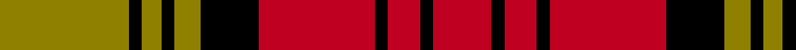

This page is one **sett** — a single exact thread-count. It belongs to the [tartan](/tartans/y20k2y3k2y4k9r18k2r5k2r9/)
(the same proportion at any scale), whose colour order is pattern [GKGKGKRKRKR](/stripes/gkgkgkrkrkr/).

Sourced from weddslist.  It is a [11 stripe tartan](/stripes/stripes11/).

Original link http://www.weddslist.com/cgi-bin/tartans/pg.pl?source=sts

## Thread count
LG/40 K4 LG6 K4 LG8 K18 R36 K4 R10 K4 R/18

## Palette

Palette: <strong>Ingles Buchan</strong> <small style="color:#888">(1 of 3 colours)</small>
<table><thead><tr><th>Colour</th><th>Threads</th><th>Shade</th><th>Base</th><th>OKLCh</th></tr></thead><tbody><tr><td>LG/</td><td style="text-align:right;font-variant-numeric:tabular-nums">40</td><td><code style="background-color:#908000;">#908000</code> <small style="color:#888">#908000</small></td><td>G <code style="background-color:#006100;">#006100</code></td><td><small style="color:#888">oklch(59.6% 0.124 100.6)</small></td></tr><tr><td>K</td><td style="text-align:right;font-variant-numeric:tabular-nums">4</td><td><code style="background-color:#000000;">#000000</code> <small style="color:#888">#000000</small></td><td>K <code style="background-color:#000000;">#000000</code></td><td><small style="color:#888">oklch(0.0% 0.000 0.0)</small></td></tr><tr><td>LG</td><td style="text-align:right;font-variant-numeric:tabular-nums">6</td><td><code style="background-color:#908000;">#908000</code> <small style="color:#888">#908000</small></td><td>G <code style="background-color:#006100;">#006100</code></td><td><small style="color:#888">oklch(59.6% 0.124 100.6)</small></td></tr><tr><td>K</td><td style="text-align:right;font-variant-numeric:tabular-nums">4</td><td><code style="background-color:#000000;">#000000</code> <small style="color:#888">#000000</small></td><td>K <code style="background-color:#000000;">#000000</code></td><td><small style="color:#888">oklch(0.0% 0.000 0.0)</small></td></tr><tr><td>LG</td><td style="text-align:right;font-variant-numeric:tabular-nums">8</td><td><code style="background-color:#908000;">#908000</code> <small style="color:#888">#908000</small></td><td>G <code style="background-color:#006100;">#006100</code></td><td><small style="color:#888">oklch(59.6% 0.124 100.6)</small></td></tr><tr><td>K</td><td style="text-align:right;font-variant-numeric:tabular-nums">18</td><td><code style="background-color:#000000;">#000000</code> <small style="color:#888">#000000</small></td><td>K <code style="background-color:#000000;">#000000</code></td><td><small style="color:#888">oklch(0.0% 0.000 0.0)</small></td></tr><tr><td>R</td><td style="text-align:right;font-variant-numeric:tabular-nums">36</td><td><code style="background-color:#C00020;">#C00020</code> <small style="color:#888">#C00020</small></td><td>R <code style="background-color:#CC0000;">#CC0000</code></td><td><small style="color:#888">oklch(50.9% 0.206 24.5)</small></td></tr><tr><td>K</td><td style="text-align:right;font-variant-numeric:tabular-nums">4</td><td><code style="background-color:#000000;">#000000</code> <small style="color:#888">#000000</small></td><td>K <code style="background-color:#000000;">#000000</code></td><td><small style="color:#888">oklch(0.0% 0.000 0.0)</small></td></tr><tr><td>R</td><td style="text-align:right;font-variant-numeric:tabular-nums">10</td><td><code style="background-color:#C00020;">#C00020</code> <small style="color:#888">#C00020</small></td><td>R <code style="background-color:#CC0000;">#CC0000</code></td><td><small style="color:#888">oklch(50.9% 0.206 24.5)</small></td></tr><tr><td>K</td><td style="text-align:right;font-variant-numeric:tabular-nums">4</td><td><code style="background-color:#000000;">#000000</code> <small style="color:#888">#000000</small></td><td>K <code style="background-color:#000000;">#000000</code></td><td><small style="color:#888">oklch(0.0% 0.000 0.0)</small></td></tr><tr><td>R/</td><td style="text-align:right;font-variant-numeric:tabular-nums">18</td><td><code style="background-color:#C00020;">#C00020</code> <small style="color:#888">#C00020</small></td><td>R <code style="background-color:#CC0000;">#CC0000</code></td><td><small style="color:#888">oklch(50.9% 0.206 24.5)</small></td></tr></tbody></table>

## Nearest tartans

The nearest existing variants by ΔTartan distance, with this tartan at the top so the swatches line up against it.

ΔTartan

Tartan

Sett

—

<a href="/ttd/edit/#slug=y20k2y3k2y4k9r18k2r5k2r9~x2">Aubigny, Auld Alliance</a> <a class="nn-out" href="/setts/s11/y20k2y3k2y4k9r18k2r5k2r9~x2/" title="open its dictionary page">↗</a>

0.67

<a href="/ttd/edit/#slug=ly20k2ly3k2ly4k9r18k2r5~x2">Aubigny</a> <a class="nn-out" href="/setts/s9/ly20k2ly3k2ly4k9r18k2r5~x2/" title="open its dictionary page">↗</a>

0.92

<a href="/ttd/edit/#slug=g8r1k1r8g1r8k1r1k8r1~x6">Hebridean, South Uist</a> <a class="nn-out" href="/setts/s10/g8r1k1r8g1r8k1r1k8r1~x6/" title="open its dictionary page">↗</a>

1.07

<a href="/ttd/edit/#slug=lo16k2lo2k2lo2k16r16k3r16k16lo16k2lo2~x2">Unidentified (NZ)</a> <a class="nn-out" href="/setts/s13/lo16k2lo2k2lo2k16r16k3r16k16lo16k2lo2~x2/" title="open its dictionary page">↗</a>

1.25

<a href="/ttd/edit/#slug=r9k9ly4k2ly3k2ly20k2ly3k2ly4k9r18k2r5k2r9~x2">Aubigny Auld Alliance District Tartan Tartan Number: 2159. Earliest known date: 1994 The Aubigny Auld Alliance tartan was created using the Stewart of Atholl tartan and the colours of the Aubigny sur Nere town crest. The Stewart of Atholl tartan was used as the basis for this tartan because of the 16th century Chateau d'Aubigny sur Nere which was built by the Stewarts. The name arises from the Auld Alliance, a cultural and diplomatic treaty between Scotland and France, which was at it's strongest during conflicts with England, the common enemy. See products available Copyright © Blair Urquhart, Comrie, 2015</a> <a class="nn-out" href="/setts/s17/r9k9ly4k2ly3k2ly20k2ly3k2ly4k9r18k2r5k2r9~x2/" title="open its dictionary page">↗</a>

1.28

<a href="/ttd/edit/#slug=db1k1r12g12k6db5r12k1db1~x2">Montrose</a> <a class="nn-out" href="/setts/s9/db1k1r12g12k6db5r12k1db1~x2/" title="open its dictionary page">↗</a>

1.28

<a href="/ttd/edit/#slug=k10t1k1r10t1k1t1r10g6r2~x2">Scoepaig, fragment</a> <a class="nn-out" href="/setts/s10/k10t1k1r10t1k1t1r10g6r2~x2/" title="open its dictionary page">↗</a>

1.33

<a href="/ttd/edit/#slug=lr1k1r10g10k5lr5r10k1lr1~x4">Graham Red</a> <a class="nn-out" href="/setts/s9/lr1k1r10g10k5lr5r10k1lr1~x4/" title="open its dictionary page">↗</a>

1.33

<a href="/ttd/edit/#slug=k2db2r26dg25k13db13r26db2k2~x2">MacNaughton (Logan) #2</a> <a class="nn-out" href="/setts/s9/k2db2r26dg25k13db13r26db2k2~x2/" title="open its dictionary page">↗</a>

1.35

<a href="/ttd/edit/#slug=g20db2g2db2g2db8r24db2r3~x2">Lindsay</a> <a class="nn-out" href="/setts/s9/g20db2g2db2g2db8r24db2r3~x2/" title="open its dictionary page">↗</a>

1.35

<a href="/ttd/edit/#slug=k12lr4k4lr4k4lr10k4lr3k8r24lr2~x2">Wcwm 9285 4906-1</a> <a class="nn-out" href="/setts/s11/k12lr4k4lr4k4lr10k4lr3k8r24lr2~x2/" title="open its dictionary page">↗</a>

## Neighbour map

Every grey dot is one of 14299 variants placed by the first two principal components of the ΔTartan feature space (44% of its variance). Red is this tartan; blue dots are its nearest — click one to open its page.

<svg viewBox="0 0 640 380" role="img" style="max-width:100%;height:auto;border:1px solid #e0e0e0;border-radius:4px;display:block" xmlns="http://www.w3.org/2000/svg"><image href="/nn/cloud.v1.png" width="640" height="380"/><a href="/setts/s9/ly20k2ly3k2ly4k9r18k2r5~x2/"><circle cx="223.1" cy="173.0" r="4" fill="#3465a4"><title>Aubigny</title></circle></a><a href="/setts/s10/g8r1k1r8g1r8k1r1k8r1~x6/"><circle cx="254.4" cy="187.7" r="4" fill="#3465a4"><title>Hebridean, South Uist</title></circle></a><a href="/setts/s13/lo16k2lo2k2lo2k16r16k3r16k16lo16k2lo2~x2/"><circle cx="196.6" cy="190.0" r="4" fill="#3465a4"><title>Unidentified (NZ)</title></circle></a><a href="/setts/s17/r9k9ly4k2ly3k2ly20k2ly3k2ly4k9r18k2r5k2r9~x2/"><circle cx="194.8" cy="145.9" r="4" fill="#3465a4"><title>Aubigny Auld Alliance District Tartan Tartan Number: 2159. Earliest known date: 1994 The Aubigny Auld Alliance tartan was created using the Stewart of Atholl tartan and the colours of the Aubigny sur Nere town crest. The Stewart of Atholl tartan was used as the basis for this tartan because of the 16th century Chateau d'Aubigny sur Nere which was built by the Stewarts. The name arises from the Auld Alliance, a cultural and diplomatic treaty between Scotland and France, which was at it's strongest during conflicts with England, the common enemy. See products available Copyright © Blair Urquhart, Comrie, 2015</title></circle></a><a href="/setts/s9/db1k1r12g12k6db5r12k1db1~x2/"><circle cx="227.0" cy="168.9" r="4" fill="#3465a4"><title>Montrose</title></circle></a><a href="/setts/s10/k10t1k1r10t1k1t1r10g6r2~x2/"><circle cx="248.1" cy="160.9" r="4" fill="#3465a4"><title>Scoepaig, fragment</title></circle></a><a href="/setts/s9/lr1k1r10g10k5lr5r10k1lr1~x4/"><circle cx="201.2" cy="171.6" r="4" fill="#3465a4"><title>Graham Red</title></circle></a><a href="/setts/s9/k2db2r26dg25k13db13r26db2k2~x2/"><circle cx="230.2" cy="161.4" r="4" fill="#3465a4"><title>MacNaughton (Logan) #2</title></circle></a><a href="/setts/s9/g20db2g2db2g2db8r24db2r3~x2/"><circle cx="253.9" cy="161.2" r="4" fill="#3465a4"><title>Lindsay</title></circle></a><a href="/setts/s11/k12lr4k4lr4k4lr10k4lr3k8r24lr2~x2/"><circle cx="216.9" cy="174.8" r="4" fill="#3465a4"><title>Wcwm 9285 4906-1</title></circle></a><circle cx="231.0" cy="172.6" r="5" fill="#c00000"/></svg>

ID: /setts/s11/y20k2y3k2y4k9r18k2r5k2r9~x2/
