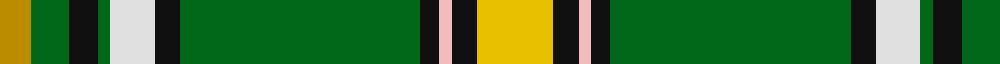

In pattern [YGKGWKGKWKY](/patterns/ygkgwkgkwky/).

This was sourced from tartans-authority.  It is a [11 stripes tartan](/stripes/stripes11/).

Original link http://www.tartansauthority.com/tartan-ferret/display/7456/

## Attestations

This cloth appears in 2 source records; the oldest owns this page.

- 2004 — Offally County Crest (Fashion) (tartans-authority, [record](http://www.tartansauthority.com/tartan-ferret/display/7456/))
- 01/05/2005 — Offaly County, Crest Range (register-of-tartans, [record](https://www.tartanregister.gov.uk/tartanDetails.aspx?ref=5058))

## Register references

External register numbers recorded for this tartan.

- Scottish Register of Tartans: [5058](https://www.tartanregister.gov.uk/tartanDetails.aspx?ref=5058)
- Scottish Tartans Authority (ITI): 7456
- Scottish Tartans World Register: 3097

## Thread count
DY/10 G12 K9 G4 LN14 K8 G76 K6 LR4 K8 Y/24

## Palette
Each colour and its ΔE from the base-6 reference it is a variant of.

| Colour | Shade | Base | ΔE (OKLab) |
|---|---|---|---|
| DY | <code style="background-color:#BC8C00;">#BC8C00</code> `#BC8C00` | Y <code style="background-color:#F2BF00;">#F2BF00</code> | 0.16 |
| G | <code style="background-color:#006818;">#006818</code> `#006818` | G <code style="background-color:#006100;">#006100</code> | 0.02 |
| K | <code style="background-color:#101010;">#101010</code> `#101010` | K <code style="background-color:#000000;">#000000</code> | 0.17 |
| LN | <code style="background-color:#E0E0E0;">#E0E0E0</code> `#E0E0E0` | W <code style="background-color:#F7F7F7;">#F7F7F7</code> | 0.07 |
| LR | <code style="background-color:#F0BCBC;">#F0BCBC</code> `#F0BCBC` | W <code style="background-color:#F7F7F7;">#F7F7F7</code> | 0.15 |
| Y | <code style="background-color:#E8C000;">#E8C000</code> `#E8C000` | Y <code style="background-color:#F2BF00;">#F2BF00</code> | 0.02 |

## Nearest tartans

The nearest existing variants by ΔTartan distance.

1. [Nor Westers Commemorative Tartan Tartan Number: 1067. Earliest known date: 1963 Named after the Nor Westers Mountain Range in Ontario. Designed by Miss Evelyn B Halliday in February 1963 to commemorate the naming of the range in that year. Variation See products available Copyright © Blair Urquhart, Comrie, 2015](/setts/s9/k1g23k1y3k1w8r1b5k1~b5c8ca8-g006818-k101010-rc80000-we0e0e0-ye8c000~x2/) — ΔT 0.86
1. [Nor Westers](/setts/s9/k1g23k1y3k1w8r1b5k1~b5480b0-g008000-k000000-rc00000-we0e0e0-yf0c000~x2/) — ΔT 0.90
1. [Canadian Caledonian, hunting](/setts/s11/b3k1g13y1r1w1r6g3r1g3w1~b304080-g008000-k000000-rc00000-we0e0e0-yf0c000~x2/) — ΔT 1.08
1. [Reilly fae the Mearns](/setts/s14/g2w5ga1k7w1ga2k6ga6g9r1g30y2g3w2~g509721-ga3b522f-k120a01-ra32d18-wf7f1e8-yf8e38c~x2/) — ΔT 1.10
1. [Steel (Personal)](/setts/s11/b6g48k4y4k4w4g20r10k4r6w5~b003c64-g006818-k101010-rc80000-wf8f8f8-ye8c000/) — ΔT 1.13
1. [Fredericton #2](/setts/s12/y2g16b2w2b2w2b6g7r2w1b1ba1~b5c8ca8-ba780078-g006818-rc80000-wfcfcfc-ye8c000~x6/) — ΔT 1.14
1. [Moss](/setts/s12/g4k2g28r4g4k18g4w4g4w7k1wa3~g289c18-k101010-rc80000-wc49cd8-wafcfcfc~x2/) — ΔT 1.20
1. [Humphries (Name)](/setts/s8/g18r1w2k1w2r1ra6k2~g007800-k000000-r8c0000-ra8c6428-wc8c8c8~x4/) — ΔT 1.21
1. [Reilly fae the Mearns (Personal)](/setts/s14/g2w5ga1k7w1ga2k6ga6g9r1g30y2g3w2~g006818-ga003820-k101010-ra00000-wfcfcfc-ydc943c~x2/) — ΔT 1.24
1. [MacKellar](/setts/s11/g32w2g2y3g2w2g2k16b2ba16w3~b5480b0-ba304080-g008000-k000000-we0e0e0-yf0c000~x2/) — ΔT 1.29

## Neighbour map

Every grey dot is one of 15726 variants placed by the first two principal components of the ΔTartan feature space (44% of its variance). Red is this tartan; blue dots are its nearest — click one to open its page.

<svg viewBox="0 0 640 380" role="img" style="max-width:100%;height:auto;border:1px solid #e0e0e0;border-radius:4px;display:block" xmlns="http://www.w3.org/2000/svg"><image href="/nn/cloud.v1.png" width="640" height="380"/><a href="/setts/s9/k1g23k1y3k1w8r1b5k1~b5c8ca8-g006818-k101010-rc80000-we0e0e0-ye8c000~x2/"><circle cx="250.3" cy="87.9" r="4" fill="#3465a4"><title>Nor Westers Commemorative Tartan Tartan Number: 1067. Earliest known date: 1963 Named after the Nor Westers Mountain Range in Ontario. Designed by Miss Evelyn B Halliday in February 1963 to commemorate the naming of the range in that year. Variation See products available Copyright © Blair Urquhart, Comrie, 2015</title></circle></a><a href="/setts/s9/k1g23k1y3k1w8r1b5k1~b5480b0-g008000-k000000-rc00000-we0e0e0-yf0c000~x2/"><circle cx="239.1" cy="84.2" r="4" fill="#3465a4"><title>Nor Westers</title></circle></a><a href="/setts/s11/b3k1g13y1r1w1r6g3r1g3w1~b304080-g008000-k000000-rc00000-we0e0e0-yf0c000~x2/"><circle cx="257.7" cy="119.2" r="4" fill="#3465a4"><title>Canadian Caledonian, hunting</title></circle></a><a href="/setts/s14/g2w5ga1k7w1ga2k6ga6g9r1g30y2g3w2~g509721-ga3b522f-k120a01-ra32d18-wf7f1e8-yf8e38c~x2/"><circle cx="278.1" cy="65.3" r="4" fill="#3465a4"><title>Reilly fae the Mearns</title></circle></a><a href="/setts/s11/b6g48k4y4k4w4g20r10k4r6w5~b003c64-g006818-k101010-rc80000-wf8f8f8-ye8c000/"><circle cx="267.7" cy="118.6" r="4" fill="#3465a4"><title>Steel (Personal)</title></circle></a><a href="/setts/s12/y2g16b2w2b2w2b6g7r2w1b1ba1~b5c8ca8-ba780078-g006818-rc80000-wfcfcfc-ye8c000~x6/"><circle cx="237.3" cy="107.8" r="4" fill="#3465a4"><title>Fredericton #2</title></circle></a><a href="/setts/s12/g4k2g28r4g4k18g4w4g4w7k1wa3~g289c18-k101010-rc80000-wc49cd8-wafcfcfc~x2/"><circle cx="260.3" cy="100.5" r="4" fill="#3465a4"><title>Moss</title></circle></a><a href="/setts/s8/g18r1w2k1w2r1ra6k2~g007800-k000000-r8c0000-ra8c6428-wc8c8c8~x4/"><circle cx="287.3" cy="128.9" r="4" fill="#3465a4"><title>Humphries (Name)</title></circle></a><a href="/setts/s14/g2w5ga1k7w1ga2k6ga6g9r1g30y2g3w2~g006818-ga003820-k101010-ra00000-wfcfcfc-ydc943c~x2/"><circle cx="286.2" cy="74.3" r="4" fill="#3465a4"><title>Reilly fae the Mearns (Personal)</title></circle></a><a href="/setts/s11/g32w2g2y3g2w2g2k16b2ba16w3~b5480b0-ba304080-g008000-k000000-we0e0e0-yf0c000~x2/"><circle cx="183.0" cy="99.1" r="4" fill="#3465a4"><title>MacKellar</title></circle></a><circle cx="233.6" cy="94.9" r="5" fill="#c00000"/></svg>

ID: /setts/s11/y24k8w4k6g76k8wa14g4k9g12ya10~g006818-k101010-wf0bcbc-wae0e0e0-ye8c000-yabc8c00/
