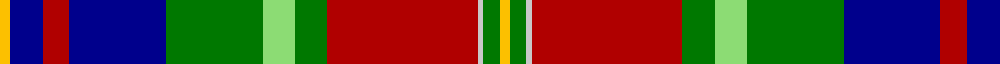

In pattern [YBRBGYGRWGY](/patterns/ybrbgygrwgy/).

This was sourced from register-of-tartans.  It is a [11 stripes tartan](/stripes/stripes11/).

Original link https://www.tartanregister.gov.uk/tartanDetails.aspx?ref=574

## Attestations

This cloth appears in 2 source records; the oldest owns this page.

- 01/01/2002 — Carr (Personal) (register-of-tartans, [record](https://www.tartanregister.gov.uk/tartanDetails.aspx?ref=574))
- pre 2002 — Carr (Personal) (tartans-authority, [record](http://www.tartansauthority.com/tartan-ferret/display/4120/))

## Thread count
Y/4 DB12 DR10 DB36 G36 LG12 G12 DR56 N2 G6 Y/4

## Palette
Each colour and its ΔE from the base-6 reference it is a variant of.

| Colour | Shade | Base | ΔE (OKLab) |
|---|---|---|---|
| DB | <code style="background-color:#00008C;">#00008C</code> `#00008C` | B <code style="background-color:#2A418A;">#2A418A</code> | 0.13 |
| DR | <code style="background-color:#B00000;">#B00000</code> `#B00000` | R <code style="background-color:#CC0000;">#CC0000</code> | 0.06 |
| G | <code style="background-color:#007800;">#007800</code> `#007800` | G <code style="background-color:#006100;">#006100</code> | 0.07 |
| LG | <code style="background-color:#8CDC74;">#8CDC74</code> `#8CDC74` | Y <code style="background-color:#F2BF00;">#F2BF00</code> | 0.14 |
| N | <code style="background-color:#C8C8C8;">#C8C8C8</code> `#C8C8C8` | W <code style="background-color:#F7F7F7;">#F7F7F7</code> | 0.14 |
| Y | <code style="background-color:#FCC000;">#FCC000</code> `#FCC000` | Y <code style="background-color:#F2BF00;">#F2BF00</code> | 0.02 |

## Nearest tartans

The nearest existing variants by ΔTartan distance.

1. [Royal Scottish P.B. Assoc. (Corp.)](/setts/s12/w6k1b20r2g3r2k15r2g3r2k6y3~b5c8ca8-g006818-k101010-rc80000-wc0c0c0-yfccc00~x2/) — ΔT 0.75
1. [Norham and Ladykirk](/setts/s11/g50b12r7b12ra10w7k2w7k2w7ra10~b202060-g285800-k101010-r888888-ra880000-wffffff~x2/) — ΔT 0.78
1. [Royal Scottish Pipe Band Association](/setts/s12/w6k1b20r2g3r2k15r2g3r2k6ka3~b5c8ca8-g006818-k101010-ka000000-rc80000-wc0c0c0~x2/) — ΔT 0.92
1. [Fermanagh County, Crest Range](/setts/s10/r4w6k10b5k3ra16k3g33k1w4~b141e46-g005020-k101010-r960000-rac87814-we0e0e0~x2/) — ΔT 0.93
1. [Unidentified No 1](/setts/s12/r8b7k8y2k1w2k1g19k1r8b3r8~b3c82af-g005020-k101010-rdc0000-we0e0e0-ye8c000~x2/) — ΔT 1.05
1. [Beaudoux - Amis Picards (District)](/setts/s11/y4b7y4k26g3k1g3w9r2w4r2~b2c2c80-g006818-k101010-rc80000-we0e0e0-yfccc00~x2/) — ΔT 1.06
1. [Aberdeen Forever (District)](/setts/s12/w4k22r2k3r2k2r3k1r8ra16wa2y4~k101010-r888888-rac80000-w98c8e8-wae0e0e0-ye8c000~x2/) — ΔT 1.06
1. [Scottish Wildcat](/setts/s14/b10w1ba1w2r10b8ba2k17ba2b7r19k3y1k1~b501400-ba441800-k101010-r888888-wfcfcfc-ye8c000~x2/) — ΔT 1.07
1. [Unnamed No 1 Tartan Tartan Number: 1340. Earliest known date: 1870 This sett is taken from the records of Messrs Bolingbroke and Jones of Norwich, who were weavers around 1870. Some of the tartans have been adopted or modified in recent times as the copyright of the designs is now in the public domain. See products available Copyright © Blair Urquhart, Comrie, 2015](/setts/s12/r8b7k8y2k1w2k1g19k1r8b3r8~b5c8ca8-g006818-k101010-rc80000-we0e0e0-ye8c000~x2/) — ΔT 1.08
1. [Unnamed C20th - National Archives](/setts/s11/b8k1r22y1r6k3g10w1k3b20w1~b5c8ca8-g003820-k101010-rc80000-wfcfcfc-yfccc00~x2/) — ΔT 1.09

## Neighbour map

Every grey dot is one of 15726 variants placed by the first two principal components of the ΔTartan feature space (44% of its variance). Red is this tartan; blue dots are its nearest — click one to open its page.

<svg viewBox="0 0 640 380" role="img" style="max-width:100%;height:auto;border:1px solid #e0e0e0;border-radius:4px;display:block" xmlns="http://www.w3.org/2000/svg"><image href="/nn/cloud.v1.png" width="640" height="380"/><a href="/setts/s12/w6k1b20r2g3r2k15r2g3r2k6y3~b5c8ca8-g006818-k101010-rc80000-wc0c0c0-yfccc00~x2/"><circle cx="131.9" cy="92.2" r="4" fill="#3465a4"><title>Royal Scottish P.B. Assoc. (Corp.)</title></circle></a><a href="/setts/s11/g50b12r7b12ra10w7k2w7k2w7ra10~b202060-g285800-k101010-r888888-ra880000-wffffff~x2/"><circle cx="161.9" cy="84.2" r="4" fill="#3465a4"><title>Norham and Ladykirk</title></circle></a><a href="/setts/s12/w6k1b20r2g3r2k15r2g3r2k6ka3~b5c8ca8-g006818-k101010-ka000000-rc80000-wc0c0c0~x2/"><circle cx="133.3" cy="94.9" r="4" fill="#3465a4"><title>Royal Scottish Pipe Band Association</title></circle></a><a href="/setts/s10/r4w6k10b5k3ra16k3g33k1w4~b141e46-g005020-k101010-r960000-rac87814-we0e0e0~x2/"><circle cx="177.1" cy="85.8" r="4" fill="#3465a4"><title>Fermanagh County, Crest Range</title></circle></a><a href="/setts/s12/r8b7k8y2k1w2k1g19k1r8b3r8~b3c82af-g005020-k101010-rdc0000-we0e0e0-ye8c000~x2/"><circle cx="143.9" cy="106.3" r="4" fill="#3465a4"><title>Unidentified No 1</title></circle></a><a href="/setts/s11/y4b7y4k26g3k1g3w9r2w4r2~b2c2c80-g006818-k101010-rc80000-we0e0e0-yfccc00~x2/"><circle cx="160.2" cy="75.0" r="4" fill="#3465a4"><title>Beaudoux - Amis Picards (District)</title></circle></a><a href="/setts/s12/w4k22r2k3r2k2r3k1r8ra16wa2y4~k101010-r888888-rac80000-w98c8e8-wae0e0e0-ye8c000~x2/"><circle cx="174.5" cy="82.9" r="4" fill="#3465a4"><title>Aberdeen Forever (District)</title></circle></a><a href="/setts/s14/b10w1ba1w2r10b8ba2k17ba2b7r19k3y1k1~b501400-ba441800-k101010-r888888-wfcfcfc-ye8c000~x2/"><circle cx="155.2" cy="99.9" r="4" fill="#3465a4"><title>Scottish Wildcat</title></circle></a><a href="/setts/s12/r8b7k8y2k1w2k1g19k1r8b3r8~b5c8ca8-g006818-k101010-rc80000-we0e0e0-ye8c000~x2/"><circle cx="146.7" cy="108.2" r="4" fill="#3465a4"><title>Unnamed No 1 Tartan Tartan Number: 1340. Earliest known date: 1870 This sett is taken from the records of Messrs Bolingbroke and Jones of Norwich, who were weavers around 1870. Some of the tartans have been adopted or modified in recent times as the copyright of the designs is now in the public domain. See products available Copyright © Blair Urquhart, Comrie, 2015</title></circle></a><a href="/setts/s11/b8k1r22y1r6k3g10w1k3b20w1~b5c8ca8-g003820-k101010-rc80000-wfcfcfc-yfccc00~x2/"><circle cx="190.1" cy="94.3" r="4" fill="#3465a4"><title>Unnamed C20th - National Archives</title></circle></a><circle cx="160.0" cy="91.9" r="5" fill="#c00000"/></svg>

ID: /setts/s11/y2b6r5b18g18ya6g6r28w1g3y2~b00008c-g007800-rb00000-wc8c8c8-yfcc000-ya8cdc74~x2/
