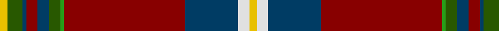

In pattern [YGBRBGGRBWY](/patterns/ygbrbggrbwy/).

This was sourced from register-of-tartans.  It is a [11 stripes tartan](/stripes/stripes11/).

Original link https://www.tartanregister.gov.uk/tartanDetails.aspx?ref=189

## Attestations

This cloth appears in 2 source records; the oldest owns this page.

- 01/05/2006 — Banause-Zunft zu Olte (register-of-tartans, [record](https://www.tartanregister.gov.uk/tartanDetails.aspx?ref=189))
- 2006 May — Banause-Zunft zu Olte (Corporate) (tartans-authority, [record](http://www.tartansauthority.com/tartan-ferret/display/6935/))

## Thread count
Y/4 G8 DB2 DR6 DB6 G6 Ga2 DR64 DB28 LN6 Y/4

## Palette
Each colour and its ΔE from the base-6 reference it is a variant of.

| Colour | Shade | Base | ΔE (OKLab) |
|---|---|---|---|
| DB | <code style="background-color:#003C64;">#003C64</code> `#003C64` | B <code style="background-color:#2A418A;">#2A418A</code> | 0.08 |
| DR | <code style="background-color:#880000;">#880000</code> `#880000` | R <code style="background-color:#CC0000;">#CC0000</code> | 0.15 |
| G | <code style="background-color:#285800;">#285800</code> `#285800` | G <code style="background-color:#006100;">#006100</code> | 0.03 |
| Ga | <code style="background-color:#289C18;">#289C18</code> `#289C18` | G <code style="background-color:#006100;">#006100</code> | 0.19 |
| LN | <code style="background-color:#E0E0E0;">#E0E0E0</code> `#E0E0E0` | W <code style="background-color:#F7F7F7;">#F7F7F7</code> | 0.07 |
| Y | <code style="background-color:#E8C000;">#E8C000</code> `#E8C000` | Y <code style="background-color:#F2BF00;">#F2BF00</code> | 0.02 |

## Nearest tartans

The nearest existing variants by ΔTartan distance.

1. [Stewart - Pr Ch Ed - Pendleton](/setts/s12/r32b2k8y1k2w2k2g18r10k2r2w2x4~b1c0070-g006818-k101010-r880000-wc0c0c0-yd09800/) — ΔT 0.69
1. [King (Austria) (Personal)](/setts/s9/w2r2b14g16y2k2g2r35g1x2~b2c2c80-g006818-k101010-rc80000-we0e0e0-ye8c000/) — ΔT 0.84
1. [Celtic Nations (Fashion)](/setts/s12/b3r2b2r35y2b3k2b5k4g13k1w3x2~b2c2c80-g006818-k101010-rc80000-wfcfcfc-ybc8c00/) — ΔT 0.91
1. [Holyrood, Chair](/setts/s13/r34w1b10g10w1y1g2ba2w1b2ba10r6w1x2~b304080-ba5480b0-g008000-rc00000-we0e0e0-yf0c000/) — ΔT 1.01
1. [MacNiven Family Tartan Tartan Number: 752. Earliest known date: 1986 Based in part on the MacNaughton of which the MacNivens are a Sept. The name in Mr Cannonito's family was spelt, MacKniffen. Other members of the family have dropped the 'Mac' since arriving in America in 1650. This clan tartan was accredited by the Scottish Tartans Society in 1988. See products available Copyright © Blair Urquhart, Comrie, 2015](/setts/s9/g18ga2b5r45ba3b18ba3r5w2~b202060-ba2c2c80-g006818-ga289c18-rc80000-we0e0e0/) — ΔT 1.02
1. [MacNiven](/setts/s9/g18ga2b5r45w3b18w3r8wa2x2~b1c0070-g006818-ga289c18-r880000-wa8ace8-wac0c0c0/) — ΔT 1.07
1. [MacNiven](/setts/s9/g18ga2b5r45ba3b18ba3r5w2~b000050-ba304080-g008000-ga30a010-rc00000-we0e0e0/) — ΔT 1.12
1. [Follower's Plaid Artifact Tartan Tartan Number: 1376. Earliest known date: 1745 Red pivot = 192 threads in original. W & Y are silk. Sindex title See products available Copyright © Blair Urquhart, Comrie, 2015](/setts/s11/r48b8k10y2k3w2g25r10k3r3w2x2~b5c8ca8-g006818-k101010-rc80000-we0e0e0-ye8c000/) — ΔT 1.12
1. [Chelsea](/setts/s11/k4r30y3r3k6g36y1g2ra2g2ga2x4~g0c5454-ga688c28-k000000-r740010-rac80000-yc89800/) — ΔT 1.15
1. [Wattenhofer (2016)](/setts/s9/b60ba8r16ba4y8b4ra2ba6w1x2~b441800-ba1870a4-rb03000-rac80000-we0e0e0-ydc943c/) — ΔT 1.16

## Neighbour map

Every grey dot is one of 15726 variants placed by the first two principal components of the ΔTartan feature space (44% of its variance). Red is this tartan; blue dots are its nearest — click one to open its page.

<svg viewBox="0 0 640 380" role="img" style="max-width:100%;height:auto;border:1px solid #e0e0e0;border-radius:4px;display:block" xmlns="http://www.w3.org/2000/svg"><image href="/nn/cloud.v1.png" width="640" height="380"/><a href="/setts/s12/r32b2k8y1k2w2k2g18r10k2r2w2x4~b1c0070-g006818-k101010-r880000-wc0c0c0-yd09800/"><circle cx="318.6" cy="80.5" r="4" fill="#3465a4"><title>Stewart - Pr Ch Ed - Pendleton</title></circle></a><a href="/setts/s9/w2r2b14g16y2k2g2r35g1x2~b2c2c80-g006818-k101010-rc80000-we0e0e0-ye8c000/"><circle cx="288.6" cy="76.9" r="4" fill="#3465a4"><title>King (Austria) (Personal)</title></circle></a><a href="/setts/s12/b3r2b2r35y2b3k2b5k4g13k1w3x2~b2c2c80-g006818-k101010-rc80000-wfcfcfc-ybc8c00/"><circle cx="279.3" cy="50.9" r="4" fill="#3465a4"><title>Celtic Nations (Fashion)</title></circle></a><a href="/setts/s13/r34w1b10g10w1y1g2ba2w1b2ba10r6w1x2~b304080-ba5480b0-g008000-rc00000-we0e0e0-yf0c000/"><circle cx="285.5" cy="55.4" r="4" fill="#3465a4"><title>Holyrood, Chair</title></circle></a><a href="/setts/s9/g18ga2b5r45ba3b18ba3r5w2~b202060-ba2c2c80-g006818-ga289c18-rc80000-we0e0e0/"><circle cx="273.3" cy="99.4" r="4" fill="#3465a4"><title>MacNiven Family Tartan Tartan Number: 752. Earliest known date: 1986 Based in part on the MacNaughton of which the MacNivens are a Sept. The name in Mr Cannonito's family was spelt, MacKniffen. Other members of the family have dropped the 'Mac' since arriving in America in 1650. This clan tartan was accredited by the Scottish Tartans Society in 1988. See products available Copyright © Blair Urquhart, Comrie, 2015</title></circle></a><a href="/setts/s9/g18ga2b5r45w3b18w3r8wa2x2~b1c0070-g006818-ga289c18-r880000-wa8ace8-wac0c0c0/"><circle cx="279.5" cy="108.7" r="4" fill="#3465a4"><title>MacNiven</title></circle></a><a href="/setts/s9/g18ga2b5r45ba3b18ba3r5w2~b000050-ba304080-g008000-ga30a010-rc00000-we0e0e0/"><circle cx="255.9" cy="95.4" r="4" fill="#3465a4"><title>MacNiven</title></circle></a><a href="/setts/s11/r48b8k10y2k3w2g25r10k3r3w2x2~b5c8ca8-g006818-k101010-rc80000-we0e0e0-ye8c000/"><circle cx="284.3" cy="79.0" r="4" fill="#3465a4"><title>Follower's Plaid Artifact Tartan Tartan Number: 1376. Earliest known date: 1745 Red pivot = 192 threads in original. W &amp; Y are silk. Sindex title See products available Copyright © Blair Urquhart, Comrie, 2015</title></circle></a><a href="/setts/s11/k4r30y3r3k6g36y1g2ra2g2ga2x4~g0c5454-ga688c28-k000000-r740010-rac80000-yc89800/"><circle cx="290.8" cy="78.1" r="4" fill="#3465a4"><title>Chelsea</title></circle></a><a href="/setts/s9/b60ba8r16ba4y8b4ra2ba6w1x2~b441800-ba1870a4-rb03000-rac80000-we0e0e0-ydc943c/"><circle cx="380.6" cy="72.6" r="4" fill="#3465a4"><title>Wattenhofer (2016)</title></circle></a><circle cx="308.7" cy="71.9" r="5" fill="#c00000"/></svg>

ID: /setts/s11/y2g4b1r3b3g3ga1r32b14w3y2x2~b003c64-g285800-ga289c18-r880000-we0e0e0-ye8c000/
