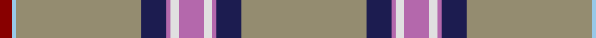

In pattern [RWYBRWRWRBY](/patterns/rwybrwrwrby/).

This was sourced from tartans-authority.  It is a [11 stripes tartan](/stripes/stripes11/).

Original link http://www.tartansauthority.com/tartan-ferret/display/10272/

## Thread count
DR/6 LB2 N60 DB12 P2 LN4 P12 LN4 P2 DB12 N/60

## Palette
Each colour and its ΔE from the base-6 reference it is a variant of.

| Colour | Shade | Base | ΔE (OKLab) |
|---|---|---|---|
| DB | <code style="background-color:#1C1C50;">#1C1C50</code> `#1C1C50` | B <code style="background-color:#2A418A;">#2A418A</code> | 0.14 |
| DR | <code style="background-color:#880000;">#880000</code> `#880000` | R <code style="background-color:#CC0000;">#CC0000</code> | 0.15 |
| LB | <code style="background-color:#98C8E8;">#98C8E8</code> `#98C8E8` | W <code style="background-color:#F7F7F7;">#F7F7F7</code> | 0.18 |
| LN | <code style="background-color:#E0E0E0;">#E0E0E0</code> `#E0E0E0` | W <code style="background-color:#F7F7F7;">#F7F7F7</code> | 0.07 |
| N | <code style="background-color:#948C70;">#948C70</code> `#948C70` | Y <code style="background-color:#F2BF00;">#F2BF00</code> | 0.23 |
| P | <code style="background-color:#B468AC;">#B468AC</code> `#B468AC` | R <code style="background-color:#CC0000;">#CC0000</code> | 0.21 |

## Nearest tartans

The nearest existing variants by ΔTartan distance.

1. [Kuehle Family Hunting (Personal)](/setts/s11/g30b6ba1w2ba6w2ba1b6g30wa1r3x2~b171844-ba7144a1-g626750-rcd5c5c-wffffff-wa74bbfb/) — ΔT 0.91
1. [Kuehle Family (Personal)](/setts/s11/g30b6ba1w2ba6w2ba1b6g30wa1r3x2~b171844-ba7144a1-g666863-rcd5c5c-wffffff-wa74bbfb/) — ΔT 1.00
1. [Quigley of Knockcroghery (Hunting) (Personal)](/setts/s11/b27w2b15y1b1y1b15k2w2ya16r1x2~b5f749c-k120a01-rb62531-we5e0d2-yf8e38c-yab6be8f/) — ΔT 1.22
1. [Carbon (Corporate)](/setts/s9/b68k4b18r20k3w3k10wa8y4~b5c5c5c-k101010-r888888-we0e0e0-wac0c0c0-yfcb464/) — ΔT 1.32
1. [Orkney Magnus](/setts/s12/r14b1r19w1r18k3r1ba7b2ba1r1bb4x2~b1c0070-ba14283c-bb505050-k101010-r888888-wffffff/) — ΔT 1.36
1. [Historic Caledonian Railway Enthusiasts', The](/setts/s11/b6k1y6k1b28w1k2w1b16w1r5x2~b576982-k120a01-r861031-wddd5af-yef8f06/) — ΔT 1.40
1. [Hebridean Fire](/setts/s9/w4r2w7b30w8b7ra5k1wa2x2~b5c5c5c-k101010-r880000-rac80000-wc0c0c0-wae0e0e0/) — ΔT 1.44
1. [British Caledonian Airways #2](/setts/s12/b68ba5k9y3k3w3k3b20r9k3r5w4~b5c5c5c-ba2474e8-k101010-r880000-wc0c0c0-yd09800/) — ΔT 1.48
1. [Inches, of Perth](/setts/s9/r44y2k4b2r15ra6k3ba3y2x2~b800080-ba5480b0-k000000-r806050-ra900030-yf0c000/) — ΔT 1.51
1. [Stuart/Stewart Authentic Grey](/setts/s12/r1g20r1g3w1k1w1k4g3k1g2y1x2~g808080-k101010-rdc0000-we0e0e0-ye8c000/) — ΔT 1.51

## Neighbour map

Every grey dot is one of 15726 variants placed by the first two principal components of the ΔTartan feature space (44% of its variance). Red is this tartan; blue dots are its nearest — click one to open its page.

<svg viewBox="0 0 640 380" role="img" style="max-width:100%;height:auto;border:1px solid #e0e0e0;border-radius:4px;display:block" xmlns="http://www.w3.org/2000/svg"><image href="/nn/cloud.v1.png" width="640" height="380"/><a href="/setts/s11/g30b6ba1w2ba6w2ba1b6g30wa1r3x2~b171844-ba7144a1-g626750-rcd5c5c-wffffff-wa74bbfb/"><circle cx="416.5" cy="96.9" r="4" fill="#3465a4"><title>Kuehle Family Hunting (Personal)</title></circle></a><a href="/setts/s11/g30b6ba1w2ba6w2ba1b6g30wa1r3x2~b171844-ba7144a1-g666863-rcd5c5c-wffffff-wa74bbfb/"><circle cx="420.3" cy="97.6" r="4" fill="#3465a4"><title>Kuehle Family (Personal)</title></circle></a><a href="/setts/s11/b27w2b15y1b1y1b15k2w2ya16r1x2~b5f749c-k120a01-rb62531-we5e0d2-yf8e38c-yab6be8f/"><circle cx="421.9" cy="109.3" r="4" fill="#3465a4"><title>Quigley of Knockcroghery (Hunting) (Personal)</title></circle></a><a href="/setts/s9/b68k4b18r20k3w3k10wa8y4~b5c5c5c-k101010-r888888-we0e0e0-wac0c0c0-yfcb464/"><circle cx="362.0" cy="113.4" r="4" fill="#3465a4"><title>Carbon (Corporate)</title></circle></a><a href="/setts/s12/r14b1r19w1r18k3r1ba7b2ba1r1bb4x2~b1c0070-ba14283c-bb505050-k101010-r888888-wffffff/"><circle cx="420.1" cy="119.1" r="4" fill="#3465a4"><title>Orkney Magnus</title></circle></a><a href="/setts/s11/b6k1y6k1b28w1k2w1b16w1r5x2~b576982-k120a01-r861031-wddd5af-yef8f06/"><circle cx="475.0" cy="117.2" r="4" fill="#3465a4"><title>Historic Caledonian Railway Enthusiasts', The</title></circle></a><a href="/setts/s9/w4r2w7b30w8b7ra5k1wa2x2~b5c5c5c-k101010-r880000-rac80000-wc0c0c0-wae0e0e0/"><circle cx="324.8" cy="98.9" r="4" fill="#3465a4"><title>Hebridean Fire</title></circle></a><a href="/setts/s12/b68ba5k9y3k3w3k3b20r9k3r5w4~b5c5c5c-ba2474e8-k101010-r880000-wc0c0c0-yd09800/"><circle cx="403.7" cy="93.0" r="4" fill="#3465a4"><title>British Caledonian Airways #2</title></circle></a><a href="/setts/s9/r44y2k4b2r15ra6k3ba3y2x2~b800080-ba5480b0-k000000-r806050-ra900030-yf0c000/"><circle cx="444.4" cy="103.9" r="4" fill="#3465a4"><title>Inches, of Perth</title></circle></a><a href="/setts/s12/r1g20r1g3w1k1w1k4g3k1g2y1x2~g808080-k101010-rdc0000-we0e0e0-ye8c000/"><circle cx="436.5" cy="99.2" r="4" fill="#3465a4"><title>Stuart/Stewart Authentic Grey</title></circle></a><circle cx="412.0" cy="88.1" r="5" fill="#c00000"/></svg>

ID: /setts/s11/y30b6r1w2r6w2r1b6y30wa1ra3x2~b1c1c50-rb468ac-ra880000-we0e0e0-wa98c8e8-y948c70/
