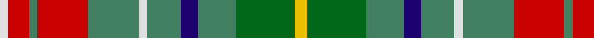

In pattern [WRGRGWGBGGY](/patterns/wrgrgwgbggy/).

This was sourced from tartans-authority.  It is a [11 stripes tartan](/stripes/stripes11/).

Original link http://www.tartansauthority.com/tartan-ferret/display/3099/

## Attestations

This cloth appears in 2 source records; the oldest owns this page.

- pre 2002 — Muirhead (Clan) (tartans-authority, [record](http://www.tartansauthority.com/tartan-ferret/display/3099/))
- undated — Muirhead (register-of-tartans, [record](https://www.tartanregister.gov.uk/tartanDetails.aspx?ref=4992))

## Thread count
LN/4 R10 G4 R24 G24 LN4 G16 DB8 G18 Ga28 Y/6

## Palette
Each colour and its ΔE from the base-6 reference it is a variant of.

| Colour | Shade | Base | ΔE (OKLab) |
|---|---|---|---|
| DB | <code style="background-color:#1C0070;">#1C0070</code> `#1C0070` | B <code style="background-color:#2A418A;">#2A418A</code> | 0.14 |
| G | <code style="background-color:#408060;">#408060</code> `#408060` | G <code style="background-color:#006100;">#006100</code> | 0.14 |
| Ga | <code style="background-color:#006818;">#006818</code> `#006818` | G <code style="background-color:#006100;">#006100</code> | 0.02 |
| LN | <code style="background-color:#E0E0E0;">#E0E0E0</code> `#E0E0E0` | W <code style="background-color:#F7F7F7;">#F7F7F7</code> | 0.07 |
| R | <code style="background-color:#C80000;">#C80000</code> `#C80000` | R <code style="background-color:#CC0000;">#CC0000</code> | 0.01 |
| Y | <code style="background-color:#E8C000;">#E8C000</code> `#E8C000` | Y <code style="background-color:#F2BF00;">#F2BF00</code> | 0.02 |

## Nearest tartans

The nearest existing variants by ΔTartan distance.

1. [State Seal of Kansas (Fashion)](/setts/s9/y5g23b21ya30k10ya4g4ya16w3x2~b1474b4-g006818-k101010-we8ccb8-ybc8c00-yaa08858/) — ΔT 1.00
1. [Greyfriars (District)](/setts/s11/b30r6g16w6ga10w14ga24y4g10w3g28~b1474b4-g604000-ga006818-rc80000-wc49cd8-ye8c000/) — ΔT 1.09
1. [Rotary Corporate Tartan Tartan Number: 2334. Earliest known date: 1996 March 1996. Check colours. Sample in STA Johnston Collection. Woven by Lochcarron of Scotland. STS entry says that it was launched at the Rotary World Convention, Glasgow, 1997 and indicates that it was designed by the Tartans Society (Keith Lumsden) for Rotary International. A counter claim suggests that Geoffrey (Tailor) was the designer. He's certainly the official supplier and can be contacted on 0131 557 0256 - 17.9.04 - "only polyviscose left and when that's finished, they won't be stocking any more." See products available Copyright © Blair Urquhart, Comrie, 2015](/setts/s12/b4y2g15r8ba15r3g15r3ba15r8g15y2x2~b202060-ba2888c4-g006818-rc80000-yd8b000/) — ΔT 1.13
1. [Bowie](/setts/s13/b8r2b3r4b13w2ra13w2g13r4g4y2g8x2~b304080-g008000-rc00000-ra703000-we0e0e0-yf0c000/) — ΔT 1.17
1. [Quinn (Name?)](/setts/s12/g20r20ga5r5ga30k10g10y8ga30r5ga5r20x2~g408060-ga006818-k101010-rc80000-ye8c000/) — ΔT 1.17
1. [Unidentified (Woven sample)](/setts/s11/g18r4g4ra6g28b28ra4w3y4w13ra6~b780078-g347800-re87878-rac80000-w50a8dc-ye8c000/) — ΔT 1.18
1. [McShane (Personal)](/setts/s8/g9w2g9k2ga14y4w2r2x4~g006818-ga604000-k101010-rc80000-wc0c0c0-ye8c000/) — ΔT 1.20
1. [Asman, Day Tan (Name)](/setts/s11/g2k1g9y3w1k3w1r3y9ya1y2x4~g5c6428-k101010-rc80000-wc0c0c0-ya08858-yad09800/) — ΔT 1.21
1. [Corcoran of Sherbrooke (Personal)](/setts/s9/k1y1g5b1g2ga5y1gb3y1x4~b780078-g006818-ga603800-gb8c7038-k101010-yb8b8b8/) — ΔT 1.22
1. [Vasseur Mignon (Personal)](/setts/s11/r2y2r2y2g5w5g11b11g5w11y2x2~b5c5c5c-g00643c-rc80000-wc8c8c8-yd4a800/) — ΔT 1.24

## Neighbour map

Every grey dot is one of 15726 variants placed by the first two principal components of the ΔTartan feature space (44% of its variance). Red is this tartan; blue dots are its nearest — click one to open its page.

<svg viewBox="0 0 640 380" role="img" style="max-width:100%;height:auto;border:1px solid #e0e0e0;border-radius:4px;display:block" xmlns="http://www.w3.org/2000/svg"><image href="/nn/cloud.v1.png" width="640" height="380"/><a href="/setts/s9/y5g23b21ya30k10ya4g4ya16w3x2~b1474b4-g006818-k101010-we8ccb8-ybc8c00-yaa08858/"><circle cx="172.4" cy="174.4" r="4" fill="#3465a4"><title>State Seal of Kansas (Fashion)</title></circle></a><a href="/setts/s11/b30r6g16w6ga10w14ga24y4g10w3g28~b1474b4-g604000-ga006818-rc80000-wc49cd8-ye8c000/"><circle cx="126.6" cy="169.0" r="4" fill="#3465a4"><title>Greyfriars (District)</title></circle></a><a href="/setts/s12/b4y2g15r8ba15r3g15r3ba15r8g15y2x2~b202060-ba2888c4-g006818-rc80000-yd8b000/"><circle cx="168.3" cy="195.8" r="4" fill="#3465a4"><title>Rotary Corporate Tartan Tartan Number: 2334. Earliest known date: 1996 March 1996. Check colours. Sample in STA Johnston Collection. Woven by Lochcarron of Scotland. STS entry says that it was launched at the Rotary World Convention, Glasgow, 1997 and indicates that it was designed by the Tartans Society (Keith Lumsden) for Rotary International. A counter claim suggests that Geoffrey (Tailor) was the designer. He's certainly the official supplier and can be contacted on 0131 557 0256 - 17.9.04 - &quot;only polyviscose left and when that's finished, they won't be stocking any more.&quot; See products available Copyright © Blair Urquhart, Comrie, 2015</title></circle></a><a href="/setts/s13/b8r2b3r4b13w2ra13w2g13r4g4y2g8x2~b304080-g008000-rc00000-ra703000-we0e0e0-yf0c000/"><circle cx="86.4" cy="166.8" r="4" fill="#3465a4"><title>Bowie</title></circle></a><a href="/setts/s12/g20r20ga5r5ga30k10g10y8ga30r5ga5r20x2~g408060-ga006818-k101010-rc80000-ye8c000/"><circle cx="161.3" cy="200.7" r="4" fill="#3465a4"><title>Quinn (Name?)</title></circle></a><a href="/setts/s11/g18r4g4ra6g28b28ra4w3y4w13ra6~b780078-g347800-re87878-rac80000-w50a8dc-ye8c000/"><circle cx="157.2" cy="143.7" r="4" fill="#3465a4"><title>Unidentified (Woven sample)</title></circle></a><a href="/setts/s8/g9w2g9k2ga14y4w2r2x4~g006818-ga604000-k101010-rc80000-wc0c0c0-ye8c000/"><circle cx="154.3" cy="185.1" r="4" fill="#3465a4"><title>McShane (Personal)</title></circle></a><a href="/setts/s11/g2k1g9y3w1k3w1r3y9ya1y2x4~g5c6428-k101010-rc80000-wc0c0c0-ya08858-yad09800/"><circle cx="177.4" cy="151.2" r="4" fill="#3465a4"><title>Asman, Day Tan (Name)</title></circle></a><a href="/setts/s9/k1y1g5b1g2ga5y1gb3y1x4~b780078-g006818-ga603800-gb8c7038-k101010-yb8b8b8/"><circle cx="106.8" cy="198.4" r="4" fill="#3465a4"><title>Corcoran of Sherbrooke (Personal)</title></circle></a><a href="/setts/s11/r2y2r2y2g5w5g11b11g5w11y2x2~b5c5c5c-g00643c-rc80000-wc8c8c8-yd4a800/"><circle cx="112.7" cy="192.4" r="4" fill="#3465a4"><title>Vasseur Mignon (Personal)</title></circle></a><circle cx="137.8" cy="179.1" r="5" fill="#c00000"/></svg>

ID: /setts/s11/y3g14ga9b4ga8w2ga12r12ga2r5w2x2~b1c0070-g006818-ga408060-rc80000-we0e0e0-ye8c000/
