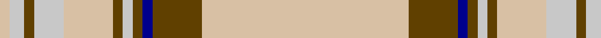

In pattern [YGBGWGYWGWY](/patterns/ygbgwgywgwy/).

This was sourced from register-of-tartans.  It is a [11 stripes tartan](/stripes/stripes11/).

Original link https://www.tartanregister.gov.uk/tartanDetails.aspx?ref=1106

## Attestations

This cloth appears in 2 source records; the oldest owns this page.

- 01/01/1984 — Elvan (register-of-tartans, [record](https://www.tartanregister.gov.uk/tartanDetails.aspx?ref=1106))
- pre 1984 — Elvan (Fashion) (tartans-authority, [record](http://www.tartansauthority.com/tartan-ferret/display/4809/))

## Thread count
LR/4 N6 T4 N12 LR20 T4 N4 T4 DB4 T20 LR/84

## Palette
Each colour and its ΔE from the base-6 reference it is a variant of.

| Colour | Shade | Base | ΔE (OKLab) |
|---|---|---|---|
| DB | <code style="background-color:#00008C;">#00008C</code> `#00008C` | B <code style="background-color:#2A418A;">#2A418A</code> | 0.13 |
| LR | <code style="background-color:#D8C0A4;">#D8C0A4</code> `#D8C0A4` | Y <code style="background-color:#F2BF00;">#F2BF00</code> | 0.13 |
| N | <code style="background-color:#C8C8C8;">#C8C8C8</code> `#C8C8C8` | W <code style="background-color:#F7F7F7;">#F7F7F7</code> | 0.14 |
| T | <code style="background-color:#604000;">#604000</code> `#604000` | G <code style="background-color:#006100;">#006100</code> | 0.14 |

## Nearest tartans

The nearest existing variants by ΔTartan distance.

1. [Loch Skene (Fashion)](/setts/s10/w48g15y2g3w2g3ya12w8g2w6x2~g604000-we8ccb8-yfcb464-yaa08858/) — ΔT 0.69
1. [Shaw of Tordarroch, Mrs (Personal)](/setts/s11/r8w46b4w4b4w5g7w7g7w4b2x2~b202060-g5c6428-re86000-we8ccb8/) — ΔT 0.90
1. [Anthony Plaid Ecru](/setts/s9/y18k1ya3k1y2r2k2r2y2x4~k101010-r880000-yb8b8b8-yae8c000/) — ΔT 1.29
1. [London Fog Camel (Fashion)](/setts/s12/y144k9y13w9y4k9y4b13w13y4w13k4~b2888c4-k101010-wd4d4c4-yccc0a4/) — ΔT 1.33
1. [Australian Dress District Tartan Tartan Number: 612. Earliest known date: 1987 Information from the Scottish Australian Heritage Council See products available Copyright © Blair Urquhart, Comrie, 2015](/setts/s9/w50r4y2k2y2r4y10r15b2x2~b5c8ca8-k101010-rac6444-we0e0e0-ybc9450/) — ΔT 1.57
1. [Australian, dress](/setts/s9/w50r4y2k2y2r4y10r15b2x2~b5480b0-k000000-r806050-we0e0e0-yd08010/) — ΔT 1.62
1. [Glen Moy Tartan Tartan Number: 1293. Earliest known date: pre 1986 A colour variation of the Royal Stewart woven by Edgars, Pitlochry around 1986, named after the place in Angus described as follows: Its mainly Sheep farming in Glen Moy. Off the beaten track, its a very quiet area of the Angus glens close to Cortachy castle and great for walking if you like it to yourself! See products available Copyright © Blair Urquhart, Comrie, 2015](/setts/s12/w98b12k16wa5k5wa5k5b28w16k5w16wa6~b5c5c5c-k101010-wc0c0c0-wae0e0e0/) — ΔT 1.62
1. [Glenclova](/setts/s12/w100g12b14y5b5wa5b5g28w16b5w18y6~b505050-g808080-wc0c0c0-wae0e0e0-yfadc00/) — ΔT 1.65
1. [Bourbon, Sebastien (Personal)](/setts/s11/w2k2r4w4r5wa4r3wa50w2ra2w2x2~k101010-r888888-rafa4b00-wffffff-waddd5af/) — ΔT 1.66
1. [Glen Moy #2](/setts/s12/r19g2b3w1b1w1b1g6r3b1r3w1x4~b441800-g604000-r888888-wfcfcfc/) — ΔT 1.67

## Neighbour map

Every grey dot is one of 15726 variants placed by the first two principal components of the ΔTartan feature space (44% of its variance). Red is this tartan; blue dots are its nearest — click one to open its page.

<svg viewBox="0 0 640 380" role="img" style="max-width:100%;height:auto;border:1px solid #e0e0e0;border-radius:4px;display:block" xmlns="http://www.w3.org/2000/svg"><image href="/nn/cloud.v1.png" width="640" height="380"/><a href="/setts/s10/w48g15y2g3w2g3ya12w8g2w6x2~g604000-we8ccb8-yfcb464-yaa08858/"><circle cx="389.2" cy="111.6" r="4" fill="#3465a4"><title>Loch Skene (Fashion)</title></circle></a><a href="/setts/s11/r8w46b4w4b4w5g7w7g7w4b2x2~b202060-g5c6428-re86000-we8ccb8/"><circle cx="396.2" cy="105.5" r="4" fill="#3465a4"><title>Shaw of Tordarroch, Mrs (Personal)</title></circle></a><a href="/setts/s9/y18k1ya3k1y2r2k2r2y2x4~k101010-r880000-yb8b8b8-yae8c000/"><circle cx="382.3" cy="121.3" r="4" fill="#3465a4"><title>Anthony Plaid Ecru</title></circle></a><a href="/setts/s12/y144k9y13w9y4k9y4b13w13y4w13k4~b2888c4-k101010-wd4d4c4-yccc0a4/"><circle cx="472.7" cy="74.6" r="4" fill="#3465a4"><title>London Fog Camel (Fashion)</title></circle></a><a href="/setts/s9/w50r4y2k2y2r4y10r15b2x2~b5c8ca8-k101010-rac6444-we0e0e0-ybc9450/"><circle cx="338.6" cy="92.7" r="4" fill="#3465a4"><title>Australian Dress District Tartan Tartan Number: 612. Earliest known date: 1987 Information from the Scottish Australian Heritage Council See products available Copyright © Blair Urquhart, Comrie, 2015</title></circle></a><a href="/setts/s9/w50r4y2k2y2r4y10r15b2x2~b5480b0-k000000-r806050-we0e0e0-yd08010/"><circle cx="317.9" cy="86.2" r="4" fill="#3465a4"><title>Australian, dress</title></circle></a><a href="/setts/s12/w98b12k16wa5k5wa5k5b28w16k5w16wa6~b5c5c5c-k101010-wc0c0c0-wae0e0e0/"><circle cx="329.1" cy="105.0" r="4" fill="#3465a4"><title>Glen Moy Tartan Tartan Number: 1293. Earliest known date: pre 1986 A colour variation of the Royal Stewart woven by Edgars, Pitlochry around 1986, named after the place in Angus described as follows: Its mainly Sheep farming in Glen Moy. Off the beaten track, its a very quiet area of the Angus glens close to Cortachy castle and great for walking if you like it to yourself! See products available Copyright © Blair Urquhart, Comrie, 2015</title></circle></a><a href="/setts/s12/w100g12b14y5b5wa5b5g28w16b5w18y6~b505050-g808080-wc0c0c0-wae0e0e0-yfadc00/"><circle cx="379.3" cy="108.4" r="4" fill="#3465a4"><title>Glenclova</title></circle></a><a href="/setts/s11/w2k2r4w4r5wa4r3wa50w2ra2w2x2~k101010-r888888-rafa4b00-wffffff-waddd5af/"><circle cx="445.7" cy="80.3" r="4" fill="#3465a4"><title>Bourbon, Sebastien (Personal)</title></circle></a><a href="/setts/s12/r19g2b3w1b1w1b1g6r3b1r3w1x4~b441800-g604000-r888888-wfcfcfc/"><circle cx="361.9" cy="121.2" r="4" fill="#3465a4"><title>Glen Moy #2</title></circle></a><circle cx="408.0" cy="109.7" r="5" fill="#c00000"/></svg>

ID: /setts/s11/y42g10b2g2w2g2y10w6g2w3y2x2~b00008c-g604000-wc8c8c8-yd8c0a4/
