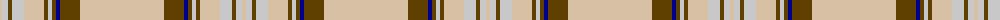

In pattern [YGBGWGYWGWY](/patterns/ygbgwgywgwy/).

This was sourced from tartans-authority.  It is a [11 stripes tartan](/stripes/stripes11/).

Original link http://www.tartansauthority.com/tartan-ferret/display/4809/

## Thread count
LR/4 N6 T4 N12 LR20 T4 N4 T4 DB4 T20 LR/84

## Palette
Each colour and its ΔE from the base-6 reference it is a variant of.

| Colour | Shade | Base | ΔE (OKLab) |
|---|---|---|---|
| DB | <code style="background-color:#00008C;">#00008C</code> `#00008C` | B <code style="background-color:#2C4084;">#2C4084</code> | 0.13 |
| LR | <code style="background-color:#D8C0A4;">#D8C0A4</code> `#D8C0A4` | Y <code style="background-color:#E8C000;">#E8C000</code> | 0.13 |
| N | <code style="background-color:#C8C8C8;">#C8C8C8</code> `#C8C8C8` | W <code style="background-color:#F4F4F0;">#F4F4F0</code> | 0.13 |
| T | <code style="background-color:#604000;">#604000</code> `#604000` | G <code style="background-color:#006400;">#006400</code> | 0.14 |

ID: /setts/s11/y4w6g4w12y20g4w4g4b4g20y84-b00008c-g604000-wc8c8c8-yd8c0a4/
