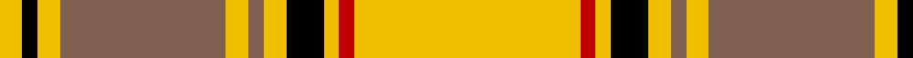

In pattern [YKYRYRYKYRY](/patterns/ykyryrykyry/).

This was sourced from weddslist.  It is a [11 stripes tartan](/stripes/stripes11/).

Original link http://www.weddslist.com/cgi-bin/tartans/pg.pl?source=sts

## Thread count
Y/6 K4 Y6 LT44 Y6 LT4 Y6 K10 Y4 R4 Y/60

## Palette
Each colour and its ΔE from the base-6 reference it is a variant of.

| Colour | Shade | Base | ΔE (OKLab) |
|---|---|---|---|
| K | <code style="background-color:#000000;">#000000</code> `#000000` | K <code style="background-color:#000000;">#000000</code> | 0.00 |
| LT | <code style="background-color:#806050;">#806050</code> `#806050` | R <code style="background-color:#CC0000;">#CC0000</code> | 0.17 |
| R | <code style="background-color:#C00000;">#C00000</code> `#C00000` | R <code style="background-color:#CC0000;">#CC0000</code> | 0.03 |
| Y | <code style="background-color:#F0C000;">#F0C000</code> `#F0C000` | Y <code style="background-color:#F2BF00;">#F2BF00</code> | 0.00 |

## Nearest tartans

The nearest existing variants by ΔTartan distance.

1. [Dunbarton Trade Tartan Tartan Number: 1886. Earliest known date: pre 2003 Dunbarton, Quebec. Different warp and weft See products available Copyright © Blair Urquhart, Comrie, 2015](/setts/s11/y60r4y4k10y6g4y6g44y6k4y6-g604000-k101010-rc80000-ye8c000/) — ΔT 0.43
1. [Morgan of Wales](/setts/s11/r4y34b20y4b8y6ra2y5b2y3r4-b441800-r901c38-rac80000-ye8c000/) — ΔT 0.70
1. [Dunbarton (Quebec)](/setts/s11/y60r4y4k10y6g4y6g44y6k4y6-g8c7038-k101010-rc80000-ye8c000/) — ΔT 0.83
1. [Ulster Irish District Tartan Tartan Number: 1196. Earliest known date: c.1590-1650 The Dungiven costume was discovered in 1956 by Mr William Dixon, a farmer at 'The Hill', Flanders Townland, Dungiven, County Derry, Northern Ireland. The tartan cloth was probably green but had been stained brown and tan by the peat. See products available Copyright © Blair Urquhart, Comrie, 2015](/setts/s10/y56k4y56k4y4k4ya58k4r4k4-k101010-rc80000-ye8c000-yaa08858/) — ΔT 1.04
1. [Bracken](/setts/s9/y10b18r6b10y4b8y52ba6r8-b202060-ba5c8ca8-rc80000-ye8c000/) — ΔT 1.29
1. [Braken Tartan Tartan Number: 1449. Earliest known date: pre 1992 Originally spelt 'Braken'. See products available Copyright © Blair Urquhart, Comrie, 2015](/setts/s9/y20b27r6b15y8b11y78ba10r12-b202060-ba2c2c80-rc80000-ye8c000/) — ΔT 1.30
1. [MacLeod (Snuffbox)](/setts/s9/k4y48r4y8k16r4k16y8k4-k101010-rc80000-ye8c000/) — ΔT 1.42
1. [Bracken](/setts/s9/y20b27r6b15y8b11y78ba10r12-b000050-ba304080-rc00000-yf0c000/) — ΔT 1.47
1. [Wilbers #2 (Personal)](/setts/s8/y10k18y4k14r20ra8r70k8-k101010-rbe7832-radc0000-yfadc00/) — ΔT 1.56
1. [Hughes (USA) (Name)](/setts/s10/b8k24ba6b8ba6k6y72ba6b4y6-b2474e8-ba2c2c80-k101010-yfccc00/) — ΔT 1.60

## Neighbour map

Every grey dot is one of 15726 variants placed by the first two principal components of the ΔTartan feature space (44% of its variance). Red is this tartan; blue dots are its nearest — click one to open its page.

<svg viewBox="0 0 640 380" role="img" style="max-width:100%;height:auto;border:1px solid #e0e0e0;border-radius:4px;display:block" xmlns="http://www.w3.org/2000/svg"><image href="/nn/cloud.v1.png" width="640" height="380"/><a href="/setts/s11/y60r4y4k10y6g4y6g44y6k4y6-g604000-k101010-rc80000-ye8c000/"><circle cx="317.0" cy="117.0" r="4" fill="#3465a4"><title>Dunbarton Trade Tartan Tartan Number: 1886. Earliest known date: pre 2003 Dunbarton, Quebec. Different warp and weft See products available Copyright © Blair Urquhart, Comrie, 2015</title></circle></a><a href="/setts/s11/r4y34b20y4b8y6ra2y5b2y3r4-b441800-r901c38-rac80000-ye8c000/"><circle cx="308.3" cy="119.5" r="4" fill="#3465a4"><title>Morgan of Wales</title></circle></a><a href="/setts/s11/y60r4y4k10y6g4y6g44y6k4y6-g8c7038-k101010-rc80000-ye8c000/"><circle cx="331.6" cy="121.8" r="4" fill="#3465a4"><title>Dunbarton (Quebec)</title></circle></a><a href="/setts/s10/y56k4y56k4y4k4ya58k4r4k4-k101010-rc80000-ye8c000-yaa08858/"><circle cx="336.8" cy="132.8" r="4" fill="#3465a4"><title>Ulster Irish District Tartan Tartan Number: 1196. Earliest known date: c.1590-1650 The Dungiven costume was discovered in 1956 by Mr William Dixon, a farmer at 'The Hill', Flanders Townland, Dungiven, County Derry, Northern Ireland. The tartan cloth was probably green but had been stained brown and tan by the peat. See products available Copyright © Blair Urquhart, Comrie, 2015</title></circle></a><a href="/setts/s9/y10b18r6b10y4b8y52ba6r8-b202060-ba5c8ca8-rc80000-ye8c000/"><circle cx="269.1" cy="142.2" r="4" fill="#3465a4"><title>Bracken</title></circle></a><a href="/setts/s9/y20b27r6b15y8b11y78ba10r12-b202060-ba2c2c80-rc80000-ye8c000/"><circle cx="281.1" cy="144.2" r="4" fill="#3465a4"><title>Braken Tartan Tartan Number: 1449. Earliest known date: pre 1992 Originally spelt 'Braken'. See products available Copyright © Blair Urquhart, Comrie, 2015</title></circle></a><a href="/setts/s9/k4y48r4y8k16r4k16y8k4-k101010-rc80000-ye8c000/"><circle cx="313.1" cy="160.1" r="4" fill="#3465a4"><title>MacLeod (Snuffbox)</title></circle></a><a href="/setts/s9/y20b27r6b15y8b11y78ba10r12-b000050-ba304080-rc00000-yf0c000/"><circle cx="274.1" cy="143.1" r="4" fill="#3465a4"><title>Bracken</title></circle></a><a href="/setts/s8/y10k18y4k14r20ra8r70k8-k101010-rbe7832-radc0000-yfadc00/"><circle cx="330.7" cy="143.8" r="4" fill="#3465a4"><title>Wilbers #2 (Personal)</title></circle></a><a href="/setts/s10/b8k24ba6b8ba6k6y72ba6b4y6-b2474e8-ba2c2c80-k101010-yfccc00/"><circle cx="267.8" cy="105.1" r="4" fill="#3465a4"><title>Hughes (USA) (Name)</title></circle></a><circle cx="313.0" cy="113.4" r="5" fill="#c00000"/></svg>

ID: /setts/s11/y60r4y4k10y6ra4y6ra44y6k4y6-k000000-rc00000-ra806050-yf0c000/
