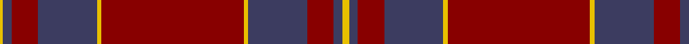

In pattern [YBRBYRYBRBY](/patterns/ybrbyrybrby/).

This was sourced from tartans-authority.  It is a [11 stripes tartan](/stripes/stripes11/).

Original link http://www.tartansauthority.com/tartan-ferret/display/4155/

## Thread count
Y/3 N8 DR24 N54 Y4 DR130 Y4 N54 DR24 N8 Y/6

## Palette
Each colour and its ΔE from the base-6 reference it is a variant of.

| Colour | Shade | Base | ΔE (OKLab) |
|---|---|---|---|
| DR | <code style="background-color:#880000;">#880000</code> `#880000` | R <code style="background-color:#C80000;">#C80000</code> | 0.14 |
| N | <code style="background-color:#3C3C60;">#3C3C60</code> `#3C3C60` | B <code style="background-color:#2C4084;">#2C4084</code> | 0.06 |
| Y | <code style="background-color:#E8C000;">#E8C000</code> `#E8C000` | Y <code style="background-color:#E8C000;">#E8C000</code> | 0.00 |

ID: /setts/s11/y6b8r24b54y4r130y4b54r24b8y3-b3c3c60-r880000-ye8c000/
